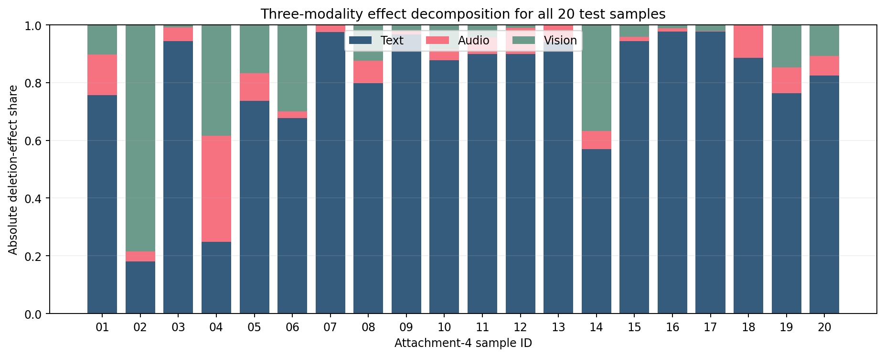
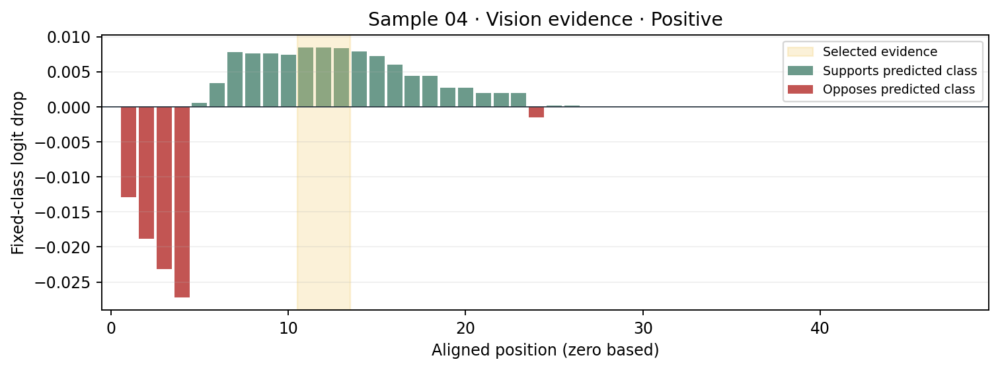

# 问题三：加入解释约束的训练与对照（2026-09-25）

## 实验目的与严格可比输入

在已选 MiniLM + Fusion checkpoint 上继续训练，使融合门控更接近模型真正的单模态删除效应，并检验验证集 ACC 能否保持。原始 `cache_qint8` 文本向量与当前部署包的ONNX编码器不一致：直接使用时，未训练起点只有60.16% ACC，不能进行公平对照。故先用当前部署包的 `text_encoder_int8.onnx` 逐条重编码附件2 train 3395条和 valid 728条；重建后未训练起点准确复现 **63.736% ACC、Macro-F1 0.600084、MAE 0.596055**。文本编码器冻结，只有Fusion参数可更新；音视频沿用原训练集标准化文件和 `[0.2,0,0]` 类别偏置。验证集不参与梯度。

## 解释约束

每个训练批次做完整前向和三个“整模态删除”前向。取真值类别 `y` 的有符号删除效应 `Δ_m^y=z_y(x)-z_y(x\setminus m)`，对可用模态的正效应归一化，得到停止梯度的目标分布 `q_m`；如果全为非正，则在可用模态间均匀分配。模型当前门控分布为 `g_m`。优化

`L = weighted CE + 0.8·SmoothL1(强度) + λ·KL(q || g)`。

删除文本时将文本掩码全部清零；因为注意力池化只汇集有效位置，这与问题三部署时先替换 `[UNK]`、重编码再清除整段文本掩码得到同一Fusion输入。音视频的特征与掩码都清零。解释约束的删除效应在 dropout 关闭状态下计算，与实际推理一致；监督损失仍在训练模式计算。优化器 AdamW、Fusion 学习率 `3e-5`、权重衰减0.01、batch 64、梯度裁剪1、最多12轮。解释目标只由附件2 train 样本及其标签生成，没有使用附件4标签或额外情绪数据。

## 结果

`gate-deletion top1` 是验证集上门控最大模态与**预测类别**最大正删除效应模态一致的比例；`L1` 是两者三模态分布的平均绝对差总和，越低越好。该评估用预测类别，训练目标用真值类别；仅验证集结果用于选轮，不能视为独立测试。

| 版本 | seed | 最佳轮 | 验证ACC | Macro-F1 | MAE | top1一致 | L1差异 |
|---|---:|---:|---:|---:|---:|---:|---:|
| 原冻结模型 | 20260925 | 0 | **0.63736** | **0.60008** | **0.59605** | 0.89148 | 0.56179 |
| 无约束续训 `λ=0` | 20260925 | 1 | 0.63599 | 0.59870 | 0.59856 | 0.90797 | 0.53730 |
| 解释约束 `λ=0.05` | 20260925 | 1 | 0.63599 | 0.59870 | 0.59854 | 0.90659 | 0.53395 |
| 解释约束 `λ=0.2` | 20260925 | 1 | 0.63599 | 0.59870 | 0.59852 | 0.90659 | 0.53191 |
| **解释约束 `λ=1`** | 20260925 | 1 | **0.63736** | 0.59982 | 0.59790 | **0.90934** | **0.52759** |
| 解释约束 `λ=3` | 20260925 | 1 | 0.63462 | 0.59642 | 0.59904 | 0.90934 | 0.52052 |
| 解释约束 `λ=1` | 20260926 | 2 | 0.63462 | 0.59901 | 0.59527 | 0.91071 | 0.50952 |
| 解释约束 `λ=1` | 20260927 | 2 | 0.63324 | 0.59403 | 0.59665 | 0.90522 | 0.51475 |

第1轮 `λ=1` 在同样的464/728正确数下，将门控和删除效应的top1吻合从89.15%提高到90.93%，L1从0.56179降到0.52759；但Macro-F1略降0.00026、MAE上升0.00184。它比同seed无约束续训多判对1条，仍**不能证明解释约束带来稳健的ACC增益**；另外两种随机种子的最佳ACC分别为63.46%、63.32%。较强的 `λ=3` 进一步缩小L1但损失约0.27个百分点ACC，体现准确率和该解释一致性指标之间的权衡。训练时长：无约束12轮约5.9秒，含解释约束12轮每组约11秒（RTX 2080 Ti；不含重编码和全量解释）。

`λ=1` 的验证集混淆矩阵为 `[[148,20,38],[37,63,84],[43,42,253]]`，与原版比有35条预测类别翻转，其中13条从对变错、13条从错变对，总正确数不变。中性→正性错误从90降到84，但最大概率≥0.7的错误从47升到61；因此不能只看ACC和门控一致性就替换原版。验证集文本绝对删除效应占比也从71.07%升到72.12%，文本依赖未减轻。

## 附件4解释变化与交付判断

实验版本已用同一问题三脚本完成附件4 20/20条全量预测和解释。20条极性类别与冻结原版完全相同。样本04旧版音频 `Δ=+0.364`、视觉 `Δ=+0.363`，两者几乎并列；实验版音频 `Δ=+0.360`、视觉 `Δ=+0.377`，主要参考模态转为视觉。这个例子说明“主模态”对接近并列的效应敏感，报告不应把其解释成唯一稳定证据。其他19条的主要模态不变。




当前保留原冻结模型作为默认问题三交付：它的ACC相同，Macro-F1/MAE较好，高置信错误更少。`λ=1` 作为**已训练的解释约束对照版本**交付，供论文讨论方法和权衡，不把它误称为全面优于原模型。实验版 [20条预测CSV](results/q3_explanation_training/lambda1_attachment4_predictions_explanations.csv)、[全局与局部JSON](results/q3_explanation_training/lambda1_attachment4_explanations.json)、[验证摘要](results/q3_explanation_training/lambda1_validation_summary.json)、[完整训练曲线](results/q3_explanation_training/lambda100_report.json) 均已保存。Fusion权重位于 `B/checkpoints/q3_gate_aligned_lambda1_seed20260925.pt`；完整推理包在服务器 `/mnt/disk/data/inainai/mosei_e_20260924/q3_explanation_training_20260925/lambda100/`，需配合选定的MiniLM ONNX编码器、训练集标准化器及类别偏置。

## 可复现命令

先在服务器使用 `B/scripts/reencode_q3_train_valid.py`，将 `cache_qint8` 的 train/valid 以选中包的 `text_encoder_int8.onnx` 逐条重编码至 `q3_explanation_training_20260925/reencoded_cache`。运行环境若没有系统级 `onnxruntime`，传 `--onnxruntime-path /mnt/disk/data/inainai/mosei_e_20260924/vendor`。然后运行：

```bash
/home/inainai/anaconda3/envs/myenv/bin/python B/scripts/train_q3_explanation.py \
  --cache /mnt/disk/data/inainai/mosei_e_20260924/q3_explanation_training_20260925/reencoded_cache \
  --package /mnt/disk/data/inainai/mosei_e_20260924/q2_minilm_deploy_candidate_calibrated_20260925 \
  --output /mnt/disk/data/inainai/mosei_e_20260924/q3_explanation_training_20260925/lambda100 \
  --explanation-weight 1 --epochs 12 --batch-size 64 --lr 3e-5 \
  --seed 20260925 --device cuda
```

最后以 `B/scripts/run_q3.py --package .../lambda100` 导出验证集指标、附件4预测与解释，以 `B/scripts/plot_q3.py` 绘图。具体输入和版本见 [参数配置](../../../B/configs/q3_explanation_training_20260925.json)；训练日志、图、预测均与上述实测运行对应。
