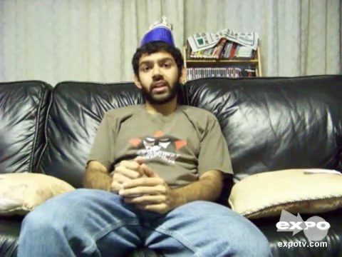

# 附件4样本 06 解释卡

原文：If you're a fan of dancing in that sense, just like to watch people dance, see impressive dance moves then you might want to check out this movie solely for that

预测：**Positive**；强度 **0.799**。
三类概率（负/中/正）：0.079, 0.387, 0.533。

| 模态 | 删除后目标类logit下降 | 作用绝对占比 | 门控权重 | 关键片段 |
|---|---:|---:|---:|---|
| text | +1.018 | 67.8% | 0.735 | 原文 79:101 ‘impressive dance moves’；局部遮挡Δ=+0.422 |
| audio | +0.036 | 2.4% | 0.146 | 对齐位置 [11, 12, 13]，约 7.00–7.10 秒；局部遮挡Δ=+0.017 |
| vision | -0.448 | 29.8% | 0.118 | 对齐位置 [26, 27, 28]，约 7.53–7.73 秒；局部遮挡Δ=+0.007 |

主要参考模态：**text**（largest_positive_logit_drop）。
正的logit下降表示该模态支持当前预测；负值表示它抑制当前预测。门控权重仅作模型内部诊断，不作为贡献值。

[播放语音证据](../assets/audio/06_audio.wav)

局部时间由对齐特征与未对齐帧精确匹配后，按音频20 Hz、视觉15 Hz估计；视频流时长用于核查。
遮挡效应反映模型对输入变化的敏感性，不等同于人类情绪的因果来源。
