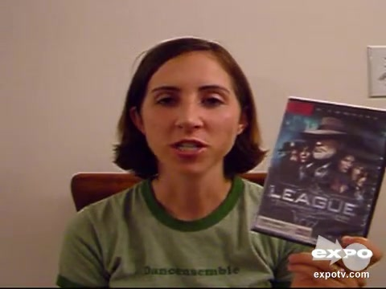

# 附件4样本 09 解释卡

原文：(uhh) I did not like this movie at all, I would not recommend it

预测：**Negative**；强度 **-1.405**。
三类概率（负/中/正）：0.879, 0.074, 0.047。

| 模态 | 删除后目标类logit下降 | 作用绝对占比 | 门控权重 | 关键片段 |
|---|---:|---:|---:|---|
| text | +2.323 | 96.2% | 0.692 | 原文 26:34 ‘movie at’；局部遮挡Δ=+0.114 |
| audio | -0.055 | 2.3% | 0.128 | 对齐位置 [5, 6, 7]，约 4.30–4.45 秒；局部遮挡Δ=+0.015 |
| vision | +0.036 | 1.5% | 0.180 | 对齐位置 [16, 17, 18]，约 4.80–5.00 秒；局部遮挡Δ=+0.012 |

主要参考模态：**text**（largest_positive_logit_drop）。
正的logit下降表示该模态支持当前预测；负值表示它抑制当前预测。门控权重仅作模型内部诊断，不作为贡献值。
主要模态的作用分散在多个位置；单个最多3步的片段只解释了其中较小部分。

[播放语音证据](../assets/audio/09_audio.wav)

局部时间由对齐特征与未对齐帧精确匹配后，按音频20 Hz、视觉15 Hz估计；视频流时长用于核查。
遮挡效应反映模型对输入变化的敏感性，不等同于人类情绪的因果来源。
