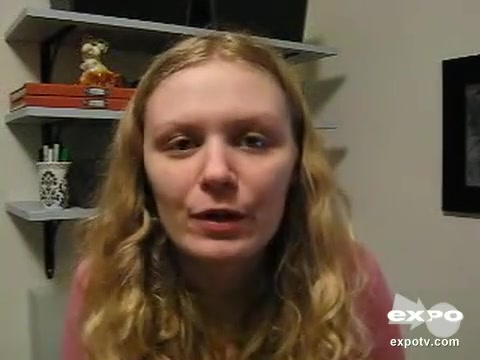

# 附件4样本 10 解释卡

原文：(umm) And you know I really do like to see fluffy chick flicks sometimes so I'm not against that but this one was pretty terrible

预测：**Negative**；强度 **-1.271**。
三类概率（负/中/正）：0.839, 0.105, 0.056。

| 模态 | 删除后目标类logit下降 | 作用绝对占比 | 门控权重 | 关键片段 |
|---|---:|---:|---:|---|
| text | +2.760 | 84.3% | 0.691 | 原文 121:129 ‘terrible’；局部遮挡Δ=+1.951 |
| audio | -0.174 | 5.3% | 0.124 | 对齐位置 [14, 15, 16]，约 9.05–9.15 秒；局部遮挡Δ=+0.021 |
| vision | -0.338 | 10.3% | 0.185 | 对齐位置 [5, 6, 7]，约 8.27–8.47 秒；局部遮挡Δ=+0.022 |

主要参考模态：**text**（largest_positive_logit_drop）。
正的logit下降表示该模态支持当前预测；负值表示它抑制当前预测。门控权重仅作模型内部诊断，不作为贡献值。

[播放语音证据](../assets/audio/10_audio.wav)

局部时间由对齐特征与未对齐帧精确匹配后，按音频20 Hz、视觉15 Hz估计；视频流时长用于核查。
遮挡效应反映模型对输入变化的敏感性，不等同于人类情绪的因果来源。
