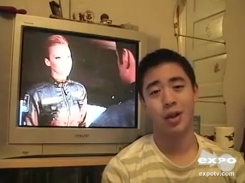

# 附件4样本 11 解释卡

原文：I would be ashamed to have made this film if I was a director

预测：**Negative**；强度 **-1.076**。
三类概率（负/中/正）：0.821, 0.129, 0.051。

| 模态 | 删除后目标类logit下降 | 作用绝对占比 | 门控权重 | 关键片段 |
|---|---:|---:|---:|---|
| text | +1.699 | 88.5% | 0.854 | 原文 2:18 ‘would be ashamed’；局部遮挡Δ=+2.197 |
| audio | +0.104 | 5.4% | 0.069 | 对齐位置 [2, 3, 4]，约 5.05–5.20 秒；局部遮挡Δ=+0.027 |
| vision | -0.116 | 6.0% | 0.077 | 对齐位置 [1, 2, 3]，约 4.80–5.00 秒；局部遮挡Δ=+0.021 |

主要参考模态：**text**（largest_positive_logit_drop）。
正的logit下降表示该模态支持当前预测；负值表示它抑制当前预测。门控权重仅作模型内部诊断，不作为贡献值。

[播放语音证据](../assets/audio/11_audio.wav)

局部时间由对齐特征与未对齐帧精确匹配后，按音频20 Hz、视觉15 Hz估计；视频流时长用于核查。
遮挡效应反映模型对输入变化的敏感性，不等同于人类情绪的因果来源。
