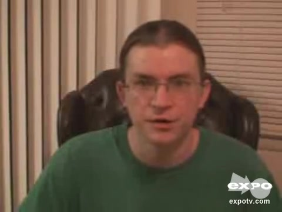

# 附件4样本 16 解释卡

原文：It's a terrible, this is a terrible movie

预测：**Negative**；强度 **-1.620**。
三类概率（负/中/正）：0.883, 0.082, 0.035。

| 模态 | 删除后目标类logit下降 | 作用绝对占比 | 门控权重 | 关键片段 |
|---|---:|---:|---:|---|
| text | +2.715 | 97.4% | 0.746 | 原文 27:41 ‘terrible movie’；局部遮挡Δ=+0.092 |
| audio | -0.055 | 2.0% | 0.143 | 对齐位置 [9, 10, 11]，约 2.85–3.00 秒；局部遮挡Δ=+0.067 |
| vision | +0.018 | 0.7% | 0.111 | 对齐位置 [2, 3, 4]，约 2.40–2.53 秒；局部遮挡Δ=+0.029 |

主要参考模态：**text**（largest_positive_logit_drop）。
正的logit下降表示该模态支持当前预测；负值表示它抑制当前预测。门控权重仅作模型内部诊断，不作为贡献值。
主要模态的作用分散在多个位置；单个最多3步的片段只解释了其中较小部分。

[播放语音证据](../assets/audio/16_audio.wav)

局部时间由对齐特征与未对齐帧精确匹配后，按音频20 Hz、视觉15 Hz估计；视频流时长用于核查。
遮挡效应反映模型对输入变化的敏感性，不等同于人类情绪的因果来源。
