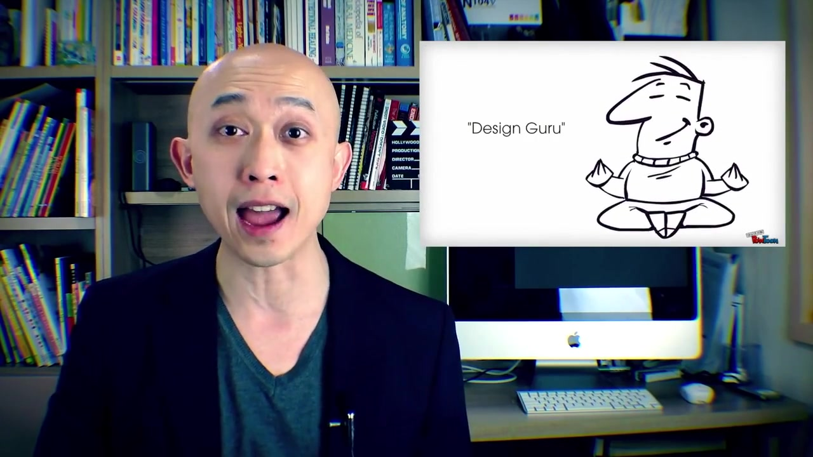

# 附件4样本 17 解释卡

原文：Applying these four design concepts to your presentations is simple, easy and will make people think you turned into a design guru.

预测：**Positive**；强度 **1.036**。
三类概率（负/中/正）：0.029, 0.128, 0.843。

| 模态 | 删除后目标类logit下降 | 作用绝对占比 | 门控权重 | 关键片段 |
|---|---:|---:|---:|---|
| text | +1.443 | 96.2% | 0.660 | 原文 88:100 ‘people think’；局部遮挡Δ=+0.062 |
| audio | -0.013 | 0.9% | 0.185 | 对齐位置 [12, 13, 14]，约 8.95–9.10 秒；局部遮挡Δ=+0.028 |
| vision | -0.043 | 2.9% | 0.154 | 对齐位置 [6, 7, 8]，约 8.40–8.60 秒；局部遮挡Δ=+0.014 |

主要参考模态：**text**（largest_positive_logit_drop）。
正的logit下降表示该模态支持当前预测；负值表示它抑制当前预测。门控权重仅作模型内部诊断，不作为贡献值。
主要模态的作用分散在多个位置；单个最多3步的片段只解释了其中较小部分。

[播放语音证据](../assets/audio/17_audio.wav)

局部时间由对齐特征与未对齐帧精确匹配后，按音频20 Hz、视觉15 Hz估计；视频流时长用于核查。
遮挡效应反映模型对输入变化的敏感性，不等同于人类情绪的因果来源。
