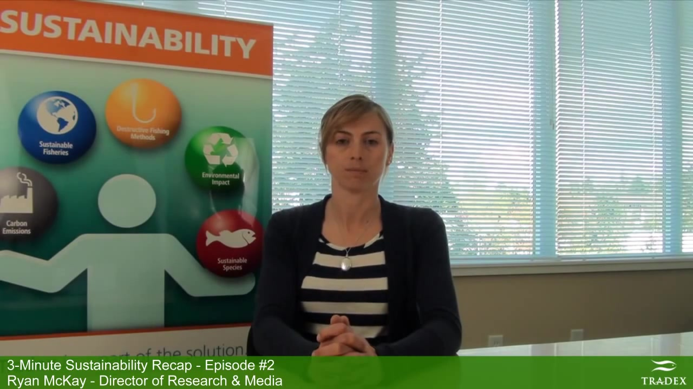

# 附件4样本 18 解释卡

原文：-And in Denmark - the first Baltic Cod fishery has been MSC – certified -Meanwhile, the Faeroese Mackerel Fishery has been denied MSC certification based on the fact that the fishery has failed to reach an agreement on mackerel quotas with Norway and the European Union.

预测：**Neutral**；强度 **0.000**。
三类概率（负/中/正）：0.351, 0.435, 0.215。

| 模态 | 删除后目标类logit下降 | 作用绝对占比 | 门控权重 | 关键片段 |
|---|---:|---:|---:|---|
| text | +0.470 | 88.1% | 0.533 | 原文 56:71 ‘MSC – certified’；局部遮挡Δ=+0.086 |
| audio | -0.060 | 11.3% | 0.195 | 对齐位置 [3, 4, 5]，约 16.35–16.50 秒；局部遮挡Δ=+0.015 |
| vision | -0.003 | 0.6% | 0.273 | 对齐位置 [46, 47, 48]，约 18.13–18.20 秒；局部遮挡Δ=+0.017 |

主要参考模态：**text**（largest_positive_logit_drop）。
正的logit下降表示该模态支持当前预测；负值表示它抑制当前预测。门控权重仅作模型内部诊断，不作为贡献值。

[播放语音证据](../assets/audio/18_audio.wav)

局部时间由对齐特征与未对齐帧精确匹配后，按音频20 Hz、视觉15 Hz估计；视频流时长用于核查。
遮挡效应反映模型对输入变化的敏感性，不等同于人类情绪的因果来源。
