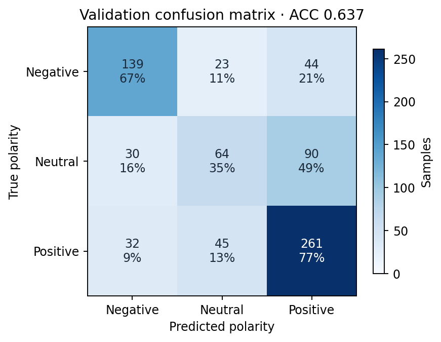
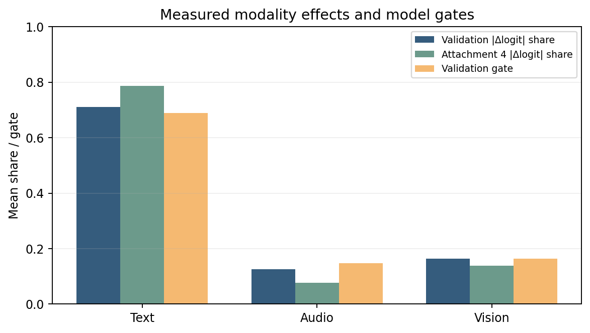
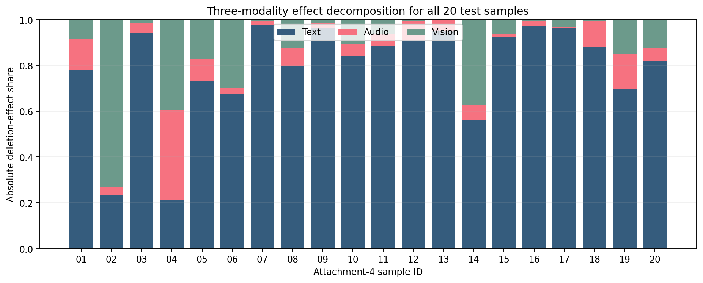
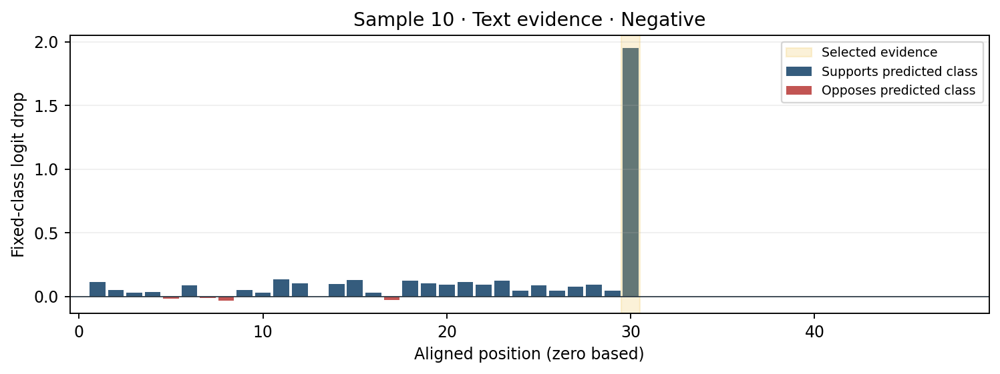
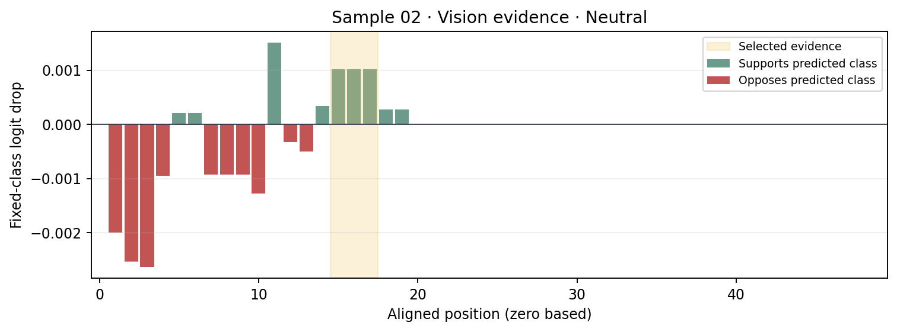
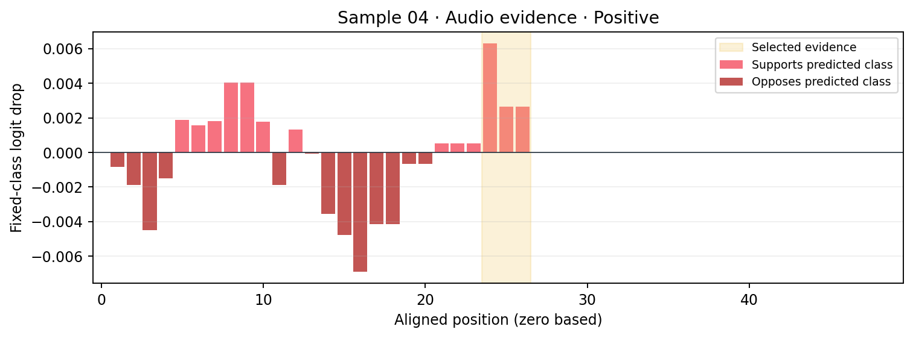

# 问题三论文方法与结果稿

## 任务与数据

给定附件4样本的对齐文本、语音、视觉特征，输出情感极性 `Negative/Neutral/Positive`、强度以及可核对的模态作用和局部证据。模型参数仅从附件2训练集学习；验证集用于选模、类别偏置校准及性能分析。附件4没有公开标签，所以其20条只输出预测和解释。此边界也避免把解释定位用的未对齐文件和视频误当成附加训练数据。

## 预测模型

采用同一已选模型完成问题二、三，保证极性和强度结果一致。文本原始 token 经 `sentence-transformers/all-MiniLM-L6-v2` 编码为每位置384维；音频、视觉输入分别为74维、35维，统一为50个对齐位置。MiniLM顶部两层在附件2 train 上微调，随后转为动态int8 ONNX，推理每次只送一条样本。三模态分别投影至64维，经带有效掩码的注意力池化得到 `h_t,h_a,h_v`。门控网络读取三模态汇总及有效率，输出 `g=softmax(·)`；不可用模态的门控被置零。融合向量为 `h_f=Σ_m g_m h_m`。预测头读取 `h_t,h_a,h_v,h_f` 与各模态有效率，输出三类logit及范围 `[-3,3]` 的强度。

训练使用随机30%模态缺失：文本缺失位置先替换成 `[UNK]` 后送入文本编码器，音视频特征和有效掩码同步清除。对选中的 `Fusion` 结构，目标函数为加权三分类交叉熵加 `0.8 × SmoothL1(强度)`；插补结构的额外损失不属于本模型。优化器为 AdamW，文本编码器学习率 `2e-5`，融合层 `2e-4`，权重衰减 `0.01`，梯度范数裁剪1，batch size 32。类别交叉熵权重按训练类频次的平方根逆比计算。选择顺序为验证集干净 ACC、六种30%缺失验证 ACC 的均值、干净 Macro-F1；最终包为 seed 20260925 的第3轮 checkpoint。验证集确定的极性logit偏置（负/中/正）为 `[0.2,0,0]`。选定类别为中性时输出强度0，正/负类别分别输出回归头幅值的正/负值，满足题目极性与强度一致性。

## 模态作用和局部解释

解释必须基于真实部署函数，而不能只读门控值。先用完整输入得到预测类别 `c` 和带校准偏置的logit `z_c(x)`。令 `x\setminus m` 表示清除模态 `m` 的所有有效位置并完整重跑模型，定义有符号作用

`Δ_m = z_c(x) − z_c(x\setminus m),    R_m = |Δ_m| / Σ_k |Δ_k|`。

固定原类别 `c` 使各种删减可比较。`Δ_m>0` 表示该模态支持当前类别，`Δ_m<0` 表示抑制；`R_m` 只描述作用大小。主要参考模态取最大正 `Δ_m`；若均非正，退化到最大 `|Δ_m|` 并标注。由于多模态非线性交互，三项 `Δ_m` 不要求加和等于完整logit。

对每个模态的每个有效位置 `j`，同样计算 `d_{m,j}=z_c(x)-z_c(x\setminus(m,j))`，绘制有符号分布与正值归一化分布。进一步穷举宽度1–3的连续对齐位置窗口 `W`，实际联合遮挡并计算 `d_{m,W}`，选最大的正值作为关键窗口；如果没有正窗口，则选绝对作用最大的窗口并标出反向。联合效应可能不同于单点效应之和，所以不用单点求和冒充局部证据。文本窗口由 tokenizer 原文 offset 回写字符范围。音频、视觉对齐向量在附件4未对齐版本中进行精确向量匹配，再按名义20 Hz/15 Hz换算时间，结合视频流30 fps和流时长提取可查看的关键帧或语音片段。无法定位时明确给出状态。

这个方法衡量的是**模型预测对特定输入删除的敏感性**，不声称找到情绪的因果来源。文本删除使用 `[UNK]`、音视频删除使用零特征及无效掩码，两者是训练中相同的缺失协议。门控权重同时输出用于诊断，但它不是模态贡献。

## 验证集评价与错误分析

附件2验证集728条，ACC **0.63736**（464/728）、Macro-F1 **0.60008**、MAE **0.59605**、Pearson **0.64246**。这些数据用于 checkpoint 与偏置选择，不是独立测试。负/中/正类别 F1 为0.6830/0.4051/0.7121。混淆矩阵如下：

| 真值\预测 | 负 | 中 | 正 |
|---|---:|---:|---:|
| 负 | 139 | 23 | 44 |
| 中 | 30 | 64 | 90 |
| 正 | 32 | 45 | 261 |

中性→正性共90条，是最大错误来源；中性召回率仅34.8%。47条错误样本的最大预测概率至少0.7，说明现有类别概率尚不足以给解释设可靠性阈值。验证集平均绝对遮挡作用占比为文本71.1%、音频12.6%、视觉16.4%；主参考模态次数649、23、56，表明本模型主要依赖文本。只有15条验证样本视觉完全不可用，ACC 0.60；此切片过小，只作为错误审查线索。解释与错误是相关分析，不能由这些切片推断因果。

## 附件4全量预测与典型解释卡

附件4共20条，均完成极性、强度、三模态作用、主要模态、三个模态的局部分布及证据定位。全量逐样本CSV和JSON位于 `B/outputs/q3_explanations_20260925/`；20张解释卡见同目录 `cards/`。预测为负6、中5、正9，主模态文本18、音频1、视觉1。下表为全量预测汇总，精确概率和局部索引见CSV/JSON。

| ID | 极性 | 强度 | 主模态 | ID | 极性 | 强度 | 主模态 |
|---|---|---:|---|---|---|---:|---|
| 01 | 中 | 0.000 | 文本 | 11 | 负 | -1.076 | 文本 |
| 02 | 中 | 0.000 | 视觉 | 12 | 负 | -0.762 | 文本 |
| 03 | 中 | 0.000 | 文本 | 13 | 中 | 0.000 | 文本 |
| 04 | 正 | 0.856 | 音频 | 14 | 正 | 0.867 | 文本 |
| 05 | 正 | 0.916 | 文本 | 15 | 正 | 1.039 | 文本 |
| 06 | 正 | 0.799 | 文本 | 16 | 负 | -1.620 | 文本 |
| 07 | 正 | 0.773 | 文本 | 17 | 正 | 1.036 | 文本 |
| 08 | 正 | 0.852 | 文本 | 18 | 中 | 0.000 | 文本 |
| 09 | 负 | -1.405 | 文本 | 19 | 负 | -0.176 | 文本 |
| 10 | 负 | -1.271 | 文本 | 20 | 正 | 1.106 | 文本 |

样本10是可局部核对的文本例子：预测负性、强度-1.271，三类概率约0.839/0.105/0.056。文本全模态遮挡使负性logit下降2.760，文本作用占84.3%；原文 `terrible` 对应窗口的联合遮挡下降1.951，能在原句直接核查。其音频和视觉全模态 `Δ` 分别为-0.174、-0.338，对此预测起抑制作用。

样本02预测中性，主要参考视觉的全模态 `Δ=+0.284`，但最强最多三步窗口只有约 `+0.004`；所以视觉作用呈分布式，不能宣称一帧解释了预测。视觉对齐位置15–17映射原视频约3.20–3.27秒。样本04预测正性、强度0.856，音频与视觉全模态作用分别约 `+0.364` 和 `+0.363`，排序差距仅约0.001，主模态“音频”对数值扰动很敏感；最强音频短窗口只约 `+0.013`，在原视频约6.75–6.85秒。图与解释卡均需保留这个不确定性，而不把关键帧当作充分原因。

原始附件4的20条文本token映射、20条音频向量映射均通过核对；19条有可用视觉向量，样本13视觉缺失，不生成假关键帧。音视频时间根据特征采样率估算，源帧对应关系比时间精确。样本16的未对齐视觉长度字段有误，已用实际非零帧和特征匹配定位。题目未提供附件4标签，因此不对这一集计算性能指标。

## 工具、参数与复现

PyTorch 2.7.0+cu126（融合模型）、Transformers 4.51.3（MiniLM与tokenizer）、ONNX Runtime 1.20.1（int8文本编码）、NumPy 2.2.5（特征计算）、scikit-learn 1.6.1（验证指标）、FFmpeg/ffprobe 4.3（原视频片段定位和提取）。图由 Matplotlib 生成。关键参数：50步、384/74/35维、融合隐层64、head 128→64、dropout 0.25、局部窗口1–3步、文本 `[UNK]=100`、校准偏置 `[0.2,0,0]`。完整输入/输出协议在 [接口说明](../requirements/q3_explanation_interface.md)，可复现命令和结果在 [实验记录](../experiments/q3_explanation_20260925.md) 及 [B README](../../../B/README.md)。
