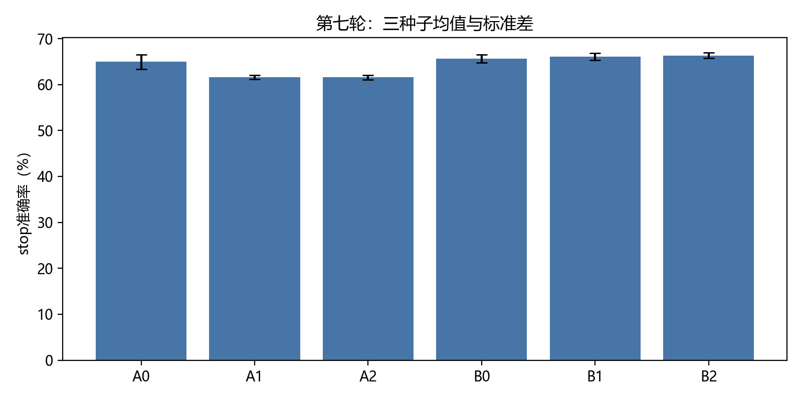
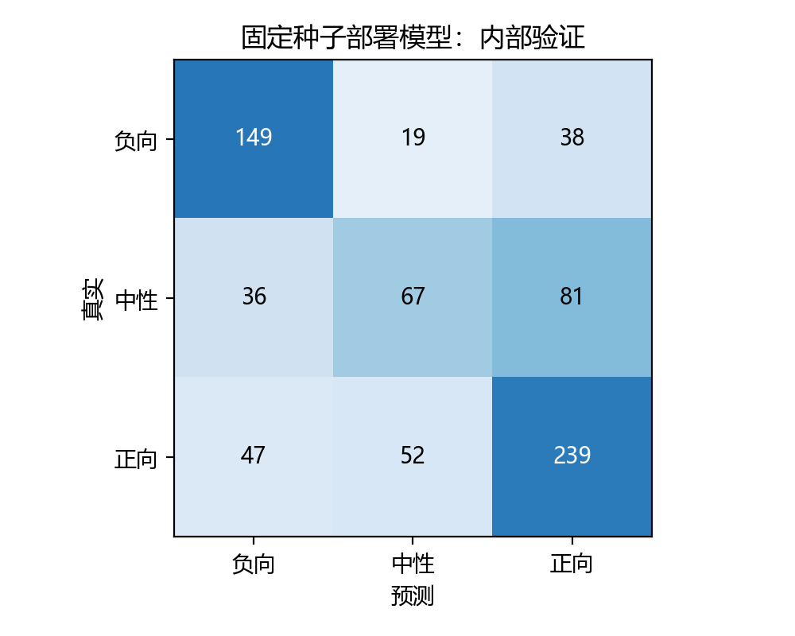

# 第七轮类别对比学习与时序动态融合：实验结果

日期：2026-09-26。负责人：C。[预设方案](第七轮实验方案：类别对比学习与时序动态融合.md)。本轮已完成18个开发模型、6个完整train模型，共218epoch；训练及内部stop评估累计15.98分钟，不含开发、部署评估和解释耗时。

## 结果与决策

内部stop锁定 **B2**。达到预设三种子平均指标门槛，但预固定交付种子的准确率下降。基于实际单模型交付表现保守保留旧包，不改挑其他种子；本轮包作为可复核候选保留。这一区分不是否定已通过的平均指标门槛。

| 组别 | stop ACC均值 | Macro-F1 | 中性F1 |
|---|---:|---:|---:|
| A0 | 64.9616% | 0.6227 | 0.4667 |
| A1 | 61.6368% | 0.6065 | 0.4683 |
| A2 | 61.5516% | 0.6056 | 0.4727 |
| B0 | 65.6436% | 0.6374 | 0.5076 |
| B1 | 66.0699% | 0.6349 | 0.4908 |
| B2 | 66.3257% | 0.6422 | 0.5184 |

A0为自然采样原Fusion，A1为均衡采样，A2再加监督对比；B0/B1/B2分别为时序交互的固定文本/等权/动态汇总。编码器均为在线MiniLM顶部两层微调。AB是否执行见combination.json；仅当两个分支均晋级才组合。

A2相对A1是否达到预设门槛：**False**；B2是否同时超过B0/B1并达到门槛：**False**。结构候选入选与机制证明是不同判断，不能把任意B组胜出都归因于动态选择。

## 完整训练与实际部署

| 组别 | FP32均值 | int8未校准均值 | 分组校准折外均值 | 全valid拟合偏置后均值 |
|---|---:|---:|---:|---:|
| A0 | 61.3095% | 60.4396% | 60.8516% | 61.0806% |
| B2 | 61.3095% | 61.5842% | 62.1795% | 62.4084% |

固定交付seed20267001，最终int8在728条valid上ACC **62.5000%**，Macro-F1 **0.5944**，一致性强度MAE **0.6184**，Pearson **0.6442**。与同轮A0的配对部署ACC差值为[-0.0027472527472527375, 0.020604395604395642, 0.0219780219780219]（比例单位）。三种子均值、单种子和校准折外口径分别报告，不与第五轮test直接排名。

| 类别 | Precision | Recall | F1 | 样本数 |
|---|---:|---:|---:|---:|
| 负向 | 0.6422 | 0.7233 | 0.6804 | 206 |
| 中性 | 0.4855 | 0.3641 | 0.4161 | 184 |
| 正向 | 0.6676 | 0.7071 | 0.6868 | 338 |

官方valid历史上反复用于研究，本轮后处理也使用valid；上述均为内部验证。本轮没有读取test。校准折外仅检验偏置步骤，不是整套研究的嵌套交叉验证。量化前后的均值差应与结构收益分开解释。

重训日志的`final_* acc 0`是未运行逐epoch验证时的打印占位，不是准确率为零；真实指标以锁定训练完成后的valid逐样本预测及本表为准。

## 第三问与复核

附件4全20条已生成极性、强度、概率、删除效应、精确Shapley、局部证据、位置映射与解释卡。音频预览20条，视觉预览19条；无有效位置时明确保留失败状态。附件4无标签，不计算准确率。

部署概率与固定12条valid逐样本路径、Shapley加和、训练哈希、最佳epoch与冻结权重检查通过。门控不是贡献；文本输入干预重新编码，动态模型干预后重新计算选择权重。

独立解压复验状态：已通过，20条预测、解释与映射精确一致。

## 复现及产物

训练：`python C/scripts/run_q3_round7_representation.py --stage all`；部署：`python C/scripts/deploy_q3_round7_representation.py`；审计：`python C/scripts/check_q3_round7_representation.py`；报告：`python C/scripts/report_q3_round7_representation.py`。使用myenv及既有隔离依赖，训练需要原准备缓存和本地预训练版本。SHA256及环境见manifest和round7_sources。

日志/权重：`C/outputs/q3_round7_representation_v1/`；单模型候选包：`C/outputs/submission/q3_round7_representation_v1.zip`。完整FP32及其他种子权重保留在实验目录，不进入比赛包。独立包推理入口复用第六轮通用解释脚本，实际加载本轮模型。全队合包50MB上限仍需整体检查，不以本组件大小替代。
