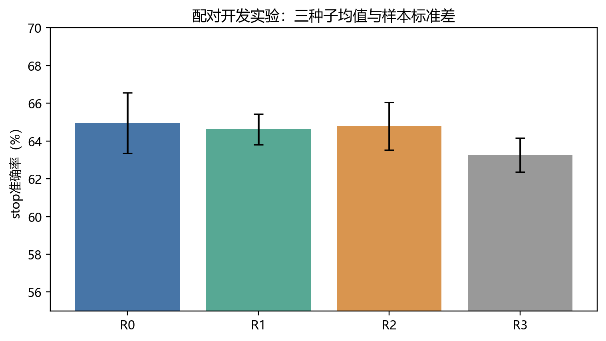
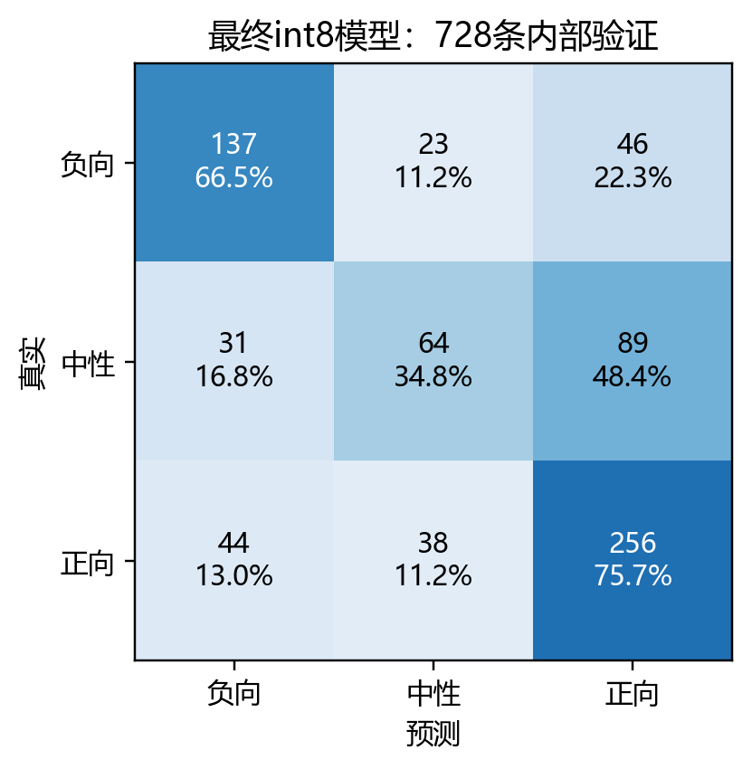
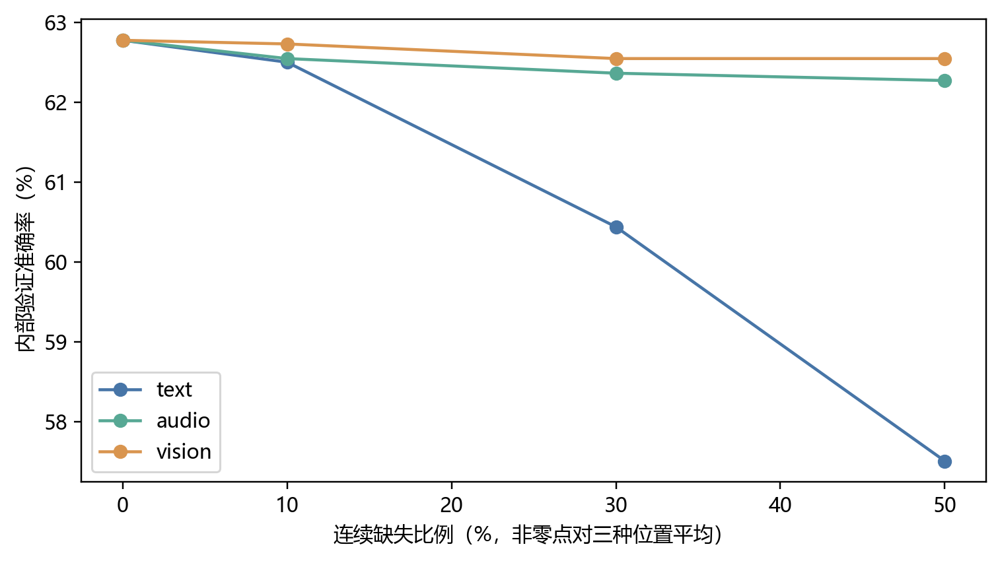
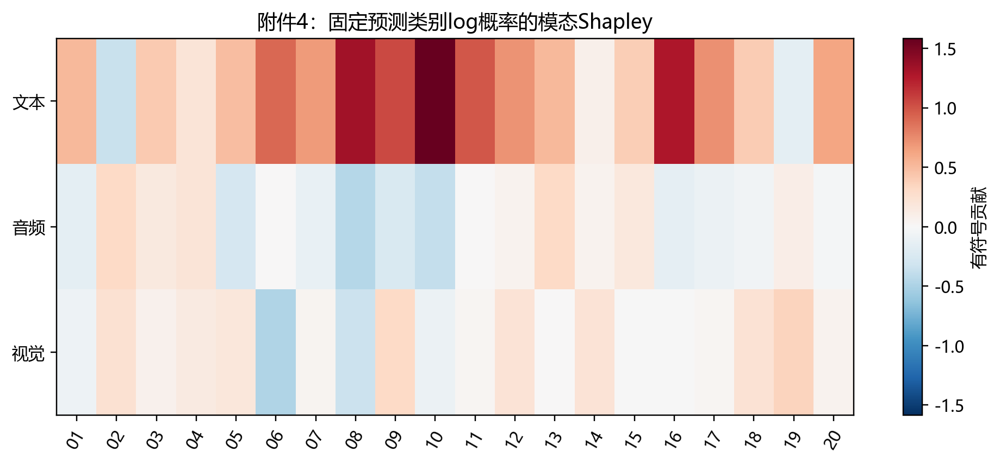
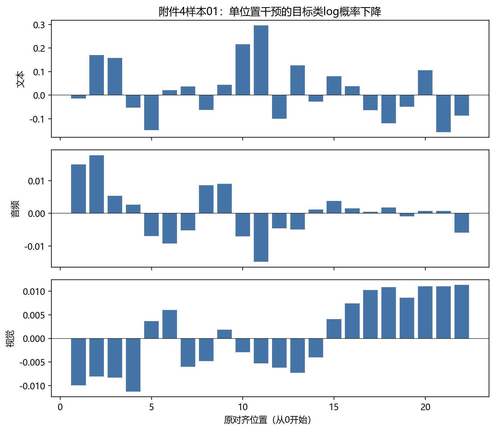

# 第六轮：端到端MiniLM训练与第三问交付结果

状态：训练、量化校准、附件4预测解释及审计已完成。依据正确队友归档226b84f和[重设计方案](第六轮重设计：端到端MiniLM与第三问解释模型.md)，未沿用已撤回v4的七模型路线。本文为实验记录，不是第五轮论文的改写。

## 结果与选择

四组各三个种子完成120个开发epoch。相对R0，加宽R1和全编码器更新R2未达到预设稳定改进门槛，最终锁定 **R0**，不是宣称扩大容量成功。随后用完整3395条train重训三个种子，epoch分别为[4, 9, 5]；共计138个训练epoch。训练与其内部stop评估的阶段用时约7.96分钟，不含开发、量化、解释和审计。

| 组别 | stop ACC（三种子均值） | Macro-F1 | 中性F1 |
|---|---:|---:|---:|
| R0 | 64.96% | 0.6227 | 0.4667 |
| R1 | 64.62% | 0.6204 | 0.4766 |
| R2 | 64.79% | 0.6152 | 0.4384 |
| R3 | 63.26% | 0.6079 | 0.4759 |

R0为顶部两层微调＋dim64；R1为顶部两层微调＋dim192；R2为六层及嵌入微调＋dim192；R3为冻结文本＋dim192。R2确实参与了训练。最终模型含22,788,179参数，其中3,623,891参数参与训练；并非只优化旧冻结特征任务头。所有冻结参数在训练末保持不变。

## 完整训练后的精度与校准

| 口径 | 干净验证ACC |
|---|---:|
| FP32，三个完整train模型均值 | 61.3095% |
| int8未校准，三个模型均值 | 60.4396% |
| int8五折分组校准折外，三个模型均值（候选校准检验） | 60.7601% |
| 最终采用偏置，完整valid拟合后三个模型均值 | 61.0806% |
| 预先固定交付seed20267001，最终int8 | 62.7747% |

最终偏置为`[0.2, 0.0, 0.0]`；校准是否获准采用：True。种子20267001在验证前已固定，未挑选验证集最高种子。FP32、int8、折外校准及全valid拟合是不同口径，不能混写成同一个成绩。官方valid历史上反复用于研究，本轮也用于后处理选择；全部称内部验证，未读取test用于本轮评估或选型。

交付单模型在728条valid上：ACC **62.77%**（457/728），Macro-F1 **0.5907**，最终一致性强度MAE **0.5902**，Pearson **0.6463**。63种缺失条件等权平均ACC为61.21%，Macro-F1为0.5788。强度同时保存原始回归值与按最终极性映射的服务值。

正确队友的历史部署单模型为63.74%、Macro-F1 0.6001、MAE 0.5961；第五轮65.61%属于历史test三种子均值。本轮不与第五轮test直接比较，不将跨协议差异归为单一因素。结构更大没有稳定胜出，本次可交付性与准确率提升必须分别评价。

| 类别 | Precision | Recall | F1 | 样本数 |
|---|---:|---:|---:|---:|
| 负向 | 0.6462 | 0.6650 | 0.6555 | 206 |
| 中性 | 0.5120 | 0.3478 | 0.4142 | 184 |
| 正向 | 0.6547 | 0.7574 | 0.7023 | 338 |

## 第三问产物与解释边界

附件4全20条已输出极性、强度、原始与校准概率、模态删除效应、精确三模态Shapley、主要参考模态、局部证据、原文/音频时段/关键帧定位与解释卡。无标签，不能计算准确率。审计记录的有效音频预览20条、视觉预览19条；映射失败或名义采样率近似状态保留在JSON，不能假称全为精确时间。

解释实际运行最终int8模型，文本UNK替换后重新编码，音视频置零并同步掩码，固定原预测类别的校准log概率。门控仅作诊断；有符号删除效应与Shapley分列，绝对占比并非因果百分比。Shapley八个子集加和通过检查；空集包含模型先验。没有正支持时允许主要模态未确定。

对valid每类前4条共12条固定样本复核部署推理与保存概率，并比较关键窗口与同宽随机窗口的干预变化；这是模型敏感性诊断，不是人工证据正确率。详细检查见产物`audit.json`。

## 复现与交付

训练：`python C/scripts/run_q3_minilm_round6.py --stage all`；导出与校准：`python C/scripts/deploy_q3_minilm_round6.py`。这两个命令在原项目环境及已核对的历史prepared缓存/分组文件下运行，日志、权重、manifest、锁定信息和逐样本预测在`C/outputs/q3_round6_minilm_v2/`。源码改变时断点恢复会拒绝混用旧状态。

比赛组件在`C/outputs/submission/q3_round6_minilm_v2/`及同名zip。内含独立推理代码、模型、tokenizer、标准化、偏置、结果、解释卡、图表及SHA256清单。解压后按README运行，无需历史特征缓存或训练checkpoint；从头训练则仍需原项目缓存和通用预训练权重。没有覆盖全队原提交包；全队合包后的50MB上限需另行核对。

独立解压复验已通过：在不引用仓库实现的独立目录重新运行全部20条附件4样本，预测、解释及定位JSON与原结果完全一致。依赖使用已验证的隔离库目录，详见`package_smoke.json`。13号样本原始视觉无有效位置，故19张视觉预览是如实交付，不是遗漏。
