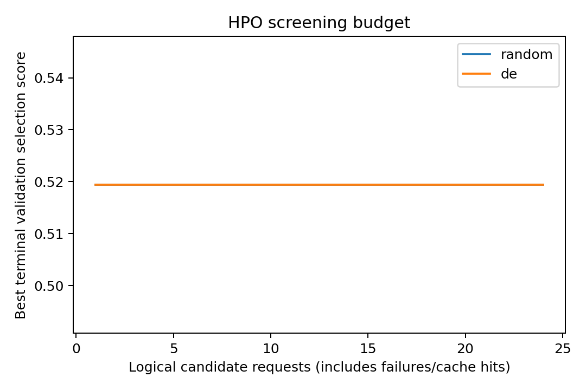
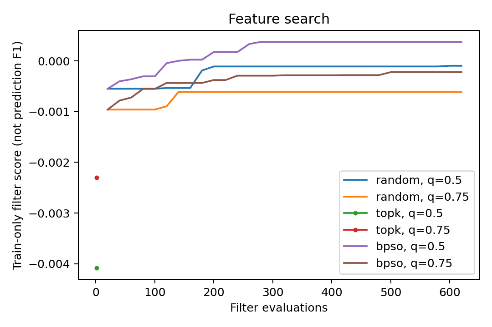

# 固定预算智能优化与特征选择实验：方法、结果及局限

问题二／成员C论文分节草稿　版本：第一轮结果临时稿　日期：2026-09-24

编辑说明：本文依据已完成的本机实验撰写，作为后续统稿的独立章节。Markdown为正文编辑源，Word为本次临时导出版；不将本轮结果表述为最终方案已获得全面性能提升。算法参考文献编号待合并论文时按文献阅读记录统一补入。

## 1 研究目的

针对复杂场景下多模态情感预测的参数配置与输入冗余问题，本研究在既有缺失增强门控融合模型上，考察差分进化（Differential Evolution，DE）超参数搜索与二进制粒子群优化（Binary Particle Swarm Optimization，BPSO）特征选择的效果。实验保持融合网络主体和数据处理协议一致，分别检验智能搜索相对于随机搜索的收益，以及减少音频、视觉输入通道后预测性能的变化。研究同时关注情感极性分类、情感强度回归与局部模态缺失下的鲁棒性，不以单一准确率作为优化有效性的充分依据。

## 2 方法

### 2.1 基础模型与缺失一致性处理

基础模型使用冻结MiniLM编码器生成384维文本特征，结合74维音频特征与35维视觉特征，通过带掩码的模态聚合和动态门控完成融合，输出负向、中性、正向三类概率以及范围为[−3, 3]的情感强度。音视频标准化参数仅由训练集估计。文本人工缺失先在词元层替换为[UNK]，保留attention mask，再执行冻结的动态int8 ONNX编码；所有样本统一按单条输入编码，以避免编码前后遮挡差异与量化编码器批次差异影响比较。

训练时，每条样本以0.8概率使用受损视图，缺失模态从七种非空模态组合中选择，缺失比例从10%、20%、30%、50%中抽取，并在序列中随机确定连续区间。预先生成八组固定视图供训练轮换，所有实验组共享视图。缺失区间基于原始序列坐标的有效跨度定义，不将其直接换算为实际秒数。

模型损失为类别加权交叉熵与SmoothL1回归损失的加权和：

L = CE_w(y_cls, p) + λ·SmoothL1(y_reg, ŷ_reg)，其中 w_c = √[N/(3N_c)]。

为兼顾完整输入与缺失输入表现，定义验证选择分数：

S = (1/4) Σ_{c∈C} [Macro-F1_c − 0.15·MAE_c + 0.05·Pearson_c]。

其中C包含完整输入及文本、音频、视觉各自30%中段缺失四个条件。搜索和选模使用原始回归头计算S。交付时另将中性类别强度置为0，正向／负向强度分别取正／负绝对值，形成符号一致性解码结果；这一处理不改变分类指标。两种回归输出分别统计，避免评价口径混用。

### 2.2 固定预算DE超参数优化

搜索变量包括学习率η、权重衰减ω、Dropout比例d和回归损失权重λ。η、ω、λ采用对数尺度，d采用线性尺度，分别在[10⁻⁴, 10⁻²·⁵]、[10⁻⁶, 10⁻²]、[0.1, 0.5]和[0.25, 2]范围内搜索。DE采用DE/rand/1/bin策略，变异系数F=0.5，交叉概率CR=0.5，强制至少一个维度来自变异向量，并将越界坐标截断至合法范围。

DE与随机搜索均采用6个初始候选和3轮更新，各使用24次候选评估请求，初始候选保持一致。每个候选训练6轮，以终点验证分数筛选；各搜索器排名前两名续训至累计18轮，并按完整预算下的最佳验证检查点复核。默认配置及所有最终对照同样训练18轮，关闭早停。缓存复用的逻辑请求仍计入搜索预算，不能等同于新增实际训练消耗。

正式搜索前，以默认配置和三个随机配置进行pilot。6轮与18轮终点分数的Spearman相关系数为1.0，前两名重合2/2，因此本轮继续采用短预算筛选。该诊断仅涉及四个配置，不足以证明整个搜索空间中的短长预算排序始终一致。

### 2.3 基于过滤目标的BPSO特征选择

在DE选定参数下，对音频和视觉共109个通道执行二进制选择，文本特征保持完整。先在训练集有效位置提取每个通道的时序均值与标准差，再进行五分位离散化，通过对称不确定性估计通道与分类标签、离散强度标签的相关性，以及同一模态内的通道冗余。过滤目标定义为：

J(z) = (1/2) Σ_{m∈{A,V}} [R̄_m(z) − 0.2·D̄_m(z)]。

其中R̄_m表示所选通道的平均相关性，D̄_m表示所选通道对的平均冗余。相关性综合均值／标准差与两类目标之间的统计联系，冗余仅在同模态内计算。该分数属于训练集统计代理目标，并非预测Macro-F1，也不直接描述通道组合经融合网络后的非线性交互。

BPSO使用20个粒子、30轮更新，惯性权重0.7298、两个学习系数均为1.49618，速度截断至[−6, 6]，经Sigmoid得到二进制采样概率，再修复为逐模态固定配额。分别考察50%与75%的保留比例，向上取整后对应音频／视觉37／18维和56／27维。每个比例下BPSO与随机子集搜索均评价620个过滤候选；单变量排序作为无需迭代的简单参照，不将其宣称为等搜索预算方法。每种方法各取两个比例的子集进行18轮真实模型复核，由验证分数选择。

特征屏蔽在原始通道投影前实施，并随模型检查点保存。当前实现仍使用固定维度的稠密运算，因此减少保留通道仅说明减少输入信息，不能推导出参数量、FLOPs或推理延迟同比下降。

## 3 实验设置与比较规则

实验采用附件2对齐版本，训练集3395条、验证集728条、独立测试集727条。验证集用于参数、特征比例、检查点与最终方案选择；测试集在方案锁定后一次性评价六组候选，不根据测试结果重新选择。附件3的30条无标签样本仅用于最终推理。

| 项目 | 设置 |
| --- | --- |
| 优化器与训练预算 | AdamW；batch size 64；梯度裁剪1；筛选6轮、复核及重训18轮 |
| 默认参数 | η=0.0008，ω=0.01，d=0.25，λ=0.8 |
| 随机种子 | 搜索11；搜索阶段训练17；最终训练20260924、20260925、20260926 |
| 评价条件 | 完整输入＋7种模态组合×3种缺失率×3种位置，共64个条件 |
| 最终缺失设置 | 10%、30%、50%；首段、中段、尾段 |
| 本机环境 | RTX 4070 Laptop 8GB；myenv；PyTorch 2.7.0+cu128；NumPy 1.26.4 |

表1　实验设置。各组共享数据、标准化、编码器和缺失视图。

| 组别 | 方案 | 保留音频／视觉通道 |
| --- | --- | --- |
| E0 | 默认参数缺失增强门控模型 | 74／35 |
| E1 | 随机超参数搜索 | 74／35 |
| E2 | DE超参数搜索 | 74／35 |
| E3 | DE＋随机子集搜索 | 37／18 |
| E4 | DE＋单变量排序 | 37／18 |
| E5 | DE＋BPSO | 56／27 |

表2　六组对照及最终选择的通道数量。E3—E5均建立在E2参数之上，故本设计不能分离BPSO在默认参数模型上的独立收益。

最终每组以三个固定种子重训，表中“均值±标准差”表示三个训练种子的均值和样本标准差。缺失指标先在每个种子内对63个条件等权平均，再计算种子间统计量；63个条件不被视作63次独立重复。方法选择设置完整输入性能保护条件：相对参考模型Macro-F1下降不超过0.02、MAE增加不超过0.05。上述阈值是工程筛选规则，不是统计非劣效性检验。

## 4 实验结果

### 4.1 验证选择与最终模型

| 组别 | 三种子平均验证选择分数S |
| --- | --- |
| E0 | 0.518186 |
| E1 | 0.510900 |
| E2 | 0.508847 |
| E3 | 0.514734 |
| E4 | 0.512059 |
| E5 | 0.514470 |

表3　用于锁定方案的验证综合分数，基于原始回归头及四个选择条件。

E0取得最高平均验证选择分数0.518186，优于E1—E5，因此按预先确定的规则保留默认方案，并选择该组验证分数最高的种子20260924用于交付。随机搜索、DE及三种特征方法在搜索阶段均未触发回退；最终选择E0来自独立于搜索训练种子的三次重训比较，而非搜索程序未实际执行。

### 4.2 完整输入下的独立测试表现

| 组别 | Accuracy（%）↑ | Macro-F1↑ | MAE↓ | Pearson↑ |
| --- | --- | --- | --- | --- |
| E0 | 63.64 ± 0.84 | 0.5914 ± 0.0046 | 0.6703 ± 0.0131 | 0.6219 ± 0.0073 |
| E1 | 63.96 ± 0.55 | 0.5910 ± 0.0083 | 0.6826 ± 0.0086 | 0.6183 ± 0.0079 |
| E2 | 64.24 ± 0.71 | 0.5891 ± 0.0157 | 0.6793 ± 0.0113 | 0.6208 ± 0.0078 |
| E3 | 63.64 ± 0.29 | 0.5803 ± 0.0126 | 0.6848 ± 0.0221 | 0.6183 ± 0.0104 |
| E4 | 64.10 ± 0.90 | 0.5912 ± 0.0086 | 0.6842 ± 0.0086 | 0.6130 ± 0.0093 |
| E5 | 63.96 ± 0.63 | 0.5859 ± 0.0098 | 0.6814 ± 0.0155 | 0.6247 ± 0.0070 |

表4　727条独立测试样本的完整输入结果，强度指标采用一致性解码；均为三种子均值±样本标准差。

DE组准确率由E0的63.64%提高至64.24%，增加约0.60个百分点，但Macro-F1由0.5914下降至0.5891，MAE由0.6703增加至0.6793。准确率改善未同时转化为类别均衡识别与强度预测收益。随机调参和单变量排序也呈现部分指标接近基线、其他指标下降的情况，未出现对主要指标的全面优势。

BPSO组保留56维音频和27维视觉，共83个通道，相对原109个音视频通道减少23.85%；完整文本特征不计入这一比例。其测试准确率为63.96%，Macro-F1为0.5859，MAE为0.6814。与E0相比，输入通道数有所减少，但分类均衡性与强度误差存在代价，不能仅凭准确率略高即认定综合改进成立。

### 4.3 局部缺失条件下的表现

| 组别 | 缺失平均Macro-F1↑ | 缺失平均MAE↓ | 最差条件Macro-F1↑ |
| --- | --- | --- | --- |
| E0 | 0.5703 ± 0.0019 | 0.6956 ± 0.0114 | 0.5188 ± 0.0143 |
| E1 | 0.5720 ± 0.0044 | 0.7042 ± 0.0056 | 0.5232 ± 0.0104 |
| E2 | 0.5707 ± 0.0085 | 0.7003 ± 0.0083 | 0.5185 ± 0.0066 |
| E3 | 0.5638 ± 0.0070 | 0.7041 ± 0.0157 | 0.5114 ± 0.0106 |
| E4 | 0.5685 ± 0.0078 | 0.7046 ± 0.0073 | 0.5095 ± 0.0040 |
| E5 | 0.5696 ± 0.0048 | 0.7013 ± 0.0110 | 0.5158 ± 0.0185 |

表5　独立测试集63种缺失条件的汇总，一致性解码。最差指标先取每个种子在63条件中的最低Macro-F1，再对三个种子汇总，最差条件不要求在种子间相同。

E0的平均缺失Macro-F1为0.5703，DE为0.5707，差值仅约0.0004；BPSO为0.5696，略低于E0。随机调参取得最高平均缺失Macro-F1 0.5720，但其MAE仍高于基线。全部优化组的平均缺失MAE均未优于E0，因此本轮结果不支持智能优化已获得整体缺失鲁棒性优势。

### 4.4 搜索过程与交付结果

图1中两种搜索方法的历史最优短预算分数曲线重合，且从首个候选起即保持不变，说明在本轮24次请求内，后续候选未超过初始候选的6轮终点分数。不同方法最终采用的参数仍可能不同，因为晋级候选还要接受累计18轮训练与最佳检查点复核。搜索轨迹未显示持续改善，是本轮有限预算结果的一部分，不将其包装为收敛优势。

DE最终参数为η≈2.6001×10⁻⁴、ω≈3.8833×10⁻⁴、d≈0.3406、λ≈0.2654。BPSO在50%比例下取得的过滤分数约0.000377，高于75%比例的−0.000221；但对应搜索训练种子的真实模型验证分数分别约为0.51227和0.51724，最终反而选择75%比例。这一具体结果说明，过滤代理目标的高低与最终预测效果未保持一致顺序，但尚不足以证明全部候选之间普遍缺乏关联。

图1　DE与随机搜索的短预算候选请求—历史最优验证选择分数。横轴包含缓存请求，曲线不代表独立测试性能。

图2　训练集过滤目标的搜索轨迹。不同配额分别优化，代理分数不能替代模型预测指标或直接作为选择保留比例的依据。

最终交付模型E0的验证准确率为61.68%，原始Macro-F1为0.5942，一致性解码MAE为0.5901；其独立测试准确率为62.72%、Macro-F1为0.5865、一致性解码MAE为0.6554。这些是选定单模型的成绩，不应与表4中的三种子均值混淆。本轮已生成附件3全部30条预测及其类别概率；附件3无真实标签，不报告其准确率。

## 5 讨论与局限

首先，本轮优化的收益具有明显指标权衡。DE搜索得到的低学习率、低回归损失权重配置在当前搜索阶段获得较好验证分数，但最终三种子验证选择分数未超过默认参数。这说明一次固定训练种子上的候选优势不足以保证重复训练后的优势。损失权重变化是否导致回归退化、是否存在过拟合验证集等原因，尚未通过单因素实验识别，不作因果结论。

其次，过滤式特征选择的目标与最终多任务模型目标不同。通道的单变量相关性与同模态冗余只反映部分统计特征，不能完整描述时间结构、跨模态互补或网络训练过程。50%与75%配额的代理排序和模型排序不一致为这一局限提供了实例，但不能据此断言具体某些通道必然无效。

再次，搜索预算和重复范围限制了结论。每种超参数方法仅24次短预算请求，BPSO只使用一个搜索种子；三个最终训练种子反映已选配置的训练波动，不等价于重复三次完整搜索。本文未实施显著性检验，不能把小幅均值变化称为显著提升，也不能把缺少全面优势称为两种算法普遍无效。

此外，E3—E5同时改变参数与输入子集，无法独立估计特征选择与参数优化的全部交互效应；完整目标与缺失感知目标之间的消融也未实施。测试结论限定于当前数据划分、门控结构、缺失模拟和预算。测试集现已用于本轮最终评价，后续若参考这些结果继续设计方法，应保持其反馈记录透明，不能将同一测试集再次描述为完全未见的独立确认集。

B此前61.68%的数值属于验证集选定模型，不能与本轮独立测试集上的64.24%直接比较以证明提升。虽然本轮E0单模型验证指标与其记录在所报精度下相符，但B历史训练采用最多35轮及早停，本轮统一18轮；数值相符不替代编码器、配置和产物来源的核验。本文以本轮重新训练的E0作为直接对照。

## 6 本节结论

在保持输入一致性、缺失增强协议与训练预算可比的条件下，本研究完成了DE超参数优化、BPSO过滤式特征选择及六组对照评价。本轮DE提高了测试准确率，但未同步改善Macro-F1、强度误差和缺失鲁棒性；BPSO减少约23.85%的音视频输入通道，但未获得综合性能优势，且当前实现未证明计算加速。因此最终按验证规则保留默认参数门控模型。该结果明确了当前搜索预算与代理目标下的收益边界，为后续研究提供可复现的对照依据，而不构成对智能优化方法的一般否定。

## 附录A 原始回归头结果与复现索引

| 组别 | 完整MAE↓ | 完整Pearson↑ | 缺失平均MAE↓ |
| --- | --- | --- | --- |
| E0 | 0.6775 ± 0.0200 | 0.6254 ± 0.0109 | 0.7010 ± 0.0156 |
| E1 | 0.6909 ± 0.0094 | 0.6202 ± 0.0073 | 0.7113 ± 0.0062 |
| E2 | 0.6859 ± 0.0136 | 0.6224 ± 0.0089 | 0.7059 ± 0.0104 |
| E3 | 0.6923 ± 0.0249 | 0.6255 ± 0.0085 | 0.7118 ± 0.0195 |
| E4 | 0.6953 ± 0.0118 | 0.6140 ± 0.0062 | 0.7149 ± 0.0095 |
| E5 | 0.6911 ± 0.0219 | 0.6287 ± 0.0085 | 0.7100 ± 0.0164 |

表A1　独立测试集原始回归头结果。分类预测不随一致性解码变化；该表用于核对表4—5与验证选择分数采用的不同回归输出口径。

本轮实验目录为C/outputs/q2_optimization_local_myenv_v1/。主要依据包括final.json、hpo.json、features.json、locked_selection.json、validation_grid.json、test_grid.json以及paper/下的CSV。训练、缓存和配置哈希见prepared.json；运行环境见environment.json。本稿表格从实际CSV自动读取生成，不手工补造结果。原始模型和逐样本预测留在实验目录；正文所需表格来源和配图在本稿assets/round1/另作归档。

本稿为本轮结果归档，未开展下一轮实验，也未将进一步优化方向写为已经验证的结论。
