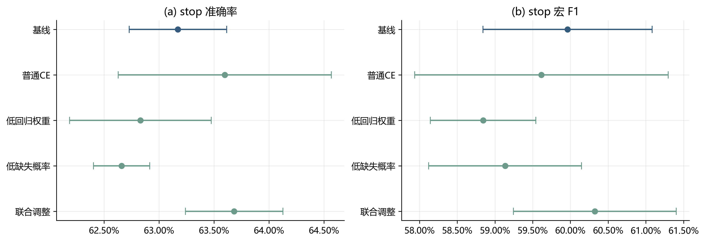
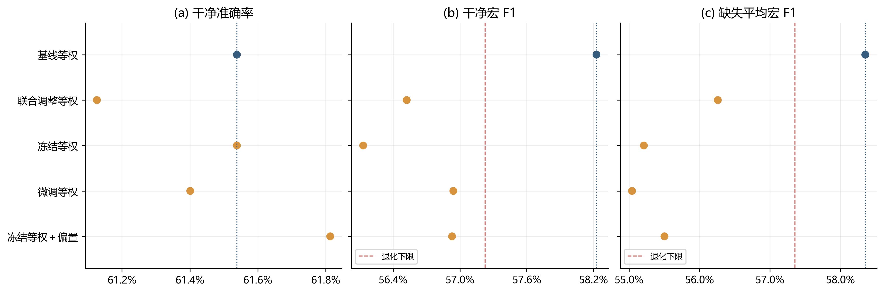
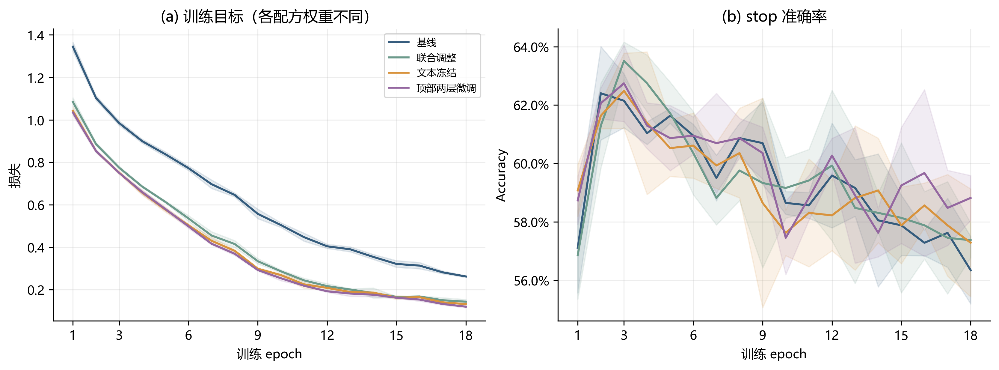
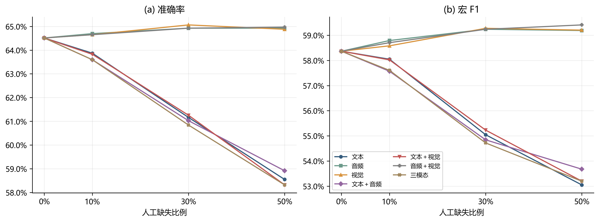
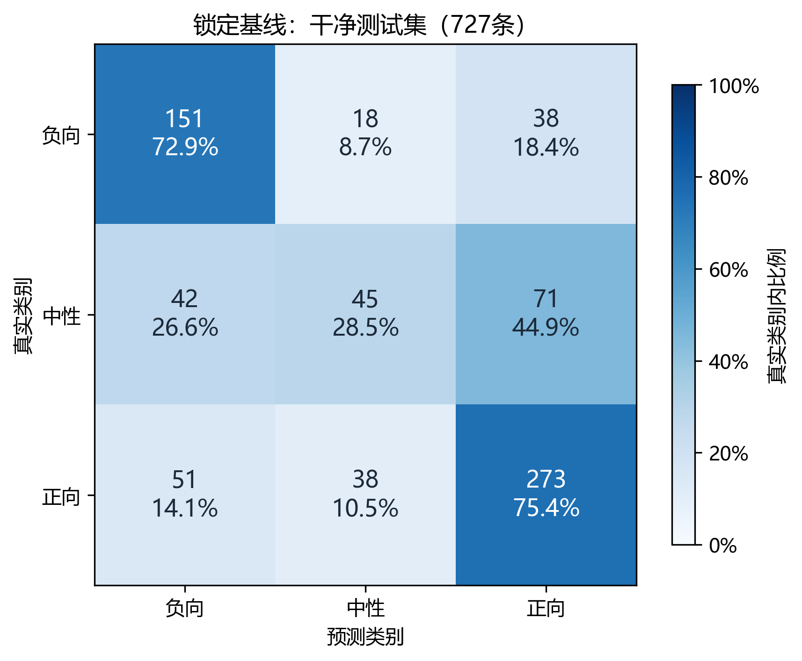

# 第三轮：准确率导向训练与文本局部微调的对照实验

负责人：C。实验完成日期：2026-09-26。状态：**临时论文片段，含实测图表，供A统稿使用**。本文为Markdown编辑源，Word由同源脚本导出；第一、二轮论文保持原样。

**片段摘要。** 针对前两轮参数与集成搜索未稳定提高准确率的问题，本轮将优化对象前移至训练目标和文本表示，在固定视频分组划分下检验类别加权、回归损失权重、缺失增强强度及MiniLM顶部两层微调。共训练21个模型、378个epoch，比较18种单模型、等权集成及偏置校准候选。联合调整在stop上的三种子平均准确率由63.17%升至63.68%，但收益未迁移至valid；文本微调与偏置校准亦未提供满足退化限制的改进。预设规则最终保留本轮三种子基线等权集成，锁定后干净test准确率为64.51%。本轮结果支持训练后期存在明显过拟合，不支持所测试配置带来稳定的准确率提升。

## 1. 研究动机与训练方法

第二轮在固定模型库上优化集成权重，内部验证收益未稳定转化为测试收益。第三轮据此检验三个训练因素：类别加权是否与总体准确率目标存在取舍，较强的回归辅助损失是否干扰分类，以及较高的缺失增强概率是否压低完整输入表现。上述机制是实验假设，不应由单因素名称直接推定其成立。

基础融合网络继续调用B维护的Fusion模型，输入为长度50的对齐序列，文本、音频和视觉维度分别为384、74、35。网络通过带掩码的注意力池化与门控融合，同时输出负向、中性、正向三类概率及[-3,3]范围的强度预测。新增文本缺失先将相应词元替换为[UNK]再编码；音视频缺失保持原序列坐标，掩码同时参与融合，避免先编码后删除造成上下文信息残留。

一个大小为N的批次采用加权交叉熵与SmoothL1联合损失，类别权重由fit集合频数确定；普通CE组将全部类别权重置为1。记样本真实类别为y，真实强度为s，预测强度为r，H为转折点等于1的SmoothL1函数，则：

$$
L=-\frac{\sum_{i=1}^{N}w_{y_i}\log p_{i,y_i}}{\sum_{i=1}^{N}w_{y_i}}+\frac{\lambda}{N}\sum_{i=1}^{N}H(r_i-s_i).
$$

加权组使用类别频数倒数平方根形式，即类别c的权重为fit总样本数除以三倍该类样本数后取平方根。加权CE按批次真实类别权重之和归一化，与实际实现一致。

表C3-1给出五组消融设置。每组使用20262001、20262002、20262003三个种子，各训练18个epoch；Fusion采用AdamW，学习率0.0008，weight decay为0.01，dropout为0.25，batch为64，梯度范数裁剪上限为1。

| 配方 | 分类损失 | 回归权重λ | 期望缺失概率 | stop准确率均值±标准差 |
|---|---|---:|---:|---:|
| baseline | 加权CE | 0.8 | 0.8 | 63.17% ± 0.44个百分点 |
| plain_ce | 普通CE | 0.8 | 0.8 | 63.60% ± 0.97个百分点 |
| low_reg | 加权CE | 0.3 | 0.8 | 62.83% ± 0.64个百分点 |
| low_missing | 加权CE | 0.8 | 0.4 | 62.66% ± 0.26个百分点 |
| combined | 普通CE | 0.3 | 0.4 | 63.68% ± 0.44个百分点 |

训练复用八份固定缺失视图，随机选择模态组合、连续片段位置以及0.1、0.2、0.3、0.5之一的缺失比例。低缺失组采用独立Bernoulli(0.5)保留表，将原视图的一半替换为干净输入，从而保留其余样本原有的缺失片段。实际发生掩码改变的样本—视图比例由78.79%降至39.29%，不将名义抽样概率误写成实际缺失比例。

## 2. 文本微调、集成与校准

根据stop上的三种子平均指标选择训练配方后，以同一配方开展全精度文本冻结与顶部两层微调的配对实验。两组均从本机预训练all-MiniLM-L6-v2初始化，而非沿用已在valid上筛选过的队友权重；使用同三个种子、batch32、18个epoch和相同Fusion学习率。微调组仅更新第5、6层Transformer参数，文本学习率为0.00002；嵌入层及前四层冻结并保持eval模式，Fusion参与训练。

全精度冻结对照用于区分更换编码方式、批大小等条件与实际参数微调的作用。int8训练组和全精度组并非只相差一个微调开关，因此二者差异不能全部归因于微调。全精度冻结与微调两组之间才是本轮针对文本更新的配对比较。审计确认应冻结的权重保持不变，顶部两层权重确有更新。

集成仅使用固定等权，不再搜索连续模型权重。对M个模型的概率p和强度r分别取平均：

$$
\bar p_i=\frac{1}{M}\sum_{m=1}^{M}p_{mi},\qquad \bar r_i=\frac{1}{M}\sum_{m=1}^{M}r_{mi}.
$$

候选包含基线、所选int8配方、全精度冻结和微调的第一种子单模型与三种子等权集成，以及所选int8配方和微调共六模型等权集成。每个候选分别比较无校准与两参数类别偏置校准，共18种。偏置作用于负向、中性两类的对数概率，正向偏置固定为0；每参数在[-0.2,0.2]内以0.05为步长搜索，共81点：

$$
\tilde p_{ic}=\frac{\bar p_{ic}\exp(b_c)}{\sum_{k=0}^{2}\bar p_{ik}\exp(b_k)},\qquad b_2=0.
$$

每折偏置仅在valid其余视频组上拟合，再对留出组预测。校准不改变强度回归输出；准确率相同时优先采用偏置平方范数更小的解，零偏置优先。最终候选按干净Accuracy选取，并以模型数更少、无校准、固定名称顺序依次处理平局。

## 3. 数据划分与评价约束

使用附件2对齐版，保留官方train/valid/test划分。train按原始视频前缀进一步分成fit 3004条与stop 391条；valid为728条，按视频分组三折；test为727条。音视频标准化参数只在fit上估计，fit用于反向传播，stop用于选择epoch和训练配方，valid用于集成与校准选型。视频前缀隔离不等于已经证明主体隔离。

每个模型以干净stop准确率优先选择epoch，同分时依次考虑宏F1、较低MAE和较早epoch。训练配方在三种子stop均值上筛选，最终方法在valid拼接后的留出折预测上筛选。二者均设置同类型退化限制：相对对应阶段基线，干净宏F1及三种缺失条件的平均宏F1各不得下降超过0.01，四条件平均MAE不得增加超过0.02。校准折内拟合也相对自身无偏置预测限制宏F1退化。这里的0.01是绝对1个百分点，不是相对下降1%。

开发面板为干净输入及文本、音频、视觉分别中段30%缺失。锁定后的test面板包含干净输入和7种模态组合×3种比例（10%、30%、50%）×3种位置（起始、中段、末尾），共64条件。缺失宏F1约束只覆盖开发面板，不能保证所有缺失场景均不退化。Macro-F1按固定三类计算，强度采用原始回归头输出，Pearson遇常量预测按0处理并记录。

valid同时用于方法选择，所报告分数属于内部验证；无校准候选的预测本身无需逐折拟合。test已在历史轮次查看，本轮仅在方法锁定后复评，不能称为全新盲测，也不能将本轮基线与历史不同配置成绩的差异解释为单一优化因素的因果效应。

## 4. 实验结果

### 4.1 训练目标调整的收益未迁移

图C3-1显示，联合调整的stop准确率均值比基线高0.51个百分点，宏F1由0.5996升至0.6032，三种缺失条件平均宏F1由0.5817升至0.5880，通过预设筛选。普通CE单独替换的准确率略升，但宏F1略降；单独降低回归权重或缺失增强概率未提高准确率。低回归权重组的干净宏F1下降超过1个百分点，未通过约束。三个种子的标准差仅刻画这三次训练的离散程度，不是显著性检验或总体置信区间。

**图C3-1 五组配方的stop结果。** 点为三个种子的均值，误差线为样本标准差。横轴使用明确的局部比例刻度。各模型均采用其自身stop最优epoch，不能将本图视为独立测试结果。

表C3-2与图C3-2给出主要等权候选的valid表现。联合调整等权集成的准确率为61.13%，低于基线61.54%；干净与缺失宏F1也下降。其stop收益未在valid上保留，说明本轮配方选择尚未获得稳定迁移证据。

| 候选 | valid准确率 | 干净宏F1 | 缺失平均宏F1 | 通过最终约束 |
|---|---:|---:|---:|---|
| 基线三种子等权 | 61.54% | 0.5823 | 0.5836 | 是，最终保留 |
| 联合调整三种子等权 | 61.13% | 0.5652 | 0.5626 | 否 |
| 全精度冻结三种子等权 | 61.54% | 0.5613 | 0.5521 | 否 |
| 顶部两层微调三种子等权 | 61.40% | 0.5694 | 0.5504 | 否 |
| 全精度冻结等权＋偏置 | 61.81% | 0.5693 | 0.5550 | 否 |

**图C3-2 准确率与宏F1的取舍。** 蓝色点为基线，橙色点为候选；竖直点线标记基线，红色虚线标记宏F1允许退化下限。偏置候选使用按视频分组的三折留出预测，未校准候选直接使用固定模型预测。完整18种候选见实验记录。

### 4.2 文本微调与校准未形成可接受改进

顶部两层微调的valid准确率为61.40%，未超过同条件冻结组的61.54%。微调后的干净宏F1较冻结组升高，但缺失平均宏F1略降，且仍未达到本轮基线约束。微调组三个种子的stop最优epoch为16、3、3，提示学习轨迹存在较大差异；这一现象不足以证明某个特定优化机制是失败的唯一原因。

全精度冻结等权加偏置取得61.81%的内部验证准确率，比基线多答对2条，但干净宏F1和缺失平均宏F1分别降低约1.30、2.86个百分点，因超限而未采用。由此可见，仅展示最高准确率会掩盖类别间与缺失条件下的性能取舍。实验最终保留无校准的baseline_mean，未将未入选候选追加到test上择优。

### 4.3 训练曲线呈现过拟合迹象

如图C3-3，基线在各自最优epoch时平均训练损失为1.064、stop准确率为63.17%；训练至18 epoch时，损失降至0.262，而stop准确率降至56.35%。联合调整与全精度冻结组也呈现训练目标持续下降、stop表现未同步改善的趋势。这支持训练后期过拟合的判断，但不能单凭曲线将原因唯一归为文本编码器、模型容量或数据噪声。

**图C3-3 三种子学习曲线。** 实线为逐epoch均值，阴影为均值±样本标准差，不是置信区间。左图不同配方的损失系数不同，绝对损失大小不可直接用于跨配方优劣排序；右图使用同一stop准确率口径。图中各epoch均值的峰值与“各模型自身最优epoch再求平均”不必相等。

本轮已保留stop最优权重，因此简单缩短训练只能减少后续无效计算，不能使已经选出的最优模型再次获得同等幅度的提升。更强正则或分阶段解冻值得另行验证，尚不能写成已经证实的解决方案。

### 4.4 锁定后的缺失复评与类别错误

最终基线在干净test上Accuracy为64.51%、Macro-F1为0.5837、MAE为0.6762、Pearson为0.6380；64条件等权平均Accuracy为62.74%、Macro-F1为0.5697、MAE为0.6995、Pearson为0.6062。场景均值按每个预设条件等权计算，不代表现实缺失事件发生频率。最终候选与本轮参照基线是同一模型组合，不构成两个独立方法的比较，因此不将其零差异或退化为零的bootstrap区间作为优化有效性的统计证据。

**图C3-4 锁定基线的受控缺失复评。** 非零缺失比例处对起始、中段、末尾三种位置取平均；0%共用干净输入值。图中仅展示已锁定基线，不能据此推断未入选微调模型在全部缺失条件下的表现。

**图C3-5 锁定基线的干净test混淆矩阵。** 单元格显示样本数及真实类别内比例，颜色按行归一化；共727条。中性类F1为0.3475，低于负向0.6696和正向0.7339，是本模型值得继续诊断的错误来源，但不据此反向调整本轮决策阈值。

## 5. 讨论与结论

本轮实验没有得到满足准确率、宏F1与回归退化约束的新候选。结果的价值在于缩小有效假设范围：单独减小辅助回归或增强强度不是必然收益；联合调整的stop收益会在valid上消失；本轮顶部两层微调尚未优于同条件冻结对照；小范围偏置校准虽可提高少量样本的准确率，却可能降低宏F1与缺失表现。以上结论仅适用于本轮数据划分、模型、种子和预算，不宜推广为对微调或校准方法的普遍否定。

后续研究可检验先稳定融合头再以更小文本学习率解冻、更强正则及更稳定的分组模型选择，但这些仍是候选假设。现有结果不支持继续增加训练轮数或扩大集成搜索即可解决问题，也不支持本轮保底模型优于历史最强模型。正式提交包未替换，第一、二轮实验保留。

## 6. 复现与统稿说明

本轮固定配置、分组边界与执行修复见[实验方案](../experiments/第三轮准确率优化实验.md)，完整候选与种子结果见[实验记录](../experiments/第三轮准确率优化实验结果.md)。21模型的378个epoch、冻结层不变、微调层更新、折外校准和64条件指标均通过产物审计。训练及stop评估合计约7.14分钟，已记录主阶段约8.53分钟，均不包含开发、依赖修复及独立审计。运行设备为RTX4070 Laptop 8GB，PyTorch 2.7.0+cu128，文本接口为Transformers 4.44.2；预训练权重版本与完整哈希在实验manifest中。

配图由已保存结果生成，参考A已有问题二作图脚本、B问题三图表与第二轮C论文的白底、中文字体、蓝绿橙配色及带行比例的混淆矩阵形式。五图均提供300dpi PNG和SVG，数值与来源哈希见[配图归档](assets/round3/README.md)。图表编号为临时C3编号，由A统稿统一调整；本片段是对既有方法适用性的实验检验，不主张提出新的损失函数、微调算法或校准方法。
