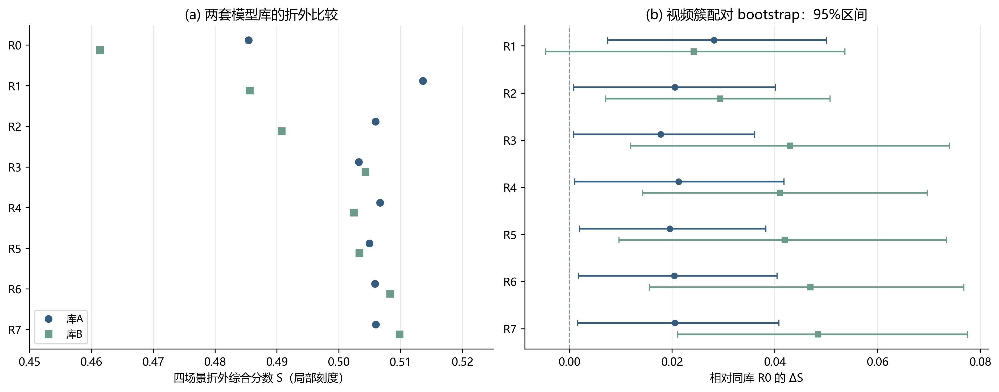
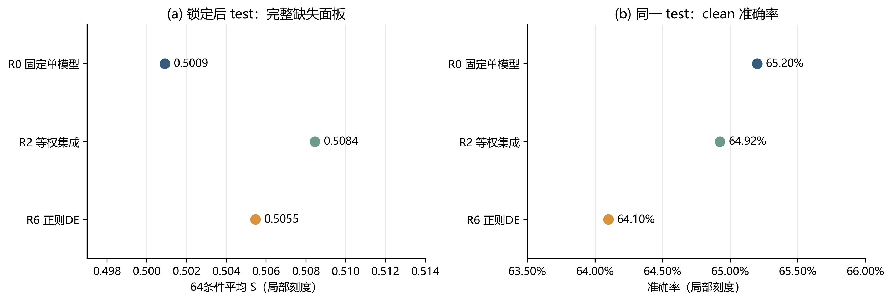
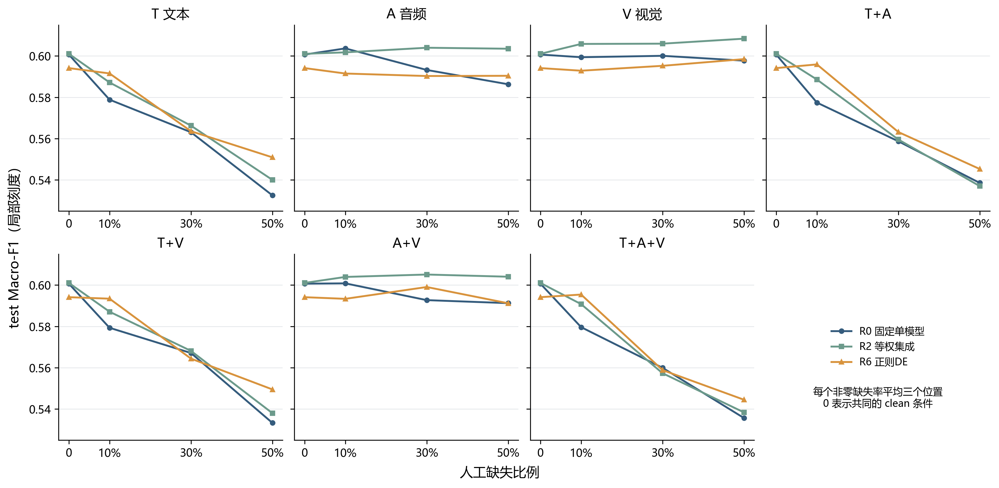
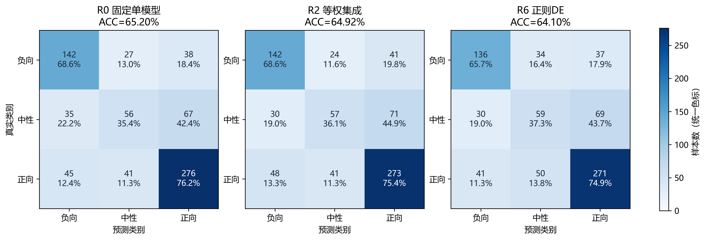
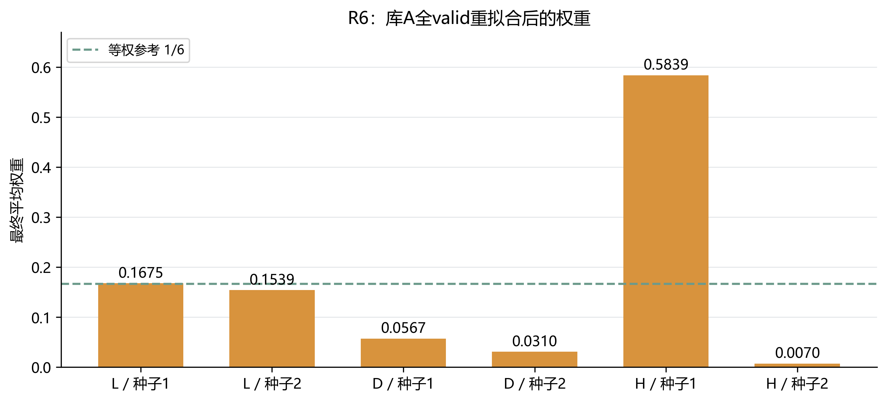

# 第二轮：连续缺失条件下的受约束预测集成实验

负责人：C。实验完成日期：2026-09-26。状态：**临时论文片段，含可直接用于统稿的图表与图注**；尚未合并到A统稿。本文是第二轮的Markdown编辑源，第一轮论文及本轮已锁定实验结果继续保留。

**片段摘要。** 在固定模型库和输入一致性缺失协议下，对等权、贪心、随机搜索、DE及其正则化变体进行等预算比较。两套模型库共训练216轮，集成层执行27000次搜索请求。正则DE按预设内部验证规则获选，但test上未稳定超过等权集成，且clean准确率下降。实验支持普通集成具有收益，尚不支持复杂搜索带来全面泛化提升。

复现、逐类指标、搜索种子波动和统计区间见[完整实验记录](../experiments/第二轮完整优化实验结果.md)；预设规则及实施前修订见[实验设计](../research/2026-09-25_第二轮优化实验设计.md)。本节不是首次提出DE或集成选择，而是在统一输入协议和同请求预算下检验其适用性。

## 1. 动机与方法

第一轮实验中，短训练搜索收益没有稳定转化为完整训练收益，基于代理指标的特征选择也未表现出稳定优势。第二轮将基础模型训练与优化器比较分离：先训练固定模型库，再缓存分类概率和强度预测，在同一模型库上比较集成权重搜索，避免每个候选权重重复训练网络。

基础网络继续复用B的Fusion门控模型，采用384维MiniLM文本、74维声学和35维视觉输入。新增文本缺失先将词元替换为[UNK]，再由冻结的int8 ONNX编码器逐条编码；音视频在原位置施加连续缺失掩码。本轮不更换编码器、融合结构或特征子集，不能将结果与A的768维预计算文本路线直接作优化器因果比较。

每个库包含六个模型，即三个学习率（0.0004、0.0008、0.0016）各配两个训练种子。库A使用20261001/20261002，库B使用20261003/20261004。每个模型固定训练18轮，batch为64，weight decay为0.01，dropout为0.25，回归损失权重为0.8；损失为类别加权交叉熵与SmoothL1之和。共享八组缺失训练视图，缺失概率为0.8。

模型 $m$ 在场景 $s$、样本 $i$ 上的分类概率与回归预测分别为 $p_{msi}$ 和 $r_{msi}$。非负权重满足 $\sum_m w_m=1$，两头使用同一权重：

$$
p_{si}=\sum_{m=1}^{6}w_m p_{msi},\qquad
r_{si}=\sum_{m=1}^{6}w_m r_{msi},\qquad w_m\geq 0.
$$

四个选型场景为完整输入，以及文本、音频、视觉分别中段30%缺失。综合目标为：

$$
S=\frac{1}{4}\sum_{s\in\mathcal S}
\left(\operatorname{MacroF1}_s-0.15\operatorname{MAE}_s+0.05\operatorname{Pearson}_s\right).
$$

S是本项目预设选择指标，不是准确率或官方评分公式。Macro-F1固定按负、中、正三类计算；Pearson遇常量预测回退为0并记录标志。R6最大化`S − 0.01 C(w)`，其中`C(w) = (6Σ_m w_m² − 1)/5`，以轻度惩罚权重过度集中。

$$
J(w)=S(w)-0.01\,C(w),\qquad
C(w)=\frac{6\sum_{m=1}^{6}w_m^2-1}{5}.
$$

## 2. 数据隔离与比较设置

附件2官方train/valid/test分别含3395/728/727条样本。原始片段ID含视频前缀；按视频分组将train划为3004条fit与391条stop，同一视频不跨两区。标准化与类别权重仅在fit拟合，每轮仅在stop四场景按S选择检查点。valid的三折也按视频分组，同一样本的四个场景保持同折。这里的隔离是视频级，不保证主体级隔离。

库A预先指定为最终候选库，库B只检查重复性。对valid，在两折拟合集成层并预测剩余一折，最后拼接全部728条折外预测计算指标。折外结果仍参与方法选型，因此属于内部验证，不是全流程无偏估计。第一轮已经查看test，本轮只能称锁定后复评。

R0为默认学习率的首个种子模型；R1在折内选择单最佳；R2为六模型等权；R3为有放回贪心集成；R4为随机权重搜索；R5为DE；R6为正则DE；R7进一步加入类别偏置。R3—R7每次300次请求，各运行三个优化种子11/23/37，按预测平均，不选最好种子。完整预算为两库×三折×五方法×三种子×300＝27000次请求。

DE采用12个初始点和24代，F=CR=0.5，按上一代快照更新。实施前发现全零偏置初始种群会使R7的偏置坐标无法变化，因此在未训练、未评分前修订为：七个锚点偏置为0，五个随机初始点的偏置在[-0.15,0.15]独立采样，保持共同权重初始化和总预算不变。

## 3. 折外结果与选型

| 方法 | 库A折外S | 库B折外S | 两库平均S |
|---|---:|---:|---:|
| R0 固定默认 | 0.485417 | 0.461390 | 0.473403 |
| R1 选单最佳 | 0.513595 | 0.485611 | 0.499603 |
| R2 等权 | 0.505963 | 0.490777 | 0.498370 |
| R3 贪心 | 0.503244 | 0.504336 | 0.503790 |
| R4 随机 | 0.506674 | 0.502429 | 0.504552 |
| R5 DE | 0.504982 | 0.503343 | 0.504163 |
| R6 正则DE | 0.505861 | 0.508315 | 0.507088 |
| R7 正则DE加偏置 | 0.505994 | 0.509841 | 0.507917 |



**图C2-1 两套模型库的折外表现及相对固定单模型的增益。** 左图为三折拼接728条验证样本后计算的四场景S，点图采用标明的局部刻度；右图为相对各库R0的ΔS及2000次视频簇配对bootstrap的95%百分位区间。圆点/蓝色代表库A，方点/绿色代表库B。区间不覆盖重新训练、搜索与方法选型的不确定性。数据源：已保存的`crossfit_summary.json`和`bootstrap.json`。

等权集成相对固定单模型在两库均改善。普通DE的平均S略低于随机搜索，且没有在两个库同时超过贪心，因此本轮不支持“DE本身优于简单搜索”的结论。R6相对R5在两库的增益分别为0.000879和0.004972，平均约0.002925，支持正则化可能有益的初步观察，但增益有限。

R7与R6的平均S差约0.000829，位于预设0.002平局范围内。按折外解的实际非零模型数均值优先规则（R6为5.5，R7为6），锁定R6，再仅在库A全部valid上重拟合集成层。这个折外复杂度比较不等于最终推理模型数：最终R6平均权重均非零，仍需六个基模型。

按视频簇进行2000次配对bootstrap，R6相对R0的ΔS的95%百分位区间，库A为[0.001818,0.040434]，库B为[0.015596,0.076847]。这些区间只描述固定折外预测的样本不确定性，不覆盖重新训练、搜索和方法选择，不能据此宣称全流程统计显著优势。

## 4. 锁定后复评与局限

下面的64条件为clean加七种非空模态组合、三个缺失率、三个位置。raw回归为主报告，coherent解码作为固定附表，均未用于重新选择方法。

| test方法 | 64条件平均S(raw) | clean ACC | clean Macro-F1 | clean MAE |
|---|---:|---:|---:|---:|
| R0 | 0.500909 | 0.651994 | 0.600701 | 0.667568 |
| R2 | 0.508448 | 0.649243 | 0.601057 | 0.662937 |
| R6 | 0.505467 | 0.640990 | 0.594152 | 0.668903 |



**图C2-2 锁定后test复评的收益与退化。** 左图为64个条件等权平均的raw S，右图为同一727条test样本在clean条件下的准确率。两者是不同统计口径，分别绘制；点图局部刻度已标明。固定单模型、等权集成和正则DE统一使用蓝、绿、橙。R6并未在这两个指标上超过R2。数据源：`test_grid.json`，没有据此重选方法。

R6相对R0的64条件平均S增加0.004558，但低于等权集成R2；clean ACC从65.20%下降到64.10%，Macro-F1也下降。内部验证收益未形成对简单集成的稳定复评优势，不能写为全面性能提升。可能原因包括集成权重对有限valid的适配、基模型误差相关性和场景权衡，但本轮没有因果消融证实这些解释。没有依据test改选R2或重新调整R6。

### 4.1 缺失组合与比例的影响



**图C2-3 七种模态组合下的缺失比例与Macro-F1。** T、A、V分别表示文本、音频、视觉；非零比例处的点为start/middle/end三个位置的Macro-F1算术平均，曲线连接预设离散条件，未平滑或插值补造观测。比例0为各方法共同重复展示的clean条件，不是额外七组样本。七个面板使用相同纵轴范围；不将三个位置当作随机种子或置信区间。数据源：完整63种缺失条件的已保存test结果。

涉及文本的较大比例缺失通常伴随更明显的性能下降。在本次50%文本相关缺失的四个组合中，R6的平均Macro-F1均高于R0/R2；但音频或视觉单独缺失时并无统一优势，且部分条件的分数高于clean。此处只描述固定条件下的观察，不能推断缺失天然有益，也不能据此修改选型目标。局部鲁棒收益与整体复评排序并不等价。

### 4.2 类别错误的变化



**图C2-4 clean test的分类错误对照。** 行为真实类别、列为预测类别；每格上行为样本数，下行为该真实类别内部的行百分比。三幅图均含相同727条样本并共享色标。图中计数从锁定后保存的逐样本概率取argmax重新汇总，准确率与原实验表一致；绘图没有重新执行模型推理。

R6相对R0将中性正确数从56提高到59，但负向正确数由142降到136、正向由276降到271，合计少判对8条。中性召回的小幅改善未抵消其他类别损失，也不能等同于中性F1改善。这使clean准确率下降的来源能够定位到类别层面，仍不构成对训练原因的因果解释。

本轮说明，将训练与预测层搜索分离后，可以低成本完成有对照的优化器比较；但搜索更充分并不保证泛化收益。对本数据与模型库而言，普通集成收益较清晰，复杂搜索相对简单集成的附加收益仍不稳定。

## 5. 成本与复现



**图C2-5 锁定R6在库A全部valid重拟合后的平均权重。** L/D/H学习率分别为0.0004/0.0008/0.0016，种子1/2分别为20261001/20261002。柱高为三个优化种子得到的权重平均；R6没有类别偏置，因此等价于平均其预测。虚线为六模型等权的1/6参考线。权重表示基模型的集成系数，不是文本/音频/视觉的模态贡献。

H族种子1模型权重约0.5839，而最小权重仍约0.0070，六个基模型全部保留。正则化没有强制等权，也没有实现模型剪枝；不能把权重集中程度的下降等同于推理加速。

RTX 4070 Laptop GPU、myenv环境下，12模型建库阶段约330秒，完整27000次搜索约12秒。成功主流程约16.8分钟，其中数据准备约398秒、64场景复评约255秒；不包含开发、准备重试及后续bootstrap归档，不能把16.8分钟称为本次全部工作耗时。

入口为`C/scripts/run_q2_round2.py`，输出为`C/outputs/q2_round2_ensemble_v1/`。数值检查与真实产物审计均已通过；审计核对345个产物、216轮、27000次请求、视频分组隔离，并从保存的搜索解重建折外预测，在1e-12容差内一致。详见[启动与恢复指南](../experiments/第二轮优化实验启动指南.md)。本次未覆盖第一轮论文或正式提交包。

## 6. 临时图表交付说明（统稿时可移至附录）

图号C2-1—C2-5为本片段临时编号，A统稿时统一调整。配图参考A的问题二对比图、权重图和中文混淆矩阵，以及B的问题三对照图配色、统一色标与行百分比标注；章节采用队友已有的“模型—求解—结果分析—复现”顺序。借鉴的是表达形式，不混用队友的实验分数。

全部图片已存为300 dpi PNG与可编辑排版的矢量SVG，位于[配图与数据目录](assets/round2/README.md)。同目录保留`plot_data.json`、`plot_values.csv`及来源/渲染哈希；不依赖被忽略的临时outputs才能查看或重新绘图。已有实验权重、预测和选择锁定文件保持原状。复现命令：

```powershell
& 'C:/Users/ken/miniconda3/envs/myenv/python.exe' C/scripts/plot_q2_round2_paper.py
```

上述命令默认从已归档的汇总数据绘图；首次生成时核验原运行文件哈希。只有明确需要重新提取原运行快照时才加`--snapshot`，该参数也不会训练、搜索或重新推理test。作图风格参考路径和源文件哈希见`source_manifest.json`。
