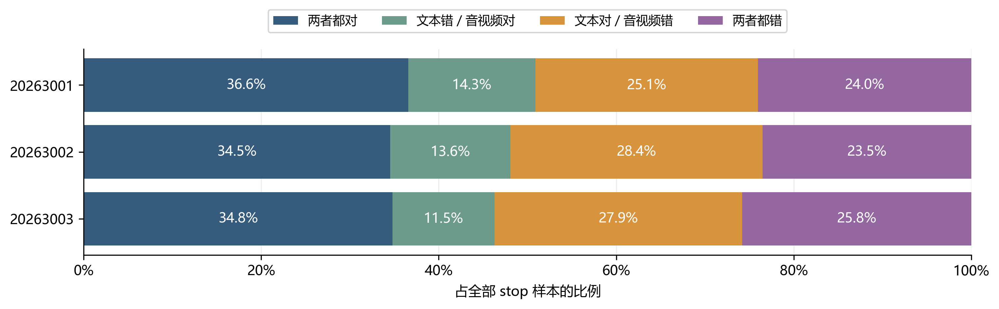
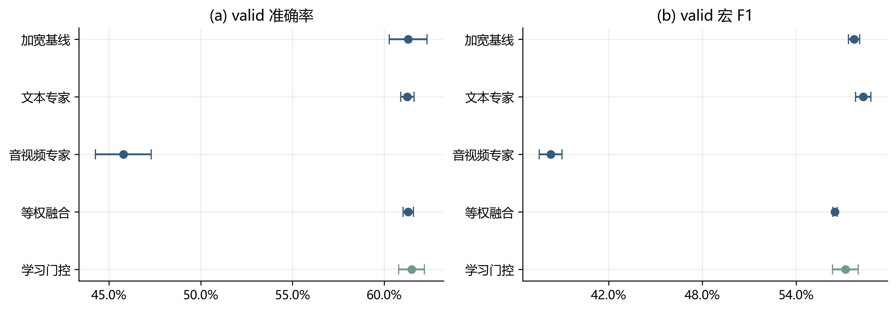
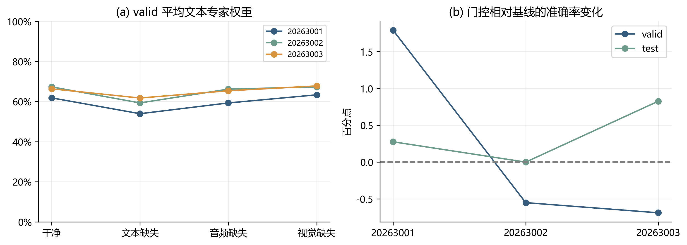
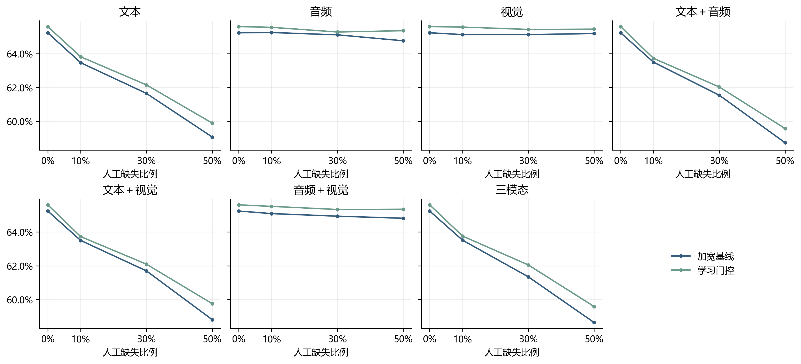
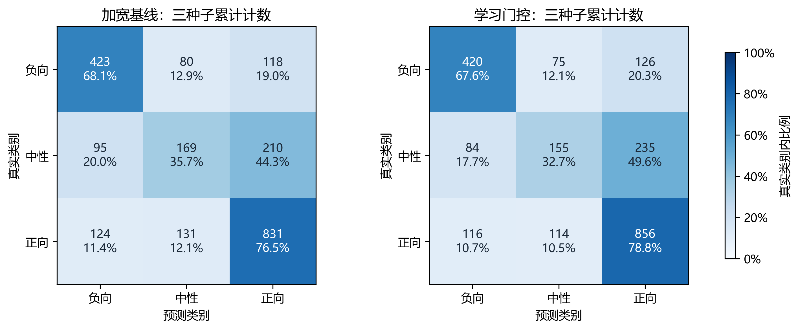

# 第五轮优化：独立专家与缺失感知决策融合

本片段对应问题2第五轮实验，供A合并正文。Markdown为编辑源，Word为导出版。实验已完成新增21个专家模型、378个epoch、3个学习门控及64条件复评，并通过产物审计和断点恢复检查。所有汇总指标为三个种子分别运行预测流程后的指标均值，不跨种子集成；以下test均指历史测试集的锁定后复评。

## 1 研究动机与实验假设

第四轮中，仅文本模型的valid准确率为61.26%，加宽三模态基线为61.31%，两者接近，池化前序列交互也未胜出。这提示当前模型尚未稳定利用音视频的增量信息，但不能据此断言音视频信息无用。本轮将文本与音视频分开训练，先检查两类专家的错误是否互补，再检验一个小型决策融合器能否识别适合采用音视频判断的样本。

保留第四轮隐藏维度91的Fusion作为固定对照，复用其三个种子的权重和预测，同时复用第四轮文本专家。新增音视频专家只接收音频、视觉特征及对应掩码，避免在训练中依赖文本。若预先约定的互补诊断阈值未达到，则转向文本表示实验；本轮实测达到阈值，因而执行决策融合分支，没有运行更换编码器实验。

## 2 方法与数据隔离

### 2.1 独立专家与可用性门控

文本专家以384维MiniLM特征为输入，投影至64维并进行掩码注意力池化，参数量为41925。音视频专家将74维音频与35维视觉分别投影至64维，独立池化后拼接摘要及两路可用率，经128→64预测头输出三分类概率和范围为[−3,3]的强度，参数量为33030。两种专家使用相同的加权交叉熵与0.8倍SmoothL1联合目标。

融合器输入为两专家的三分类概率（6维）、除以3的预测强度（2维）、预测熵（2维）及三模态剩余有效位置比例（3维），共13维。可用率以当前有效位置数除以该样本干净有效位置数，干净分母为零时记零。13→8→2网络使用tanh中间激活，共130个参数，末层零初始化。令zᵢₑ为门控输出，mᵢₑ表示专家是否可用，e取文本T或音视频AV，则至少一路可用时：

$$
g_{ie}=\frac{m_{ie}\exp(z_{ie})}{\sum_{k\in\{T,AV\}}m_{ik}\exp(z_{ik})}.
$$

文本至少一个有效位置时文本专家可用，音频或视觉至少一路存在有效位置时音视频专家可用。不可用专家的概率先替换为均匀分布、强度置零，其门控权重严格为零。两路均不可用时直接返回均匀分类概率与强度零，不执行上述零分母归一化。对可用专家的概率与回归输出进行加权组合：

$$
p_i=\sum_{e\in\{T,AV\}}g_{ie}p_{ie},\qquad r_i=\sum_{e\in\{T,AV\}}g_{ie}r_{ie}.
$$

等权融合采用相同的可用性屏蔽规则，将可用专家权重设为相等，作为学习门控的直接对照。门控权重是预测组合系数，不是模态因果贡献，也不保证与缺失比例单调对应。

### 2.2 按原视频分组的折外训练

延续官方train 3395条中的fit 3004条和stop 391条划分，valid为728条，test为727条。归一化仅由相应训练部分拟合。对fit按原视频进行三折StratifiedGroupKFold，种子为20265000，三个留出折分别为1033、1003、968条。每折只使用其余两折训练文本、音视频专家，类别权重及音视频归一化也只由这两折计算。外部stop用于选择该折专家的epoch；留出fit标签不参与专家训练、归一化或epoch选择。该分组不能称为受试者独立划分。

每个fit样本仅由未见过其原视频组的专家生成折外预测。每种子需训练六个折内专家，三种子共18个；再加完整fit训练的三个音视频专家，共新增21个专家模型。冻结文本编码器和已缓存的缺失视图可复用，但严格按原fit行号索引。推理时，门控接收完整fit训练的专家输出，不是折内专家集成。

门控训练面板包含干净条件、8个既有局部缺失视图、整路文本缺失及整路音视频缺失，共11种。设aₛ为面板权重，w为fit类别频率逆平方根权重，yᵢ和sᵢ分别为真实类别和强度，H₁为SmoothL1，则门控目标为：

$$
L=\sum_{s=1}^{11}a_s\left[-\frac{\sum_{i=1}^{N}w_{y_i}\log p_{si,y_i}}{\sum_{i=1}^{N}w_{y_i}}+\frac{0.8}{N}\sum_{i=1}^{N}H_1(r_{si}-s_i)\right].
$$

干净条件权重为0.5，8个局部缺失视图各0.03125，两种整路缺失各0.125。每个门控固定训练200个全批步骤，使用AdamW，学习率及权重衰减均为0.01，不在valid上搜索门控超参数或类别偏置。门控学习使用全部fit的折外预测及标签，不反向更新专家。

## 3 训练设置与互补诊断

专家沿用第四轮配置：18个epoch、AdamW学习率0.0008、权重衰减0.01、batch size 64、预测头dropout 0.25、梯度范数裁剪1。随机种子为20263001、20263002、20263003。训练复用缺失施加概率0.8的八个缓存视图；文本新增缺失在编码器输入端替换为UNK，再编码，保持与此前实验的缺失口径一致。专家按干净stop准确率选择epoch，同分依次比较宏F1、较低MAE，仍同分保留更早epoch。

进入融合分支的预定条件是：干净stop中“文本错、音视频对”占全部样本的比例，三种子平均至少5%，且至少两个种子达到3%。该阈值为工程筛选规则，不是统计显著性标准。实际三个种子分别为14.32%、13.55%、11.51%，平均13.13%，因此进入融合分支。

**图C5-1 干净stop上的专家错误分解。** 每行对应一个种子，四类情况互斥且合计100%。文本正确而音视频错误的比例也较高，不能只报告音视频能够纠正的样本。

音视频专家单独的stop准确率为50.90%、48.08%、46.29%，低于文本专家的61.64%、62.92%、62.66%。若利用真实标签选择正确专家，诊断上限为75.96%、76.47%、74.17%；这些数值不能部署，也不是本方法准确率。stop已用于选择专家epoch，因此该诊断同样不是独立泛化评估。

## 4 内部验证与门控行为

选型使用valid干净条件，以及文本、音频、视觉各30%中段缺失，共四条件。相对加宽基线，干净宏F1和三种缺失平均宏F1允许最多下降0.01，四条件平均MAE允许最多增加0.02；通过约束后按干净准确率三种子均值选择，同分优先保留基线。表C5-1中的SD为三个种子的样本标准差，不是置信区间。

| 候选 | 准确率±SD | 干净宏F1 | 缺失宏F1 | 通过约束 |
|---|---:|---:|---:|---|
| 加宽基线 | 61.31%±1.03% | 0.5772 | 0.5714 | 是 |
| 文本专家 | 61.26%±0.36% | 0.5830 | 0.5746 | 是 |
| 音视频专家 | 45.79%±1.52% | 0.3829 | 0.3806 | 否 |
| 等权融合 | 61.31%±0.29% | 0.5649 | 0.5573 | 否 |
| 学习门控 | 61.49%±0.70% | 0.5716 | 0.5623 | 是 |

**图C5-2 valid候选比较。** 点为三种子均值，误差线为±1个样本SD。学习门控按准确率规则获选，但宏F1未超过加宽基线。

学习门控相对基线提高约0.18个百分点，跨三种子的正确预测总数仅增加4次；对应逐种子变化为+1.79、−0.55、−0.69个百分点，增益不具备种子间一致性。等权融合虽与基线准确率相同，但干净和缺失宏F1及平均MAE均未满足约束，说明直接平均会引入不可忽略的退化。

**图C5-3 门控权重与种子波动。** 左图为各种子在四个valid条件下的平均文本专家权重；右图为学习门控相对加宽基线的干净准确率变化。非干净条件均为对应单模态30%中段缺失。跨模型使用同种子编号不意味着参数初始化相同。

干净valid上的平均文本权重分别约为0.618、0.673、0.663，文本缺失时下降至0.539、0.593、0.617。该现象说明门控会随输入条件调整组合，但平均权重不能证明样本级路由总是正确，也不能替代误差与泛化评估。

## 5 锁定后的测试复评

在valid选型后锁定学习门控，仅比较该流程与加宽基线。复评面板包含干净条件，以及七种模态组合、10%/30%/50%三档缺失比例、起始/中段/末尾三个位置，共64条件。表C5-2按单种子、单条件计算指标后取均值；64条件为等权平均，不表示真实缺失分布下的期望性能。

| 指标 | 加宽基线 | 学习门控 | 变化 |
|---|---:|---:|---:|
| 干净准确率 | 65.25%±0.48% | 65.61%±0.71% | +0.37个百分点 |
| 干净宏F1 | 0.6014 | 0.5989 | −0.0024 |
| 干净MAE | 0.6747 | 0.6747 | 约持平 |
| 64条件平均准确率 | 62.94% | 63.42% | +0.48个百分点 |
| 64条件平均宏F1 | 0.5768 | 0.5754 | −0.0014 |
| 64条件平均MAE | 0.7005 | 0.6984 | −0.0021 |

表中变化按未四舍五入的原始值计算。干净test逐种子准确率增益为+0.28、0.00、+0.83个百分点，跨三个种子的正确预测总数增加8次。64条件准确率为55胜、2平、7负；条件共享同一批样本且高度相关，不能将其作为64次独立实验解释统计显著性。本轮未计算覆盖训练和选型不确定性的置信区间。

**图C5-4 连续缺失条件下的准确率。** 非零缺失比例处平均三个位置和三个种子的指标。0%均为同一干净条件，仅作曲线参照，64条件汇总时只计一次。各子图统一纵轴，差异较小处不据视觉重合判断完全相等。

**图C5-5 干净test累计混淆矩阵。** 每幅图汇总三个种子对同一727条样本的预测，共2181次计数，并显示行内比例；并非2181条独立样本，也不是跨种子集成。表中宏F1为各模型指标均值，不能由累计矩阵直接重算替代。

学习门控的负向和正向F1从0.6698、0.7403升至0.6765、0.7433，中性F1则从0.3941降至0.3770。这解释了准确率上升而宏F1略降的现象：收益未均匀覆盖各类别。开发面板的宏F1容忍度不是对中性类别的单独保护，也不保证所有缺失条件均有改善。

## 6 结论、成本与局限

本轮实验证明当前文本与音视频专家具有一定错误互补性；学习门控在预定选型规则下获选，历史test干净准确率和64条件平均准确率分别提高约0.37和0.48个百分点。然而，valid增益较小且种子间不一致，中性识别和宏F1有所下降，因此只能表述为本设置下的小幅准确率改善，不能称为全面突破或稳定显著提升。

折外训练避免了专家在自身训练样本上的预测直接成为门控训练输入，但折内专家与完整fit专家仍有分布差异。只有三个随机种子，且valid/test经历多轮使用，进一步限制了泛化结论。新增音视频专家与门控总参数为33160，推理时加上文本专家共75085个任务网络参数；此计数不含两种流程共用的文本编码器，参数量更小也不等于已验证推理时延优势。

本轮完整fit音视频专家训练与stop评估耗时1.77分钟，折内专家训练、stop评估及折外预测7.91分钟，三个门控训练合计4.09秒，选型3.21秒，64条件复评3.68分钟，均不包含开发与论文整理时间。未增加外部情感训练数据，未用专项附件3/4调参，未替换正式提交模型。

## 7 复现与合并说明

固定设置见[第五轮实验方案](../experiments/第五轮独立专家与决策融合实验方案.md)，完整指标见[实验结果](../experiments/第五轮独立专家与决策融合实验结果.md)，小型签名与审计文件见[实验归档](../experiments/assets/round5/README.md)。训练及选型入口为[C/scripts/run_q2_round5.py](../../../C/scripts/run_q2_round5.py)，原始模型和预测保存在[C/outputs/q2_round5_experts_v1](../../../C/outputs/q2_round5_experts_v1)。

五幅图提供300 dpi PNG与SVG，绘图快照、输入哈希和导出方式见[配图资产说明](assets/round5/README.md)。绘图参考A/B已有论文的中文字体、蓝绿配色及混淆矩阵表达，并延续前几轮格式。本次整理仅使用已保存结果，没有重训练、推理或再次选型。合并时可统一编号，应保留折外训练、独立种子均值、类别退化及历史测试复评的限定。
