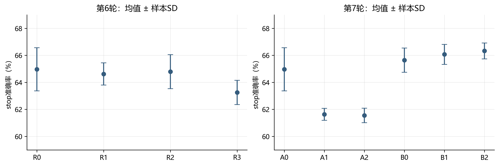
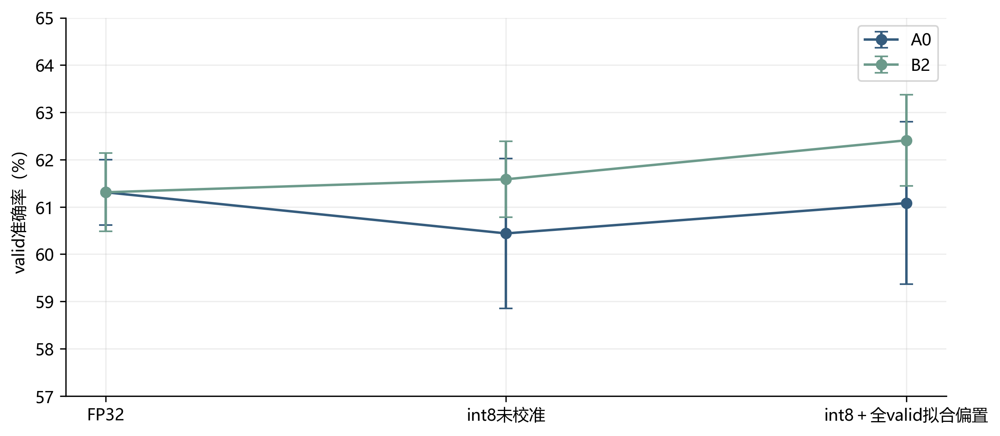
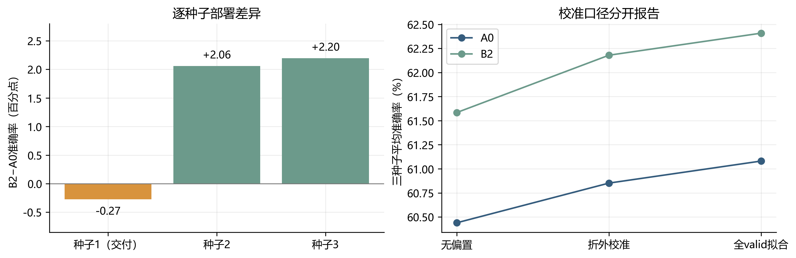
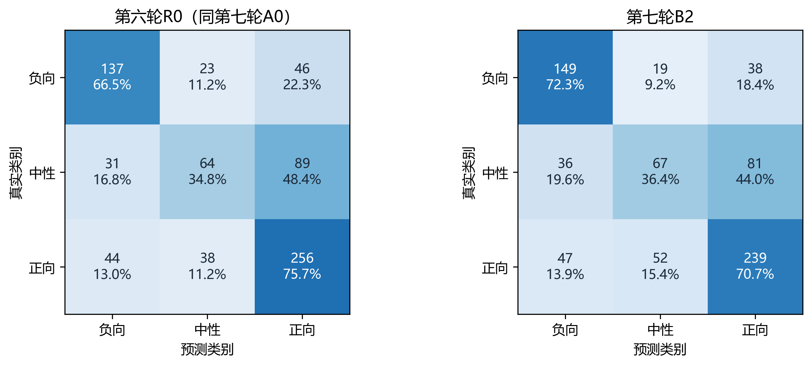

# 第六、七轮优化局限与失败经验分析

本文对应问题2模型优化及问题3部署衔接，供A统稿。Markdown为正文编辑源，Word为导出版。所谓“失败”特指未获得可直接替换既有交付单模型的准确率收益，不表示全部指标或工程工作无效。文中stop为训练集内部开发子集，valid为官方验证集；两轮均未读取test进行评估或选型。

## 1 研究动机与评价边界

前期实验中，参数搜索、集成权重调整和独立专家融合未获得稳定的准确率改善。为进一步检验模型容量与融合表征是否构成瓶颈，第六轮扩大融合宽度和文本编码器更新范围，第七轮引入类别均衡采样、监督对比学习与分类前的时序交互。两轮均在线运行MiniLM编码器，而非仅训练冻结文本特征上的小型任务头。

附件2的3395条train按原视频分组划为fit3004条和stop391条，避免同一原视频跨越两个子集。开发阶段选择结构与各自种子的最佳epoch，随后从通用预训练权重重新初始化，在全部train上重训；valid728条用于锁定模型的报告及单独声明的后处理校准。标准化与类别权重仅由当前训练部分估计，附件4的20条无标签样本仅用于第三问预测和解释。

随机种子固定为20267001、20267002和20267003，交付种子预先固定为20267001。三种子指标为分别运行模型后的均值，不是跨种子集成。stop和valid在历史研究中均已使用，因此本节只讨论内部验证证据，不将其称为独立盲测；第五轮的历史test准确率也不与本节valid直接排名。

## 2 方法与受控实验

### 2.1 端到端容量和更新范围

共同输入为长度50的在线文本序列、74维音频和35维视觉，MiniLM输出文本隐藏维度384。采用AdamW、batch32、权重衰减0.01、梯度裁剪1、缺失施加概率0.3，各组开发预算为10epoch。基本目标为逆平方根类别频率加权交叉熵与0.8倍SmoothL1回归损失。文本新增缺失在编码前替换为UNK，并在融合池化时更新有效掩码。

第六轮R0为顶部两层微调和64维Fusion；R1将Fusion加宽至192维；R2进一步更新全部六层及嵌入；R3冻结文本编码器。融合学习率为2×10⁻⁴，顶部两层为2×10⁻⁵；R2底部四层与嵌入分别采用5×10⁻⁶和10⁻⁶。因此R2检验的是扩大更新范围及固定分层学习率的组合，不是对参数量的纯单因素检验。

### 2.2 类别监督对比学习

第七轮A0复用R0结构与自然采样；A1改为类别均衡批次；A2在A1基础上增加训练期64维投影头及监督对比损失：

$$
L=L_{CE,w}+0.8L_{reg}+0.05L_{SupCon}.
$$

均衡批次按三类10/11/11条轮换额外名额，每epoch总抽样量与更新次数保持不变；类别权重仍由原始fit分布确定。同类且来自不同原视频的样本作为正对，不同类且不同原视频的样本作为负对；同视频样本从比较集合排除。对L2归一化投影计算温度0.1的对比目标，对每个有效锚点平均其所有正对的负对数相似度概率，无正对的锚点跳过。A2同时改变了表示监督与训练期投影分支，不是完整复现SFTTR[1]。投影头在部署时移除，已验证移除前后的预测完全一致。

类别均衡和原有类别加权可能共同放大少数类影响，因此A1是必要对照。中性也不一定形成单一紧凑簇，不能先验认定聚拢同类表示必然改善泛化。

### 2.3 分类前的时序交互

受动态主要模态选择方法[2]启发，第七轮B组将三模态分别投影至64维，保留原始位置并加入位置及模态标识。三个分支分别以文本、音频、视觉为查询，以其他两路有效序列为键值，执行共享参数的一层四头交叉注意力、残差、归一化及前馈变换，再做有效位置均值池化，得到hₜ、hₐ和hᵥ。

$$
h=\sum_{m\in\{T,A,V\}}w_mh_m,\qquad \sum_m w_m=1.
$$

上式限至少一路模态可用时成立。B0固定采用文本分支，文本全空时对其余有效分支等权；B1对有效分支等权；B2以195→32→3网络产生可微softmax权重，屏蔽不可用分支。全部模态为空时权重和融合表示为零，输出有限模型先验。无有效键值时交叉注意力增量置零，不让padding参与证据聚合。

B组仍采用A0采样和原任务损失，没有叠加对比学习。其交互发生在分类概率形成之前，区别于第五轮在专家最终概率上的融合。本实现没有采用MODS的图胶囊压缩或500位置未对齐输入，故只称受其启发的结构改造。B2总参数约2279万，与A0基本相当；它不是依靠进一步增大整体容量取得候选资格。

## 3 开发阶段：有局部收益，但并非机制已获证明

每种子按干净stop准确率选择epoch，同分依次比较Macro-F1和较低一致性强度MAE。候选晋级要求平均ACC增加至少0.5个百分点且至少两个配对种子改善；同时限制干净Macro-F1、中性F1、三个缺失条件平均Macro-F1分别最多下降0.005、0.02、0.01，四条件平均MAE最多增加0.02。这些阈值是工程筛选条件，不是统计显著性检验。

表C67-1 第六轮stop三种子均值。

| 组别 | 更新范围／Fusion宽度 | ACC（%） | Macro-F1 | 中性F1 |
|---|---|---:|---:|---:|
| R0 | 顶部两层／64 | 64.96 | 0.6227 | 0.4667 |
| R1 | 顶部两层／192 | 64.62 | 0.6204 | 0.4766 |
| R2 | 全六层及嵌入／192 | 64.79 | 0.6152 | 0.4384 |
| R3 | 全冻结／192 | 63.26 | 0.6079 | 0.4759 |

扩大融合宽度及编码器更新范围均未通过晋级条件，故第六轮保留R0。结果不支持在当前配置、数据量与预算下继续单纯扩容，也不等于证明更大编码器或其他训练预算普遍无效。

表C67-2 第七轮stop三种子均值。

| 组别 | 改动 | ACC（%） | Macro-F1 | 中性F1 |
|---|---|---:|---:|---:|
| A0 | 原Fusion，自然采样 | 64.96 | 0.6227 | 0.4667 |
| A1 | 均衡采样 | 61.64 | 0.6065 | 0.4683 |
| A2 | 均衡采样＋对比学习 | 61.55 | 0.6056 | 0.4727 |
| B0 | 时序交互，固定文本 | 65.64 | 0.6374 | 0.5076 |
| B1 | 时序交互，等权汇总 | 66.07 | 0.6349 | 0.4908 |
| B2 | 时序交互，动态汇总 | 66.33 | 0.6422 | 0.5184 |

**图C67-1 两轮开发子集准确率。** 点为三个训练种子的均值，误差线为样本标准差，非置信区间。两图共用纵轴范围；不同轮次相同基线的重复训练不是新增独立方法证据。

A1、A2较A0均下降约3.3—3.4个百分点；A2对A1亦无稳定增益。因此没有执行“对比学习＋时序融合”的组合分支。这只能否定本次均衡采样及固定对比配置，不能外推为所有对比学习均无效。

B2相对A0提高1.36个百分点，中性F1由0.4667升至0.5184，按预设规则入选。但B2相对B1仅提高约0.26个百分点，且未同时通过相对B0/B1的机制验证门槛。结果支持时序融合候选在当前开发子集上的价值，不足以将收益主要归因于动态选择器。

## 4 完整重训与部署：局部改善未形成更好的固定交付模型

第六轮完成12个开发模型与3个完整train模型，共138epoch；第七轮完成18个开发模型与6个完整train模型，共218epoch。两轮训练及内部评估分别约7.96、15.98分钟，不包含开发、导出和解释时间。第七轮完整重训A0与B2，轮数由各自stop最优epoch确定，未依据valid重选轮数或种子。

表C67-3 官方valid准确率的不同计算口径。

| 口径 | 第六轮R0 | 第七轮A0 | 第七轮B2 |
|---|---:|---:|---:|
| FP32三种子均值 | 61.3095% | 61.3095% | 61.3095% |
| int8未校准三种子均值 | 60.4396% | 60.4396% | 61.5842% |
| 分组校准折外三种子均值 | 60.7601% | 60.8516% | 62.1795% |
| 全valid拟合偏置后三种子均值 | 61.0806% | 61.0806% | 62.4084% |
| 固定交付种子，int8＋校准 | 62.7747% | 62.7747% | 62.5000% |

第六轮R0与第七轮A0的FP32及未校准结果一致，但两轮校准分折随机种子分别为20267000和20267010，折外校准指标不同，不能将此差异归因于模型变化。校准采用25点类别偏置候选、三种子共享偏置和按原视频分组的五折检查。折外结果仅评价偏置步骤；全valid拟合值使用了该集标签，不是无偏的泛化估计。

**图C67-2 第七轮FP32、int8及校准后的valid准确率。** 每点是三种子均值，误差线为样本SD。横轴表示不同推理处理阶段，不是训练epoch；全valid拟合偏置的结果单独标明。

B2在stop上的提升没有转化为FP32的平均valid准确率提升。量化后，A0平均下降约0.87个百分点，而B2平均增加约0.27个百分点；校准后B2较A0高1.33个百分点。导出审计在每个模型的12条固定样本、四个条件上比较PyTorch FP32和ONNX FP32，概率最大绝对误差低于1.4×10⁻⁶，支持已核查路径的一致性。该检查不证明量化收益稳定，也不将量化扰动带来的分类变化解释为表示能力必然增强。

**图C67-3 配对种子差异与校准口径。** 左图比较第七轮最终校准后的B2与A0；右图分开呈现未校准、折外校准与全valid拟合指标。第一个种子在评估前固定用于交付。

B2三个种子的部署准确率变化分别为−0.27、+2.06、+2.20个百分点，平均指标及配套护栏通过预设晋级条件。但是，固定交付种子由457/728降为455/728。故保守保留既有单模型交付，不临时改挑其他种子。这是针对实际交付对象的保守决策，不能倒称B2未通过预设的三种子平均门槛。

表C67-4 固定交付种子的valid表现，均采用int8和各自最终偏置。

| 指标 | 第六轮R0／第七轮A0 | 第七轮B2 |
|---|---:|---:|
| ACC | 62.7747% | 62.5000% |
| Macro-F1 | 0.5907 | 0.5944 |
| 中性Precision | 0.5120 | 0.4855 |
| 中性Recall | 0.3478 | 0.3641 |
| 中性F1 | 0.4142 | 0.4161 |
| 一致性强度MAE | 0.5902 | 0.6184 |
| Pearson | 0.6463 | 0.6442 |

**图C67-4 两个固定交付模型的valid混淆矩阵。** 每格为样本数及真实类别内比例，两图使用统一色阶。第六轮R0与第七轮A0具有相同最终预测，因此共用左图。

B2中性正确数由64升至67，但precision下降，F1仅小幅变化，同时强度MAE变差。仅观察中性召回或Macro-F1会遗漏这些代价。“关注中性类”应落实为完整混淆结构与多指标约束，而非将提高中性预测频率视为问题已解决。

## 5 失败经验与可支持的解释

首先，开发子集上的最优结构不保证在全train重训后保持优势。两轮均使用内部stop选epoch、全train重新初始化的流程，训练样本规模和标准化统计随阶段变化，而模型排序又来自较小开发子集。B2的开发优势未迁移是实测现象；“过拟合stop”“重训轮数不适合全train”“分布差异”均是可能解释，现有对照没有将它们逐一分离，不能指定唯一原因。

其次，更多可训练参数、额外监督目标和更复杂融合均不是充分条件。第六轮扩容未胜出；第七轮均衡采样与对比学习失败，而三种时序融合均在stop上改善。不同机制的结论应分别表述，不能把全部负结果笼统归为“音视频无用”或“模型已经达到上限”。均衡采样与类别加权的重复补偿是可检验假设，但本轮未另设均衡采样配普通CE的对照，不能认定它已被证明。

再次，应将模型训练、量化和校准视为三个不同环节。FP32平均ACC相同与最终部署平均ACC不同可以同时成立；只报告最好的一列会掩盖收益来源。校准后的中性F1也可能低于未校准值，即使ACC上升。部署比较须使用实际导出的精度路径，并保留未校准与折外校准结果。

最后，平均研究收益与交付单模型收益并不等价。三种子可用于观察波动，但不能充当充分的大样本统计证据；也不能在看到valid后以更换种子替代方法改进。后续若检验新的训练方案，应预先固定评价与重训协议，分别检查表示改造和部署变化，而非继续叠加未经分离验证的模块。

## 6 第三问交付与结论范围

两轮均保留完整FP32权重、独立int8推理候选和附件4全20条结果，输出极性、强度、原始与校准概率、模态删除效应、精确三模态Shapley、局部证据及位置映射。文本干预后重新编码，动态模型干预后重新计算权重；门控不作为因果贡献。20条音频预览与19条视觉预览如实保留，另1条无有效视觉不伪造关键帧。独立解压复验通过，证明交付路径可复现，不代表预测准确率已提高。

两轮结果最终支持的结论是：容量扩展在本次预算下未获得稳定收益；时序融合改善了开发指标和部分部署均值，但尚未形成更优的预固定交付单模型。该负结果缩小了后续优化范围，同时提示必须明确数据划分、重训、量化、校准与交付种子之间的评价边界。

## 参考文献与归档

[1] Sun K, Tian M. Sequential Fusion of Text-close and Text-far Representations for Multimodal Sentiment Analysis. COLING, 2025: 40–49. https://aclanthology.org/2025.coling-main.4/

[2] Yang D, et al. Improving Multimodal Sentiment Analysis via Modality Optimization and Dynamic Primary Modality Selection. arXiv:2511.06328v3, 2026-04-01. https://arxiv.org/abs/2511.06328v3

实验依据：[第六轮记录](../experiments/第六轮端到端MiniLM训练与第三问交付结果.md)、[第七轮记录](../experiments/第七轮类别对比学习与时序动态融合实验结果.md)。图表数据与逐种子CSV在[资产说明](assets/round67/README.md)，源结果哈希在[来源清单](assets/round67/source_manifest.json)。本文不引用已撤回的队友v4作为方法或成绩依据。
