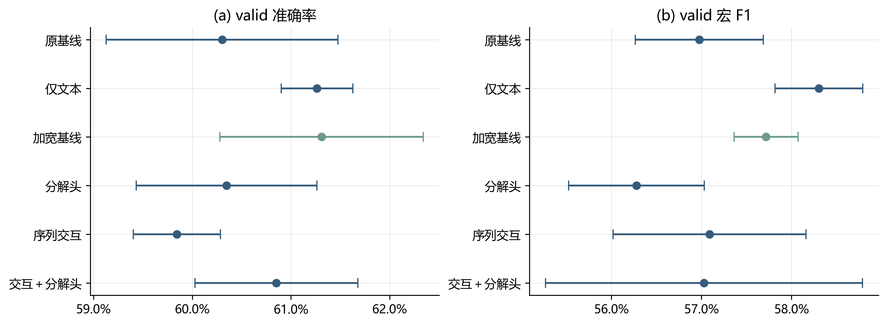
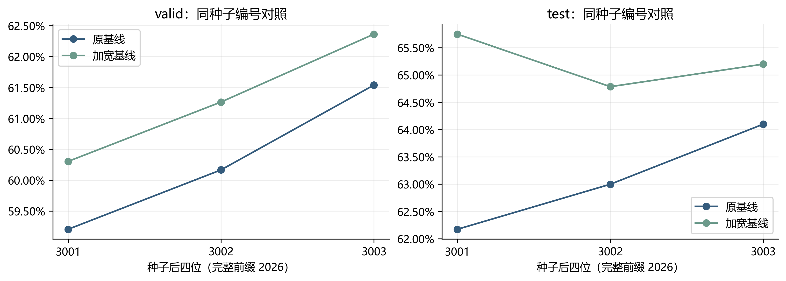
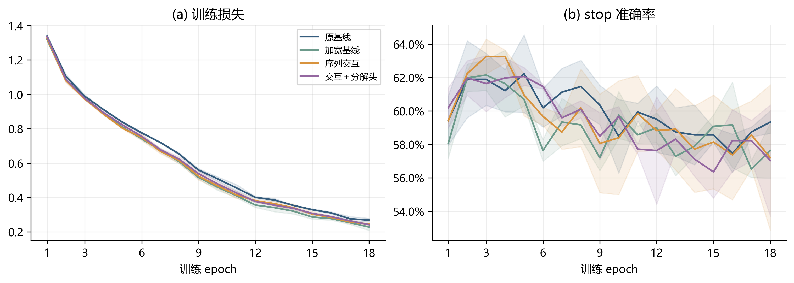
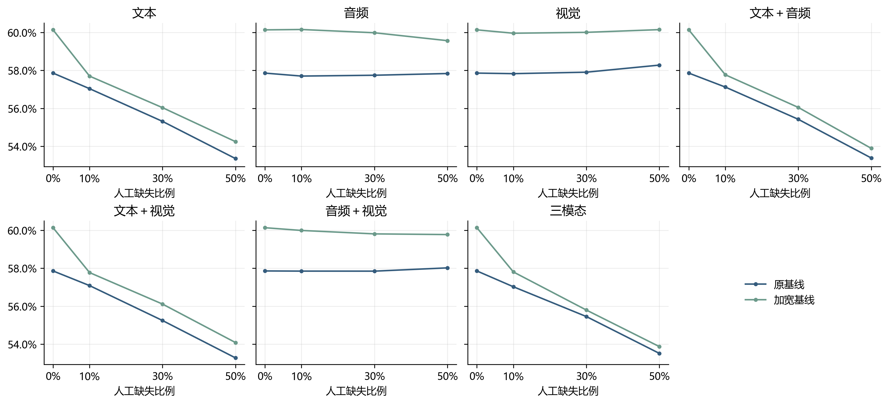
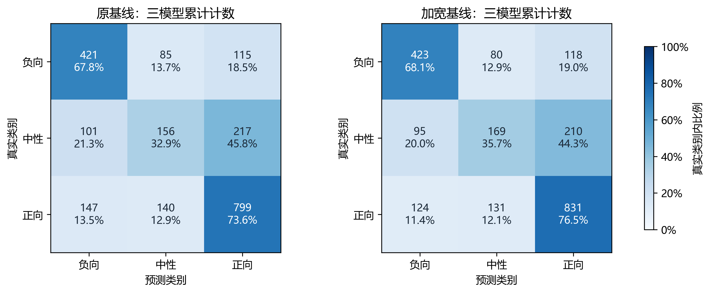

# 第四轮结构优化：序列交互、概率分解与容量对照

本片段对应问题2的第四轮优化实验，可供A合并正文。Markdown为编辑源，Word为导出版。实验已完成18个模型、324个epoch及锁定后的64条件复评；所有指标来自保存的实测结果。以下均为三个独立单模型的指标均值，未进行概率集成或校准。

## 1 研究动机与对照设计

前三轮优化主要围绕缺失训练、集成和局部微调展开。本轮进一步检验建模结构：原融合模型先分别池化各模态，再完成全局融合，不能在池化前显式利用局部跨模态关联；三分类中的中性类别识别也仍较弱。因此，我们提出轻量序列交互与中性概率分解两项候选改动，并设置文本单模态及参数匹配的容量对照，区分结构变化与参数增加带来的影响。

原基线沿用B模块Fusion，隐藏维度为64。容量对照仅将其隐藏维度增加至91，保持原有融合方式。维度91在观察本轮标签指标之前，按与交互模型参数量最接近的规则从64—160中选定；其参数量为102665，与交互模型102856相差0.19%。仅文本模型保留文本投影、掩码注意力池化及预测头，用于检查当前音视频分支是否带来可测收益。六组均使用真实参与计算的参数，不通过空置参数匹配规模。

## 2 候选结构与训练目标

### 2.1 池化前序列交互

文本、音频、视觉输入维度分别为384、74、35，统一为长度50的序列。交互模型将三模态投影至64维，加入共享的可学习位置编码，以文本为查询，将音频和视觉序列拼接作为键和值，使用一层四头跨注意力。令Q为文本投影序列，K、V为音视频投影序列，M为文本可用掩码，则局部更新写为：

$$
H=\operatorname{LN}(Q+\operatorname{MHA}(Q,K,V))\odot M.
$$

跨注意力丢弃率为0.1；不可用键被屏蔽，并通过零哨兵避免音视频全部缺失时出现无效数值，音视频全部缺失时交互更新置零。随后分别池化原文本、交互文本、音频和视觉序列。由文本摘要、交互摘要及三模态可用比例生成逐维门控，将交互结果残差注入文本摘要；预测头接收更新后的文本、交互、音频、视觉摘要及可用比例。独立音视频分支保证文本缺失时仍可计算。位置编码表示序列索引，不代表已获得真实秒级硬对齐。

### 2.2 中性概率分解

设q为中性判别logit，r为非中性条件下的正向判别logit，σ为sigmoid函数，将三分类概率参数化为：

$$
p_{0}=(1-\sigma(q))(1-\sigma(r)),\quad p_{1}=\sigma(q),\quad p_{2}=(1-\sigma(q))\sigma(r).
$$

类别0、1、2分别为负向、中性、正向。实现通过稳定的log-sigmoid表达式计算对数概率，并沿用加权交叉熵；不存在先判中性再硬路由的级联过程，也未增加额外二分类损失。强度回归保留独立输出。该改动改变概率参数化与学习偏置，不增加三类概率分布的表达能力。“分解头”应用于原基线，“交互＋分解头”同时采用上述两项改动。

六组使用相同训练目标。设批内样本数为N，真实类别为yᵢ、强度为sᵢ、预测强度为ŷᵢ，类别权重w由fit类别频率的逆平方根确定，H₁为SmoothL1损失，则：

$$
L=-\frac{\sum_{i=1}^{N}w_{y_i}\log p_{i,y_i}}{\sum_{i=1}^{N}w_{y_i}}+\frac{0.8}{N}\sum_{i=1}^{N}H_1(\hat y_i-s_i).
$$

## 3 实验设置与选择规则

沿用原始MiniLM int8文本特征及既有音视频特征。官方train的3395条样本按原视频分组划分为fit 3004条、stop 391条，valid为728条，test为727条；归一化仅使用fit统计量。本划分不能据此称为受试者独立划分。训练复用8个缓存连续缺失视图，缺失施加概率为0.8，覆盖七种模态组合及10%、20%、30%、50%的缺失比例，位置随机。使用AdamW，学习率0.0008、权重衰减0.01、batch size 64、预测头dropout 0.25、梯度范数裁剪1。每组训练18个epoch，随机种子为20263001、20263002、20263003。

每个模型按干净stop准确率选择epoch，同分依次比较宏F1、较低MAE，并保留更早epoch。结构选择使用valid的干净条件及文本、音频、视觉各30%中段缺失，共四个条件。候选需满足干净宏F1和三种缺失平均宏F1均不低于基线0.01，四条件平均MAE不高于基线0.02；满足约束后按三模型平均干净准确率选型。六组均通过约束，锁定加宽基线。

锁定后仅对原基线与加宽基线复评：干净条件加七种模态组合、三档比例（10%、30%、50%）、三个位置（起始、中段、末尾），共64条件。64条件均值为各条件等权平均，不是现实缺失分布的期望性能。valid承担内部选型作用；test历史上已被查看，因此本轮test结果属于锁定后复评，不是新的盲测。

## 4 结构消融与验证结果

表C4-1报告三种子均值及准确率的样本标准差（SD），缺失宏F1为valid三种单模态30%中段缺失的平均。SD描述种子波动，不是置信区间。

| 结构 | 参数量 | valid准确率±SD | 干净宏F1 | 缺失宏F1 |
|---|---:|---:|---:|---:|
| 原基线 | 74963 | 60.30%±1.17% | 0.5698 | 0.5598 |
| 仅文本 | 41925 | 61.26%±0.36% | 0.5830 | 0.5746 |
| 加宽基线 | 102665 | 61.31%±1.03% | 0.5772 | 0.5714 |
| 分解头 | 74898 | 60.35%±0.91% | 0.5628 | 0.5545 |
| 序列交互 | 102856 | 59.84%±0.44% | 0.5709 | 0.5634 |
| 交互＋分解头 | 102791 | 60.85%±0.82% | 0.5703 | 0.5660 |

**图C4-1 valid结构消融。** 点为三个独立模型指标均值，横线为±1个样本SD。横轴采用局部范围以显示小幅差异。

加宽基线较原基线提高1.01个百分点，三个种子的配对差值分别为+1.10、+1.10、+0.82个百分点。仅文本模型也优于原基线，且干净宏F1更高；加宽基线与仅文本的平均准确率仅相差0.046个百分点，即三个种子共2184次预测中正确数相差1，不能据此断言加宽结构稳定优于仅文本。选择加宽基线仅遵循预先确定的最高均值规则，仅文本模型未进入本轮锁定测试面板。

**图C4-2 原基线与加宽基线的逐种子准确率。** 左图为内部valid，右图为锁定后干净test复评。同种子编号共享数据和缺失视图设置，不意味着不同结构的参数初始化相同。

序列交互较原基线降低0.46个百分点，较容量对照降低1.47个百分点，未支持“池化前交互即可突破瓶颈”的假设。分解头的中性F1从0.3845降至0.3641；交互模型中性F1虽升至0.4028，但未转化为总体准确率改善。因此，不能仅凭结构动机将其描述为中性识别改进方法。

**图C4-3 训练过程诊断。** 实线为三种子均值，阴影为±1个样本SD。展示原基线、加宽基线、序列交互与联合结构；所有组训练目标权重一致，最终评估使用stop选中epoch的权重。

本轮18个模型均在第2—5个epoch选中最优stop检查点；继续训练并未使stop准确率持续提升。曲线提示当前样本规模和固定训练配方下存在早期泛化瓶颈，但不能单凭这些曲线将结构失败归因于某个组件。预检查已确认交互模型对音频帧置换产生响应，且全部八种模态可用组合前向与梯度有限；这些机制检查只证明实现能够工作，不构成有效性提升证据。

## 5 锁定后的测试复评

表C4-2汇总两个锁定结构。干净准确率仍报告三种子均值±样本SD，宏F1与MAE分别在单模型、单条件计算后再取平均。

| 指标 | 原基线 | 加宽基线 | 差值 |
|---|---:|---:|---:|
| 干净准确率 | 63.09%±0.97% | 65.25%±0.48% | +2.15个百分点 |
| 干净宏F1 | 0.5786 | 0.6014 | +0.0228 |
| 干净MAE | 0.6921 | 0.6747 | −0.0174 |
| 64条件平均准确率 | 61.68% | 62.94% | +1.26个百分点 |
| 64条件平均宏F1 | 0.5641 | 0.5768 | +0.0127 |
| 64条件平均MAE | 0.7134 | 0.7005 | −0.0129 |

干净test的逐种子准确率增益为+3.58、+1.79、+1.10个百分点。以381个原视频为分组单元，对固定模型的正确性差值进行2000次配对bootstrap，每次保留全部三个种子，准确率均值增益的95%百分位区间为[+0.71，+3.66]个百分点。该区间仅描述固定模型下的测试样本抽样波动，不包含训练随机性和结构选择的不确定性，也不能消除历史测试集复用的限制。

**图C4-4 锁定结构的连续缺失鲁棒性。** 七个面板分别对应七种缺失模态组合，纵轴为宏F1；非零比例处对三个位置、三个独立模型取平均。0%为同一个干净条件，重复显示仅用于曲线参照，汇总64条件时只计算一次。

**图C4-5 干净test混淆矩阵。** 每幅图汇总三个模型对同一727条样本的预测，共2181次计数，并给出行内比例；并非2181条独立样本，也不是集成预测。表中宏F1按单模型计算后平均，不能直接由累计矩阵重算替代。

加宽基线的负向、中性、正向F1分别为0.6698、0.3941、0.7403，均高于原基线的0.6526、0.3630、0.7201。中性类别仍明显较弱。缺失条件总体均值有所改善，但开发面板的退化约束不保证每一个测试缺失条件都改善，也不代表专项无标签数据上的准确率。

## 6 讨论与适用边界

本轮可支持的结论是：在固定特征、数据划分和训练配方下，适度增加原融合模型容量获得了可复现的同种子正向变化；本轮提出的序列交互与概率分解没有成为最佳结构。仅文本对照的表现提示应继续诊断音视频分支的信息利用效率，但不能推断音视频信息本身无用。

由于所有结构共用训练配方，本轮尚未验证每种结构各自的最优学习率或正则化强度。参数匹配仅控制总参数量，未同时控制计算量或优化难度；也未设置仅位置编码等逐组件对照，因而无法分别归因位置编码、跨注意力与残差门控。结果不能与第三轮等权集成、A模块其他文本特征版本直接计算提升幅度。训练与stop评估合计9.09分钟，该时间不含开发、选型与测试。本轮未自动替换正式提交模型。

## 7 复现与合并说明

实验定义见[第四轮方案](../experiments/第四轮结构优化实验方案.md)，完整指标与诊断见[第四轮结果](../experiments/第四轮结构优化实验结果.md)。配置为[C/configs/q2_round4_structure.json](../../../C/configs/q2_round4_structure.json)，原始权重、预测与日志保存在[C/outputs/q2_round4_structure_v1](../../../C/outputs/q2_round4_structure_v1)。小型结果与审计文件已归档至[实验资产目录](../experiments/assets/round4/README.md)。

本片段五幅实测图均提供300 dpi PNG和SVG，数据快照及源文件哈希保存在[配图资产目录](assets/round4/README.md)。绘图沿用A、B现有论文图的中文字体、蓝绿配色与计数加行百分比的混淆矩阵表达方式。图表由保存的结果生成，不触发重训练、推理或再次选型。合并时可统一章节、图表编号；应保留单模型均值、负结果及历史测试复评的限定。
