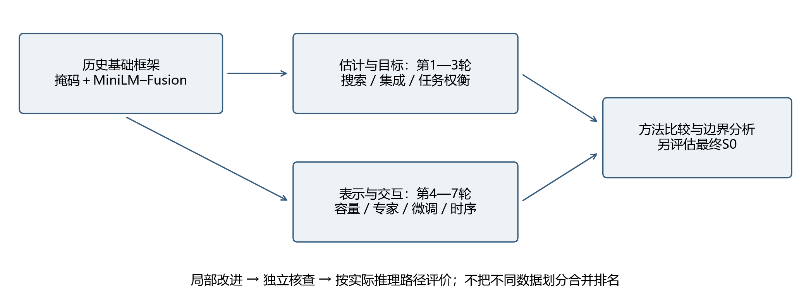
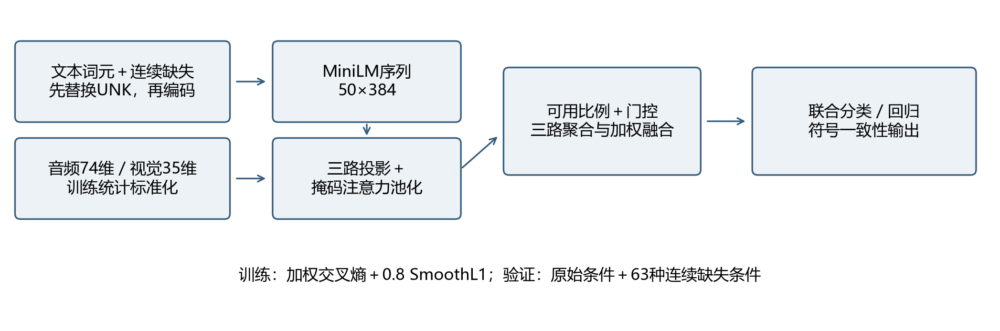
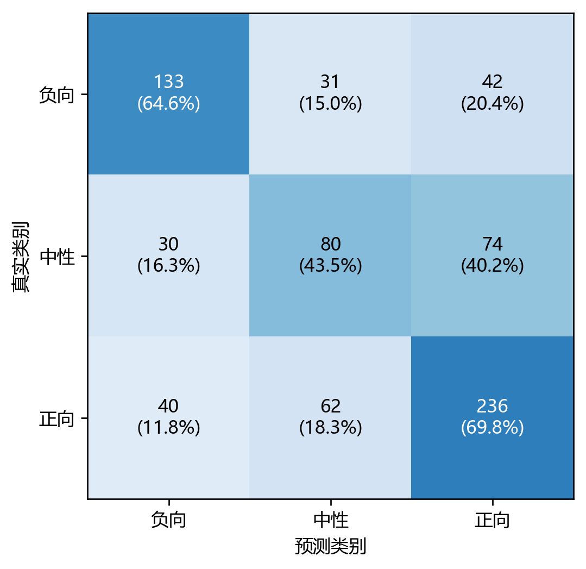
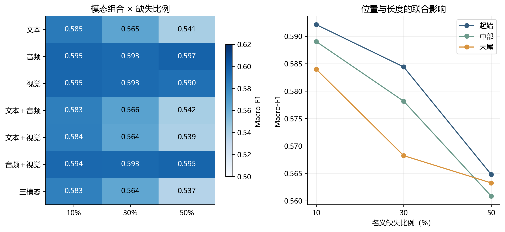
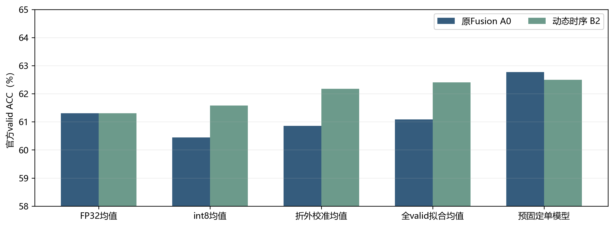
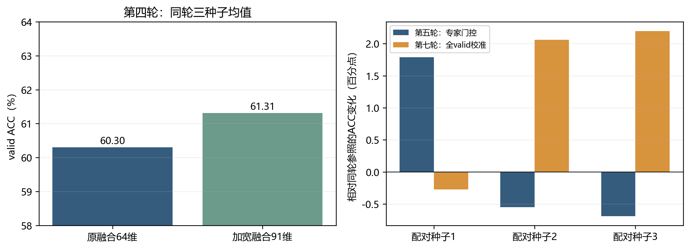
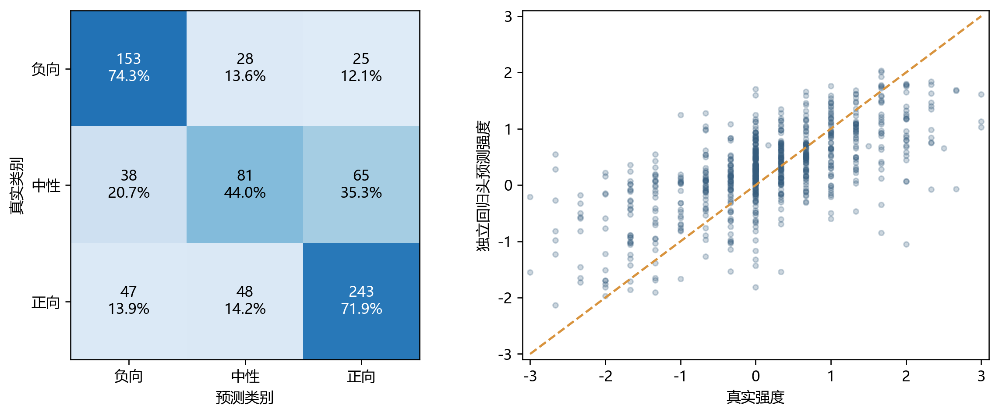
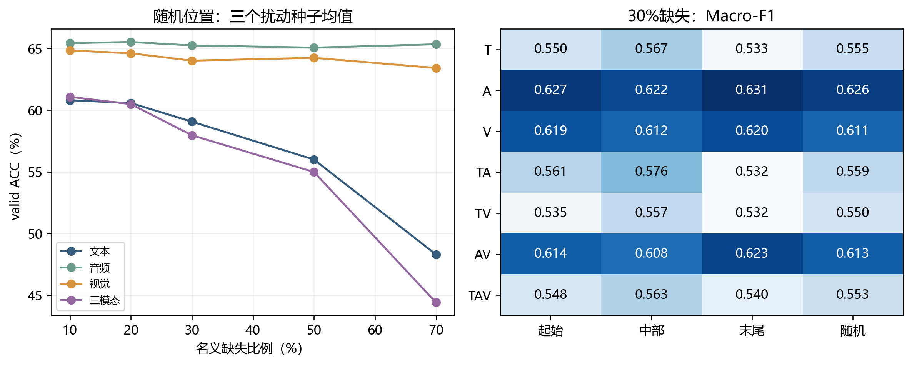
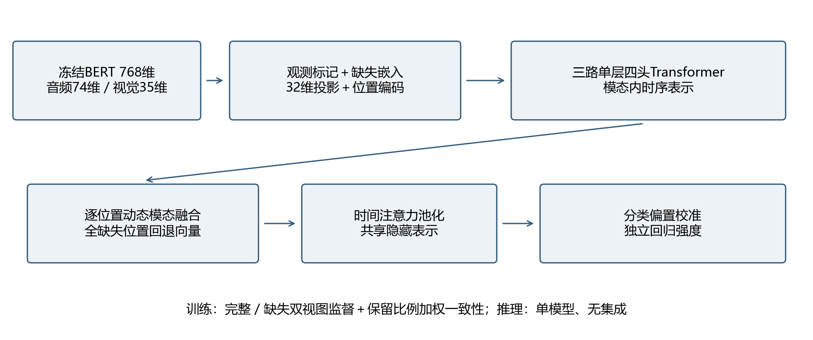

# 5.3 问题二的模型建立与求解

## 5.3.1 问题描述与建模目标

问题一建立了文本、音频和视觉的特征提取与时间映射方法。问题二进一步考虑实际采集过程中局部连续片段缺失的情况：在保留其他有效信息的条件下，同时预测情感极性与情感强度，并分析缺失模态、缺失位置及缺失长度对预测性能的影响。本文以显式有效掩码、输入一致的缺失模拟和可靠性门控融合构建鲁棒预测主线，并通过七轮受控实验检验参数搜索、集成、任务权衡、结构改造及端到端表示学习的有效边界。

本问采用附件2给定的对齐版本，包含3395条训练样本、728条验证样本及727条历史测试样本。模型训练与统计量估计仅使用训练部分，验证集用于赛题允许的模型选择与后处理检查。附件3的30条样本没有标签，仅用于专项推理，不计算准确率。问题一的100条视频及其自提取特征不混入本问的训练数据；其音频25维、视觉20维也不替代附件2的74维、35维输入。

表5-13 问题二输入、输出与数据边界

| 对象 | 维度或规模 | 本文处理方式 |
|---|---|---|
| 文本输入 | 每条最多50个词元 | 使用附件词元；历史MiniLM输出384维，最终BERT输出768维 |
| 音频、视觉 | 50×74、50×35 | 仅训练部分估计标准化参数；保留有效掩码 |
| 情感极性 | 负向、中性、正向 | 按标签小于0、等于0、大于0划分 |
| 情感强度 | 实数，范围[-3,3] | S₀独立回归；历史F₀／B₀采用极性一致性映射 |
| 附件3专项样本 | 30条，无标签 | 使用历史基线B₀模型推理，完整结果见表5-24 |

附件提供的对齐序列位置不等同于精确物理时间。因此，下文的缺失长度采用有效跨度中的位置比例表示，起始、中部和末尾也指序列位置，不能直接解释为若干秒。问题一的词级时间映射为后续原视频证据定位提供接口，但不改变本问已给定特征的坐标语义。

## 5.3.2 优化基线与研究思路

### 1 基线模型及其作用

以MiniLM–Fusion作为基础建模框架：文本编码器学习上下文语义，音频与视觉投影到公共空间，带掩码的模态内聚合与可靠性门控整合可用证据，最后联合输出极性与强度。该框架将缺失处理嵌入输入与聚合阶段，无须为每一种缺失组合训练独立模型，适合小样本、多种缺失环境并存的任务。

研究中区分两种基础配置。冻结鲁棒基线记为F₀，采用冻结的int8 MiniLM、64维融合层与较强缺失增强，用于前期受控优化及缺失机制分析。校准微调基线记为B₀，在相同融合框架内更新MiniLM顶部两层，并按实际量化推理路径进行类别偏置校准。最终预测和第三问采用S₀；B₀仅作为历史校准微调对照，最终S₀的方法与结果见第5.3.7节。

七轮实验并不是从同一检查点连续叠加七次改动。前五轮主要围绕冻结表示下的搜索与融合展开，后两轮在统一开发划分下重新检验在线微调及表示交互。明确这一关系，可以避免将不同训练范式下的结果误写成单调提高的精度曲线。

表5-14 两种基础配置及评价角色

| 配置 | 冻结鲁棒基线F₀ | 校准微调基线B₀ |
|---|---|---|
| 文本表示 | 冻结MiniLM，缓存隐藏序列 | MiniLM顶部两层参与学习 |
| 融合宽度 | 64维 | 64维 |
| 训练样本 | 附件2训练部分 | 全部3395条train |
| 缺失施加概率 | 0.8 | 0.3 |
| 优化器与batch | AdamW，64 | AdamW，32 |
| 任务头学习率 | 8×10⁻⁴ | 2×10⁻⁴ |
| 文本学习率 | 不更新 | 2×10⁻⁵ |
| 输出处理 | 极性—强度一致性约束 | int8推理、类别校准及一致性约束 |
| 实验作用 | 早期搜索与鲁棒性分析参照 | 历史校准微调对照及消融参照来源 |

B₀以逆平方根类别频率加权交叉熵加0.8倍SmoothL1为目标，权重衰减0.01、梯度裁剪1，每种子训练10轮；三个种子的最佳epoch为2、3、5，采用seed20260925的第3轮模型。权重学习仅使用train，valid用于选择epoch与后处理。该验证使用方式符合本题开发用途，但所得结果不能称为独立测试泛化估计。

### 2 从误差来源到优化假设

优化围绕三个层面展开。其一是估计层面：若现有参数与特征配置不合适，外层搜索和通道筛选应能改善相同训练预算下的验证目标；若模型误差具有互补性，集成应能降低预测波动。其二是目标层面：若分类与回归任务或类别权重存在冲突，调整损失比例、缺失强度和采样分布应能改善分类边界。其三是表示层面：若单模态池化过早丢失交互证据，则扩大融合容量、引入独立专家或在池化前进行跨模态交互，可能保留更多有效信息。

上述假设均具有对应的反证条件。例如，训练目标下降但验证性能下降，不能证明表示改善；内部集成目标上升但外部条件退化，不能证明泛化增益；单个种子提高而多数种子下降，也不能证明结构稳定有效。因此，每轮同时考察ACC、Macro-F1、强度误差和缺失条件表现，而不只报告最高准确率。

表5-15 七轮优化的假设、操作与判定重点

| 轮次 | 待检验瓶颈 | 主要操作 | 关键判定依据 |
|---|---|---|---|
| 一 | 参数与冗余通道 | 随机／DE搜索、BPSO筛选 | 固定预算下综合目标是否改善 |
| 二 | 单模型方差与互补不足 | 折外预测、正则化权重集成 | 内部权重收益是否迁移 |
| 三 | 多任务权衡与训练强度 | 类别权重、回归权重、缺失率、微调 | 分类收益是否伴随其他指标退化 |
| 四 | 融合容量与结构限制 | 加宽、中性分解、时序交互 | 同协议结构对照是否稳定改善 |
| 五 | 专家能力互补 | 文本／音视频专家及决策门控 | 可学习门控能否接近互补上界 |
| 六 | 任务语义适配不足 | 在线微调、扩容、分层学习率 | 开发晋级与完整重训能否一致 |
| 七 | 类别表征与交互阶段 | 均衡采样、对比学习、分类前交互 | 机制对照、量化后和单模型结果 |

图5-13 从基础模型到最终方案的研究路径。箭头表示研究逻辑而非精度逐轮上升；最终选择以完整评价证据为依据。

### 3 参数效率与可用证据之间的约束

本题训练样本有限，而文本编码器已经包含通用语义先验。提高可训练参数量能够增加拟合自由度，却也会扩大模型对特定划分、类别频率及缺失配置的适应程度。优化的目标因而不是无条件增加容量，而是在有限样本下保留可迁移的语义表示，并让新增结构产生可重复的增量证据。缺失增强也存在类似权衡：它可以迫使模型利用剩余模态，但过强扰动可能降低完整样本上的判别能力。

本文将“优化有效”限定为受控条件下的指标改善，将“最终采用”限定为满足实际推理路径、稳定性及多任务约束后的模型选择。二者并不等价，后文分别给出局部收益、失败现象与保留基础方法的理由。

## 5.3.3 缺失感知Fusion基线模型

### 1 连续片段缺失与有效掩码

记第i条样本的模态序列为Xᵢᵐ，有效掩码为Mᵢᵐ，m属于文本T、音频A与视觉V。掩码同时区分真实观测、原有缺失和填充。以三路掩码的并集确定有效位置跨度[aᵢ,bᵢ)，跨度为Lᵢ。在选择的模态集合S中，删除同一连续区间Iᵢ，而不压缩或移动剩余位置：

$$
M̃ᵢᵐ(t)=Mᵢᵐ(t)·[1−𝟙(m∈S)𝟙(t∈Iᵢ)]， wᵢ=min(Lᵢ−1,max(1,round(ρLᵢ)))。 (5.3-1)
$$

有效位置不足两个时不额外施加缺失；原有空洞保留，故名义缺失比例ρ与实际删去的有效观测比例可能不同。冻结配置F₀训练时以0.8的概率施加缺失；微调配置B₀采用0.3的概率。从七种非空模态组合中等概率抽取S，从10%、20%、30%、50%中选择长度比例，并随机选择连续区间起点。F₀采用八组缓存视图复用文本编码计算；B₀在线编码受损词元。评估时固定七种模态组合、三种长度比例（10%、30%、50%）与三个位置（起始、中部、末尾），形成63种缺失条件，另保留原始输入条件。

文本缺失必须发生在上下文编码之前：先把新增缺失词元替换为UNK，再调用MiniLM，并在后续池化中屏蔽相应位置。若先编码完整句子、再将部分隐藏向量置零，未删去位置仍可能包含缺失词元的上下文信息，使模拟结果偏乐观。冻结编码实验统一采用int8编码器、单样本编码批次，保持缓存构建与专项推理的数值路径一致。本文引用的第一轮主线结果采用该修正协议，不引用早期不一致版本。

### 2 模态内聚合与可靠性门控

文本采用通用预训练MiniLM，将词元映射为384维隐藏状态；音频与视觉分别保留74维和35维输入。三路经线性投影、LayerNorm与GELU映射至d维公共空间，两种基础配置均取d=64。对每一路使用带掩码的注意力池化：

$$
αᵐₜ=M̃ᵐₜ exp(sᵐₜ)/Σᵤ[M̃ᵐᵤ exp(sᵐᵤ)]， hᵐ=ΣₜαᵐₜHᵐₜ。 (5.3-2)
$$

其中s为可学习线性评分；当某一路全部不可用时，其池化向量直接置零，避免空集合归一化。以qᵐ为50个位置中有效掩码的均值，将三路聚合向量与三路可用比例共同输入门控网络：

$$
g=MaskedSoftmax(Wg[hᵀ;hᴬ;hⱽ;q]+bg)， hᶠ=Σₘgᵐhᵐ。 (5.3-3)
$$

门控仅在可用模态上归一化；全部不可用时置零。门控权重描述模型内部信息分配，不直接等同于模态的因果贡献。分类与回归共享输入[hᵀ;hᴬ;hⱽ;hᶠ;q]，经128、64维隐藏层输出三个分类logit及一个回归值，强度由3tanh约束在[-3,3]。融合网络包含74963个参数，该数量不包括冻结文本编码器。

图5-14 输入一致的连续缺失模拟与可靠性门控融合。新增文本缺失先进入词元替换步骤，再进行编码；训练统计量与专项推理共享处理规则。

### 3 联合目标与一致性输出

极性识别采用逆平方根类别频率加权交叉熵，强度估计采用SmoothL1损失。类别权重只由当前训练部分计算并归一化，基础联合目标为：

$$
L=LCE,w+0.8LSmoothL1。 (5.3-4)
$$

分类输出为最大概率类别。为满足极性与强度的符号一致性，将回归输出r映射为：负向取−|r|，中性取0，正向取|r|。该映射是确定性后处理，不代表重新训练了回归器。文中分别报告原始回归与一致性回归指标，以防将输出约束误解释为模型能力提升。

### 4 目标函数的展开与决策边界

设训练集中第c类样本数为n_c，类别权重取其逆平方根并归一化。对N条训练样本，分类目标可写为：

$$
w_c=\frac{n_c^{-1/2}}{\frac{1}{3}\sum_{k=1}^{3}n_k^{-1/2}},\qquad L_{\mathrm{CE},w}=-\frac{\sum_{i=1}^{N}w_{c_i}\log p_{i,c_i}}{\sum_{i=1}^{N}w_{c_i}}. \tag{5.3-5}
$$

分母对应加权交叉熵的加权平均约定。与直接按频率倒数加权相比，逆平方根权重对少数类的补偿较温和，但仍不能保证中性类的表示可分。强度回归采用转折点为1的平滑损失，令eᵢ=rᵢ−yᵢ：

$$
L_{\mathrm{reg}}=\frac{1}{N}\sum_{i=1}^{N}\ell(e_i),\qquad \ell(e)=\begin{cases}\frac{1}{2}e^2,&|e|<1,\\|e|-\frac{1}{2},&|e|\geq1.\end{cases} \tag{5.3-6}
$$

该目标在小误差区域保留平滑梯度，在大误差区域采用线性增长，减少极端强度样本对回归更新的支配。F₀／B₀F₀／B₀推理阶段的极性一致性约束为：

$$
\widehat y_i=\begin{cases}-|r_i|,&\widehat c_i=\mathrm{Negative},\\0,&\widehat c_i=\mathrm{Neutral},\\|r_i|,&\widehat c_i=\mathrm{Positive}.\end{cases} \tag{5.3-7}
$$

这一约束使分类边界与强度输出直接耦合：校准若改变极性，即使回归头数值不变，最终强度也可能改变。因此，分类后处理的选择必须重新检查强度误差，不能只比较ACC。

## 5.3.4 求解方法与评价协议

全文采用三类明确区分的评价口径：internal dev为train内部划分的391条开发样本，official valid为官方728条验证样本，历史test为前期已评估的727条样本。各表对应关系见表5-25；统一协议模块消融见表5-26，历史B₀缺失鲁棒性敏感性分析见表5-28，三层消融的覆盖边界及最小对照矩阵见表5-29。验证复用与调参风险在第5.3.9节单独讨论。尤其是66.33%、63.74%与65.61%分别对应内部dev、official valid单模型及历史test三种子均值，不能直接横向排序。

### 1 训练及模型锁定

主线采用AdamW，学习率8×10⁻⁴，权重衰减0.01，batch为64，Dropout为0.25，梯度裁剪阈值为1。第一轮搜索阶段每个候选先训练6轮，优选候选延长至18轮，最终六组方法分别使用20260924、20260925、20260926三个种子。选模目标综合原始输入及三个固定缺失条件上的指标：

$$
S=mean条件(Macro-F1−0.15MAE+0.05Pearson)。 (5.3-8)
$$

该式采用原始回归口径，其系数为实验约定，不是赛题规定的评分函数。搜索结果未超过默认配置，因而保留E0；冻结配置选定种子20260924、第3轮检查点。该模型用于冻结配置的诊断；最终专项输出采用S₀，不依据历史test分数重新挑选模型。

后续优化部分将train按原视频划分为fit3004条与stop391条，以降低同一原视频片段跨开发子集带来的依赖。第六、七轮使用stop选择结构与训练轮数，再从通用预训练权重初始化，在完整train重训；种子固定为20267001、20267002、20267003，单模型部署种子预先固定为20267001。各轮训练范式、选择标准和推理精度发生变化，因此七轮结果只在各自受控对照内解释。

### 2 指标定义与汇总方式

准确率ACC衡量全部样本中极性分类正确的比例；Macro-F1为三个类别F1的等权平均，避免正向样本较多时掩盖中性识别不足。MAE为预测强度与真实强度绝对误差的均值，越小越好；Pearson相关系数衡量强度变化趋势的一致性，越大越好，但不能替代绝对误差。类别F1由该类精确率与召回率的调和平均给出。

缺失条件平均值先对每种条件的728条样本计算指标，再对63种条件等权平均；同一批样本重复施加扰动，不构成63份独立验证数据。三种子均值是三个独立训练模型的指标均值，不等于概率集成后的指标。第六、七轮全valid拟合校准偏置的结果使用了验证标签，属于拟合后描述；分组折外校准仅检查偏置步骤，仍不能称为整个研究过程的独立盲测。

### 3 指标的数学定义与缺失风险

设TP_c、FP_c、FN_c分别为类别c的真正例、假正例与假负例，则：

$$
\mathrm{ACC}=\frac{1}{N}\sum_{i=1}^{N}\mathbf1(\widehat c_i=c_i),\qquad \mathrm{MacroF1}=\frac{1}{3}\sum_{c=1}^{3}\frac{2TP_c}{2TP_c+FP_c+FN_c}. \tag{5.3-9}
$$

$$
\mathrm{MAE}=\frac{1}{N}\sum_i|\widehat y_i-y_i|,\qquad r_P=\frac{\sum_i(y_i-\bar y)(\widehat y_i-\overline{\widehat y})}{\sqrt{\sum_i(y_i-\bar y)^2\sum_i(\widehat y_i-\overline{\widehat y})^2}}. \tag{5.3-10}
$$

对缺失条件集合Ω，分别报告平均性能和最差条件性能，以区分平均鲁棒性与局部失效风险：

$$
\overline F_{\mathrm{miss}}=\frac{1}{63}\sum_{\omega\in\Omega}F_\omega,\qquad F_{\mathrm{worst}}=\min_{\omega\in\Omega}F_\omega. \tag{5.3-11}
$$

这里的最差条件是预先枚举网格中的最小值，不代表所有现实缺失模式下的理论下界。均值和最差值均依赖给定网格，不能被解释为真实采集场景的发生概率加权风险。

## 5.3.5 验证结果及缺失敏感性

### 1 冻结配置F₀模型的分类与回归表现

表5-16 冻结鲁棒基线F₀在官方验证集上的指标（728条，单模型）

| 输入与输出口径 | ACC（%） | Macro-F1 | MAE | Pearson |
|---|---:|---:|---:|---:|
| 原始输入、原始回归 | 61.68 | 0.5942 | 0.5971 | 0.6488 |
| 原始输入、一致性回归 | 61.68 | 0.5942 | 0.5901 | 0.6490 |
| 63种缺失条件均值、一致性回归 | 59.72 | 0.5761 | 0.6076 | 0.6071 |

图5-15 冻结鲁棒基线F₀在原始验证输入上的极性混淆矩阵。行是真实类别，列是预测类别；括号内为行内比例。

负向、中性、正向F1分别为0.6504、0.4482、0.6841。184条中性样本中仅80条识别正确，74条被分为正向，显示中性与弱正向是当前分类的重要混淆区域。该现象支持进一步检查类别边界，却不能单凭混淆矩阵断定标签噪声或某一模态质量是唯一原因。一致性映射使MAE由0.5971降至0.5901，分类结果保持不变，说明部分回归误差可由任务间符号约束修正。

### 2 缺失模态、长度与位置

图5-16 冻结配置F₀验证集连续缺失敏感性。左图为七种模态组合与三种长度比例的Macro-F1，每格对三个位置取均值；右图为三个位置的Macro-F1，每点对七种组合取均值。各格均由同一个锁定模型计算。

对七种模态组合和三个位置平均，10%、30%、50%缺失时Macro-F1分别为0.5884、0.5769、0.5630。对全部比例与模态组合平均，起始、中部、末尾缺失时分别为0.5804、0.5760、0.5718；上述位置比较来自相同模型和同一验证集，不作为独立显著性检验。

文本缺失的影响总体大于单独音频或视觉缺失，表明现有模型对文本语义依赖较强；但单路缺失影响较小，不等于该路没有补充价值。门控、特征冗余和样本难度均可能影响这一现象。较长片段删除了更多局部证据，而关键情感词或转折信息的分布并不均匀，因此相同缺失比例也可能因位置不同产生不同误差。

历史输入一致性实验中，普通门控、缺失鲁棒门控、时序卷积与双向GRU模型的三种子选择分数分别为0.5100、0.5182、0.5162；63种验证缺失条件下原始回归MAE分别为0.6552、0.6354、0.6472，Macro-F1分别为0.5642、0.5706、0.5652。该消融支持在当前配置下保留缺失增强的门控冻结配置F₀。这里是各结构三种子统计，不能与表5-16单个锁定模型的一致性MAE直接相减。

## 5.3.6 七轮优化的受控比较与经验归纳

### 1 参数搜索、集成与任务权衡

第一轮比较默认配置、随机搜索、差分进化（DE）、随机特征子集、统计排序及二进制粒子群（BPSO）筛选。默认配置的三种子验证选择分数为0.518186，DE为0.508847，DE与BPSO组合为0.514470，均未形成总体改进。BPSO保留83/109个音视频通道，减少23.85%的输入通道，但这不等于运行耗时或总参数同步减少。历史测试中DE的ACC略高，却伴随Macro-F1和MAE退化，不能据此替换按验证规则锁定的模型。

第二轮把搜索对象从单模型超参数转为模型库集成权重，比较等权、贪心、随机、DE及带正则的DE，并使用折外方案控制权重拟合。正则DE的内部选择分数由默认参照的0.473403提高至0.507088，但历史测试ACC由65.20%降至64.10%。这说明更充分优化内部目标未必改善外部分类效果；集成需要基础模型具有可迁移的互补性，而不只是增加权重搜索预算。

第三轮降低回归损失权重、降低缺失概率、取消类别权重，并检验文本编码器精度与顶部两层微调。组合改动的验证集概率集成ACC为61.13%、Macro-F1为0.5652，低于同轮默认集成的61.54%、0.5823；顶部两层微调方案为61.40%、0.5694。训练后期损失继续下降而stop准确率下降，提示当前数据规模下存在过拟合风险。上述结果只否定本轮配置，不能推论所有文本微调方法均无效。

表5-17 前三轮搜索与训练策略的主要证据

| 轮次 | 同轮比较及统计口径 | 参照→候选 | 支持的结论 |
|---|---|---|---|
| 第一轮 | valid选择分数，三种子均值；默认→DE+BPSO | 0.518186→0.514470 | 筛选可压缩通道，未改善总体选模目标 |
| 第二轮 | 历史test ACC；默认→正则DE集成 | 65.20%→64.10% | 内部权重优化收益未迁移 |
| 第三轮 | valid ACC，概率集成；默认→组合改动 | 61.54%→61.13% | 局部训练策略调整未获稳定收益 |

### 2 融合容量与独立专家互补

第四轮检验加宽融合层、中性分解、时序交互及其组合。将公共维度由64增至91、融合参数由74963增至102665后，官方验证ACC的三种子均值由60.30%提高至61.31%，Macro-F1由0.5698提高至0.5772；同轮历史test ACC由63.09%提高至65.25%，Macro-F1由0.5786提高至0.6014。该结果支持有限度增加融合容量，但其他结构没有取得一致优势，因而不能把“结构更复杂”本身视为有效机制。

第五轮分别训练文本专家与音视频专家，再用训练集按视频分组的折外预测训练轻量决策门控。门控输入包含两个专家的类别概率、强度、熵及三路可用比例，13→8→2网络仅含130个参数。辅助训练包含整路缺失环境，用于提高专家调度能力；其含义不同于赛题要求的局部连续缺失。

文本错误但音视频正确的开发样本平均占13.13%，说明存在潜在互补；利用真实标签事后挑选正确专家的75.53%只是不可部署的理想上界。实际学习门控的验证ACC仅由61.31%升至61.49%，三个配对种子变化为+1.79、−0.55、−0.69个百分点，收益集中于一个种子。历史test ACC达到65.61%，但Macro-F1从0.6014降至0.5989，因此“第五轮约65%”是历史测试均值，不是验证准确率，也不是多指标全面领先。

表5-18 第四、五轮结构与专家融合的结果（均为三个模型指标的均值）

| 同轮比较 | valid ACC（%） | 历史test ACC（%） | 历史test Macro-F1 |
|---|---:|---:|---:|
| 第四轮：原融合 | 60.30 | 63.09 | 0.5786 |
| 第四轮：加宽融合 | 61.31 | 65.25 | 0.6014 |
| 第五轮：加宽融合参照 | 61.31 | 65.25 | 0.6014 |
| 第五轮：学习型专家门控 | 61.49 | 65.61 | 0.5989 |

### 3 端到端表示与分类前时序交互

第六轮在线运行MiniLM，比较顶部两层微调、融合维度64→192、全部六层及嵌入更新和文本冻结。使用batch32、10轮开发预算、缺失概率0.3及相同联合损失；融合层学习率为2×10⁻⁴，顶部两层为2×10⁻⁵，全层更新组对底层及嵌入采用更小学习率。stop ACC分别为64.96%、64.62%、64.79%、63.26%，扩容组未通过预设晋级规则，故保留顶部两层、64维融合。全部训练与内部评估约7.96分钟，共15个模型、138个epoch，不含开发、导出和解释时间。

第七轮从类别监督与融合阶段两方面改变建模。类别均衡批次每类10/11/11条轮换，同时保留原类别权重；在此基础上增加权重0.05、温度0.1的监督对比损失，仅以不同视频样本形成比较关系。两组stop ACC分别降至61.64%、61.55%，因此未继续叠加时序融合。类别均衡与加权目标可能重复补偿，中性情感也未必构成紧凑同质簇；这些是与观察一致的解释，而非已隔离验证的原因。

时序融合将三路序列投影至64维，加入位置和模态标识，在池化之前执行共享参数的一层四头交叉注意力。三个分支分别以一种模态为查询、其他两路为键值，再比较固定文本分支、有效分支等权及195→32→3动态门控。其交互发生在分类概率形成之前，与第五轮的决策级专家融合不同。动态组stop ACC达到66.33%，较原Fusion提高1.36个百分点，但相对等权组仅增加0.26个百分点，未通过相对固定／等权分支的机制验证条件，不能将主要收益单独归因于动态选择器。

表5-19 第六、七轮stop开发结果（三种子均值；不是官方valid）

| 轮次 | 方法 | ACC（%） | Macro-F1 | 中性F1 |
|---|---|---:|---:|---:|
| 六 | 顶部两层／64维Fusion | 64.96 | 0.6227 | 0.4667 |
| 六 | 顶部两层／192维Fusion | 64.62 | 0.6204 | 0.4766 |
| 六 | 全层及嵌入／192维Fusion | 64.79 | 0.6152 | 0.4384 |
| 六 | 冻结文本／192维Fusion | 63.26 | 0.6079 | 0.4759 |
| 七 | 自然采样、原Fusion | 64.96 | 0.6227 | 0.4667 |
| 七 | 均衡采样 | 61.64 | 0.6065 | 0.4683 |
| 七 | 均衡采样＋对比学习 | 61.55 | 0.6056 | 0.4727 |
| 七 | 时序交互、固定文本 | 65.64 | 0.6374 | 0.5076 |
| 七 | 时序交互、等权分支 | 66.07 | 0.6349 | 0.4908 |
| 七 | 时序交互、动态分支 | 66.33 | 0.6422 | 0.5184 |

### 4 验证均值、量化与固定部署模型

第七轮完整train重训后，原Fusion与动态时序模型的FP32验证ACC均值均为61.3095%，开发优势未迁移到这一口径。int8推理及校准后的比较见表5-20。两轮校准折外划分种子不同，因此第六轮0.607601与第七轮0.608516的参照折外ACC差异不代表模型本身变化。

表5-20 第七轮官方valid准确率及推理口径

| 口径 | 原Fusion A0 | 动态时序B2 | 解释 |
|---|---:|---:|---|
| FP32三种子均值 | 61.3095% | 61.3095% | 完整训练后的未校准预测 |
| int8未校准三种子均值 | 60.4396% | 61.5842% | 量化改变部分分类边界 |
| 分组折外校准三种子均值 | 60.8516% | 62.1795% | 只对偏置校准步骤做折外检查 |
| 全valid拟合后三种子均值 | 61.0806% | 62.4084% | 使用验证标签，不是无偏估计 |
| 预固定单种子，int8＋校准 | 62.7747% | 62.5000% | 457/728与455/728条分类正确 |

动态组全valid拟合后的均值提高1.33个百分点，配对种子变化为−0.27、+2.06、+2.20个百分点，满足均值改善条件；但预固定部署种子下降两条正确预测，且MAE由0.5902增至0.6184。故未采用该动态候选替换同轮单模型参照，而非事后改选表现最好的种子。第七轮完成24个模型、218个epoch，训练与内部评估约15.98分钟。两轮均未使用test评估或选型。

图5-17 第七轮不同推理与校准口径的官方valid准确率。前四组为三种子指标均值，最后一组为预固定单模型；全valid拟合值使用了该集标签。

实现一致性方面，每个模型在12条固定样本、四个条件上比较PyTorch FP32与ONNX FP32，已检查概率最大绝对误差低于1.4×10⁻⁶；独立推理包完成20条预测及解释映射一致性检查。这些结果支持已测试导出路径的正确性，不证明int8量化一定带来精度收益，也不替代附件3专项评估。

表5-21 七轮成果在本文中的采用范围

| 轮次 | 保留的成果 | 未得到支持的结论 |
|---|---|---|
| 一 | 输入一致缺失协议、默认鲁棒主线、通道筛选记录 | 智能搜索稳定超过默认配置 |
| 二 | 折外集成评估与正则权重搜索 | 内部集成目标上升必然提升外部ACC |
| 三 | 任务权衡、缺失强度及编码器更新对照 | 组合局部改动能稳定提升分类 |
| 四 | 适度加宽融合层的同轮实测收益 | 所有复杂交互结构均优于基线 |
| 五 | 独立专家、折外门控与互补性诊断 | 65.61%是验证结果或多指标全面提升 |
| 六 | 在线微调、量化校准和独立部署链路 | 单纯扩大更新范围即解决瓶颈 |
| 七 | 分类前时序交互候选、均值收益及部署审计 | 开发收益等同于固定部署模型收益 |

### 5 集成、专家门控与交叉注意力的统一解释

第二轮的概率集成可以写为非负单纯形上的组合，正则项限制权重过度集中：

$$
p_{\mathrm{ens}}(c|x)=\sum_{j=1}^{K}a_jp_j(c|x),\qquad a_j\geq0,\quad\sum_ja_j=1. \tag{5.3-12}
$$

增加搜索次数能够找到更适合内部开发样本的权重，但若基础模型在困难样本上的错误高度重合，权重调整本身不会创造新的观测证据。第五轮进一步使权重随样本变化，利用专家概率、强度、熵及可用比例构造门控输入z：

$$
a(x)=\mathrm{softmax}\!\left(W_2\tanh(W_1z(x)+b_1)+b_2\right),\qquad p(c|x)=\sum_{j=1}^{2}a_j(x)p_j(c|x). \tag{5.3-13}
$$

“存在一个专家预测正确”与“门控可以判断哪个专家正确”是两个不同问题。理想上界利用真实标签完成选择，而学习门控只能依赖模型输出及输入可用程度。若错误专家同样高置信，熵和概率幅度可能无法识别其错误，因此潜在互补不会自动转化为可实现收益。

第七轮把交互提前到分类前。单个注意力头可概括为：

$$
\mathrm{Attn}(Q,K,V)=\mathrm{softmax}\!\left(\frac{QK^\mathsf{T}}{\sqrt{d_k}}+A_{\mathrm{mask}}\right)V. \tag{5.3-14}
$$

其中无效键位置在掩码项中被屏蔽，无有效键时增量置零。该机制允许某一模态的位置表示参考其他模态，再进行池化，理论上比最终概率相加保留更多交互信息。然而，本次动态组只在部分开发和量化口径取得收益，完整FP32验证均值没有提高。因此，结构提供了新的信息通道，并不意味着有限训练数据已足以学到可迁移的交互规律。

图5-18 受控比较中的局部收益与稳定性。左图仅比较第四轮相同验证协议下的融合宽度；右图为第五轮与第七轮各自配对种子的验证ACC变化，两个实验分别解释，不跨轮合并估计。

## 5.3.7 优化局限、失败原因与最终模型选择

### 1 内部目标改善与泛化改善并不等价

第一、二轮的主要限制发生在优化目标与实际使用目标之间。综合选择分数同时包含分类、强度和相关性，优化该分数并不等价于最大化ACC；即使内部目标提高，权重和超参数也可能吸收特定开发样本的偶然性。第二轮内部选择分数提高而历史test准确率下降，是这种目标迁移失效的直接证据。它不证明DE求解错误，而说明外层优化器只能优化给定目标，无法自行消除评价样本有限造成的不确定性。

第三轮进一步表明，把回归权重或缺失概率调小也不是无代价的分类优化。回归任务提供强度顺序约束，缺失增强则使模型避免只依赖完整文本；削弱二者可能改善部分干净样本的拟合，却使学到的边界对样本组成更敏感。训练损失持续下降而stop准确率下降，支持存在过拟合现象；但尚无独立分解实验证明是哪一项正则化减少造成全部下降。

### 2 类别边界比模型容量更难修正

中性类别以强度恰为零定义，其语言表达可能包含弱情绪、客观陈述或相互抵消的信息，不能预设它在表示空间中形成一个紧凑簇。数据中的这类异质性是值得检验的解释，而非由现有结果直接证明的标签性质。第七轮类别均衡后仍保留类别加权，可能在采样和损失两处同时强化少数类；但对比损失的独立作用应由均衡组与均衡加对比组比较，而不能将其相对自然采样的全部下降归因于对比学习。

从分类结果看，F₀与B₀均存在中性向正向迁移。B₀校准后中性召回率为64/184，约34.78%；总体ACC提高仍不能掩盖这一局限。若只追求总体准确率，模型可以通过提高常见类别的正确率抵消中性错误。因此，本文保留Macro-F1和中性类指标，避免将类别不均衡下的局部改善表述为全面提升。

### 3 潜在模态互补与可学习互补之间存在差距

第四轮适度加宽有效，说明原融合层在当时配置下存在容量限制；第五轮音视频专家较弱，说明新增专家本身未形成足够强的独立判别器。二者并不矛盾：联合表示中的补充信息可以有用，而独立音视频模型未必足以独立完成情感判别。决策级融合只能重新分配已形成的预测，无法恢复池化或分类阶段已经丢失的细粒度语义。

第七轮提前交互具有更强表达能力，但相对等权分支的增益小，无法单独证实动态选择机制。现有证据更支持“交互阶段值得研究”这一有限结论，而不是“动态门控已从根本上解决文本依赖”。相同名义缺失比例下，语义关键位置的差异也会影响收益，未来需要更精细的错误样本分析才能区分表示瓶颈与样本噪声。

### 4 随机种子和推理精度改变结论的适用范围

第五轮三个配对种子中仅一个改善，第七轮则出现平均值提高而预固定种子下降。这表明平均性能、单次结果和实际采用模型是不同统计对象。本文不在比较完成后重新挑选最佳种子，否则最终报告会引入额外的选择偏差。量化也会扰动分类边界；当样本处于中性和弱极性边界附近时，小幅概率变化可能改变类别，却不意味着语义表示质量真正提高。

FP32导出一致性检查可以排查所测路径的实现误差，但不能证明int8与FP32性能等价。因此，MiniLM量化候选应在相应CPU ONNX路径上评估。这一检查只适用于其自身推理实现，不能替代S₀的冻结BERT推理检查。

表5-22 失败现象、可支持解释与结论边界

| 实验现象 | 数据支持的判断 | 尚不能据此证明 |
|---|---|---|
| 搜索内部目标上升、外部ACC下降 | 目标改善缺少稳定迁移 | 优化算法本身无效 |
| 训练损失下降、stop准确率下降 | 当前训练出现过拟合迹象 | 所有微调方案均无效 |
| 专家理想上界高、门控增益小 | 可学习互补小于标签辅助上界 | 非文本模态没有价值 |
| 均衡／对比配置下降 | 当前采样与监督组合不合适 | 对比学习普遍不适用于情感 |
| 开发时序增益、FP32验证均值持平 | 当前结构收益未稳定迁移 | 时序交互没有表达能力 |
| 均值提高、固定种子下降 | 模型选择需区分统计对象 | 均值收益完全不存在 |

### 5 最终模型：冻结BERT与缺失感知时序融合

最终预测器记为S₀，采用冻结bert-base-uncased、模态内时序编码、逐位置动态融合和双视图一致性训练。与冻结MiniLM基线F₀、校准微调MiniLM基线B₀相比，S₀不仅改变文本表示，还改变模态交互位置与训练目标，因而不能将其性能差异归因于单一模块。S₀只加载一个32维预测模型，seed43，第3轮检查点，不进行概率或参数集成；其校准后official valid正确477/728条。

文本由text_bert经过冻结BERT得到50×768序列，音频和视觉维度为50×74与50×35。定义Pₜ为排除CLS、SEP及填充后的公共内容支持，Oₜᵐ为各模态在该支持内的观测状态；文本UNK不作为可用观测，音视频全零行按不可用处理，但不推断其具体成因。三路标准化参数仅由train的有效观测估计，标准差下限10⁻⁵，标准化结果裁剪到[-10,10]，无效观测置零。

每一路先附加观测标记、投影到32维；缺失位置采用可学习模态缺失向量，再加入幅度0.1的正弦位置编码：

$$
u_t^m=P_t\left[O_t^m\phi_m([x_t^m;O_t^m])+(1-O_t^m)e_{\mathrm{miss}}^m+0.1\,\mathrm{PE}_t\right]. \tag{5.3-15}
$$

其中φ包含Linear、LayerNorm和GELU。三路分别经过一层、四头、前馈宽度64的pre-norm Transformer，Dropout为0.2；注意力键屏蔽P之外的填充，保留内容支持内的缺失嵌入，使编码器可学习局部上下文关系。该结构是模态内自注意力，不是将三路序列直接送入跨模态注意力。

将三路当前位置隐藏状态和观测标记拼接，经99→32→3网络产生动态模态权重，屏蔽当前不可用模态后归一化：

$$
a_t^m=\frac{O_t^m\exp(e_t^m)}{\sum_k O_t^k\exp(e_t^k)},\qquad z_t=\sum_m a_t^m h_t^m. \tag{5.3-16}
$$

若该位置三路均不可用，则权重全为零，融合表示回退为可学习全缺失向量与位置编码之和。再在公共支持P上进行时间注意力池化，并由共享隐藏层输出分类和回归：

$$
\beta_t=\frac{P_t\exp(w^\mathsf{T}z_t)}{\sum_uP_u\exp(w^\mathsf{T}z_u)},\quad h=\sum_t\beta_tz_t,\quad r=3\tanh(w_r^\mathsf{T}g(h)+b_r). \tag{5.3-17}
$$

模型先在每个位置融合可用模态，再对位置汇聚，区别于F₀／B₀先将每一路压缩为单个向量的流程。逐位置模态权重和时间注意力可为第三问提供中间表示，但不能直接当作因果贡献。总体流程见图5-21。

### 6 双视图监督与保留比例加权一致性

训练使用3395条train，不更新BERT参数。六组固定缺失视图的随机种子为91000—91005，每个epoch为每条样本抽取其中一组；每组视图约20%的样本不增加缺失，其余样本以0.5、0.35、0.15的概率选择一、二、三路模态，片段长度比例在0.1—0.6之间均匀抽取，包含同步和异步区间。文本在BERT前替换为UNK并重新编码，避免完整上下文泄漏。

一个batch同时包含原始视图f和缺失视图d。监督损失采用Huber回归加0.5倍逆平方根类别频率加权交叉熵：

$$
L_{\mathrm{sup}}^v=\mathrm{Huber}(r^v,y)+0.5\,\mathrm{CE}_w(l^v,c),\qquad v\in\{f,d\}. \tag{5.3-18}
$$

以缺失视图相对原始视图的观测保留比例ρᵢ加权一致性项；原始视图输出在一致性分支中停止梯度：

$$
\rho_i=\frac{\sum_{t,m}O_{i,t}^{d,m}}{\max(1,\sum_{t,m}O_{i,t}^{f,m})},\quad L_{\mathrm{con}}=\frac1N\sum_i\rho_i\left[|r_i^d-\mathrm{sg}(r_i^f)|+0.5D_{\mathrm{KL}}(\mathrm{sg}(p_i^f)\Vert p_i^d)\right]. \tag{5.3-19}
$$

$$
L=\tfrac12(L_{\mathrm{sup}}^f+L_{\mathrm{sup}}^d)+0.3L_{\mathrm{con}}. \tag{5.3-20}
$$

保留比例越低，一致性约束越弱，避免要求信息严重不足的样本机械复制完整视图预测。这一一致性指同一样本不同输入视图之间的预测约束，不是分类极性与回归符号之间的强制一致。

优化器为AdamW，初始学习率8×10⁻⁴、weight decay0.001、batch128、梯度裁剪1；余弦调度在20轮内将学习率降至8×10⁻⁵。完整训练预算为20轮，检查点及类别偏置按official valid选择，最终取第3轮。所用通用编码器固定为bert-base-uncased的revision 86b5e0934494bd15c9632b12f734a8a67f723594；冻结编码器约440MB，不能把278746字节的预测网络参数文件误当作全部推理依赖。

### 7 决策边界校准、结果及选择依据

分类偏置在负向和中性各[-0.6,0.6]、步长0.025的网格中搜索，正向固定零，共49²=2401种组合；按完整验证集正确数、Macro-F1、较小偏置范数等规则选择。最终单模型偏置为：

$$
p'_c=\frac{\exp(\log p_c+b_c)}{\sum_k\exp(\log p_k+b_k)},\qquad b=(0.375,0.275,0). \tag{5.3-21}
$$

该处理只改变分类边界，不改变回归强度，也不证明概率置信度已经校准。模型与偏置共同经过验证选择，不能将该分数解释为独立泛化估计。历史测试数据此前已经用于结果报告；当前测试只评价固定模型，仍不是新获得的盲测。

表5-23 最终S₀单模型的分类与原始强度结果

| 数据及分类口径 | ACC（%） | Macro-F1 | MAE | Pearson |
|---|---:|---:|---:|---:|
| official valid，未校准 | 62.9121 | 0.576268 | 0.594934 | 0.660018 |
| official valid，校准后 | 65.5220 | 0.629518 | 0.594934 | 0.660018 |
| 历史test，未校准 | 66.5750 | 0.574567 | 0.623140 | 0.688214 |
| 历史test，校准后 | 66.0248 | 0.602987 | 0.623140 | 0.688214 |

验证校准使正确分类由458条增加至477条，Macro-F1由0.5763提高至0.6295；历史test的ACC则由66.5750%降至66.0248%，而Macro-F1提高。校准并非所有数据与指标上均有增益。验证混淆矩阵中，中性正确数由51增至81，召回率由27.72%增至44.02%，但仍有65条中性误判为正向。

选择S₀的依据是已完成搜索中的单模型验证表现、局部缺失评价以及可复现的专项输出。B₀的63.7363%及第六、七轮固定候选的62.77%、62.50%仅作历史验证背景；不同编码器、训练与选择协议使其差值不能作为单因素因果证据。第五轮65.61%是历史test三种子均值，更不能和65.5220%的valid单模型结果直接排名。第三问使用同一S₀预测器分析模态贡献及局部证据，以保证解释对象与情感输出一致。

图5-19 最终S₀的official valid分类与回归诊断。分类采用固定偏置，强度保留原始回归头；散点图虚线表示理想预测关系。

图5-20 最终S₀的缺失敏感性。左图为四类模态组合、五种比例与随机位置的ACC，右图为30%比例下七类模态组合、四种位置的Macro-F1；均对三个扰动种子平均，而不是三个模型的训练均值。

S₀采用分类和强度独立输出。校准后official valid有46/728条、历史test有38/727条出现负类预测正强度或正类预测负强度；此外分别有157条、124条中性预测对应非零强度。两项分别统计，不能把46或38当作包含中性冲突的总数。该差异作为方法局限保留，不施加符号修正来改变已有指标；前文F₀／B₀的一致性解码公式不适用于S₀。

## 5.3.8 附件3专项预测及模型适用范围

使用最终S₀模型对附件3全部30条对齐样本推理。分类取偏置处理后的最大概率类别，强度直接取独立回归头输出；不使用专项标签、不进行专项调参。表5-24与配套CSV逐样本对应。

表5-24 附件3全部30条样本的S₀预测（强度保留六位小数）

| 样本编号 | 极性 | 强度 | 样本编号 | 极性 | 强度 |
|---|---|---:|---|---|---:|
| 附件3_01 | 负向 | -0.536986 | 附件3_16 | 正向 | 1.331466 |
| 附件3_02 | 负向 | 0.117791 | 附件3_17 | 负向 | -0.044806 |
| 附件3_03 | 中性 | 0.066119 | 附件3_18 | 正向 | 0.662061 |
| 附件3_04 | 正向 | 0.629403 | 附件3_19 | 负向 | -0.042329 |
| 附件3_05 | 负向 | -1.175675 | 附件3_20 | 中性 | 0.315413 |
| 附件3_06 | 正向 | 0.896737 | 附件3_21 | 正向 | 0.437620 |
| 附件3_07 | 正向 | 0.536310 | 附件3_22 | 中性 | 0.213254 |
| 附件3_08 | 中性 | 0.229452 | 附件3_23 | 正向 | 0.443948 |
| 附件3_09 | 正向 | 1.119161 | 附件3_24 | 负向 | 0.158707 |
| 附件3_10 | 中性 | 0.251429 | 附件3_25 | 中性 | 0.256835 |
| 附件3_11 | 正向 | 0.453289 | 附件3_26 | 正向 | 0.879186 |
| 附件3_12 | 正向 | 0.361956 | 附件3_27 | 正向 | 1.148663 |
| 附件3_13 | 正向 | 0.368962 | 附件3_28 | 正向 | 0.518680 |
| 附件3_14 | 负向 | -0.355031 | 附件3_29 | 正向 | 0.607841 |
| 附件3_15 | 正向 | 0.931899 | 附件3_30 | 中性 | 0.183475 |

预测负向7条、中性7条、正向16条，其中9条极性与强度符号不一致，包括中性类别对应非零强度的情况。例如附件3_02分类为负向、回归强度为0.117791，两者均保留实际输出，不能通过修改表格使其看似一致。预测类别分布不等于真实类别分布，无标签专项样本不能计算准确率。

S₀通过显式观测状态、缺失嵌入、局部时序编码与保留比例加权一致性学习处理局部缺失。其限制是分类和强度边界未被强制统一、模型选择多次利用验证反馈，且对齐位置不等于真实时间。三层消融表5-30至表5-32针对MiniLM–Fusion参照，不能用来宣称S₀的每个新增组件已获得独立消融验证。第三问以S₀的固定输出为解释目标，并应将分类证据与强度证据区分表述。

冻结BERT及环境依赖不包含在轻量预测参数文件内，因而该文件大小不能证明完整提交材料已满足容量约束。推理需准备相同BERT revision、标准化统计、模型参数及固定偏置。原始专项重编码核验中30条类别一致、预测最大差异为零，支持所核查推理路径的可复现性，但不构成无标签样本上的性能验证。

## 5.3.9 评价协议、模块消融与缺失鲁棒性敏感性分析

### 1 数据划分及所有结果的解释口径

本文将train内部按原视频划出的391条stop统一称为内部开发集（internal dev）；official valid专指附件2给定的728条验证样本；历史test专指已在早期实验中评估过的727条测试样本。内部dev属于train的子集，不是另一份官方验证集。表5-25给出各组结果的对应关系，以避免将不同划分、不同统计单位或不同精度下的分数直接排名。

表5-25 数据划分、使用方式与正文结果对应

| 数据／统计口径 | 样本数 | 使用方式 | 对应结果 |
|---|---:|---|---|
| fit／内部dev | 3004／391 | 按视频分组；开发结构与训练轮数 | 表5-19、表5-26；66.33%属于dev |
| official valid，冻结F₀ | 728 | 早期选模、鲁棒性及误差检查 | 表5-16、图5-15至图5-16；61.68%为单模型 |
| official valid，早期优化 | 728 | 各轮开发与结果比较 | 表5-17第三轮、表5-18的valid列；注意集成与均值之别 |
| official valid，在线候选 | 728 | 完整train重训后的报告及偏置校准 | 表5-20；61.3095%为FP32均值，62.50%为固定单模型 |
| official valid，历史基线B₀ | 728 | epoch与模型选择、偏置拟合和报告 | 表5-28；63.7363%为历史int8校准后单模型 |
| official valid，S₀ | 728 | 模型、epoch及2401种偏置选择 | 表5-23；65.5220%为最终单模型 |
| 历史test | 727 | 早期已执行的测试结果，仅作历史记录 | 表5-17、表5-18的历史test；表5-23的66.0248%为S₀单模型 |
| 附件3专项 | 30，无标签 | 最终模型推理 | 表5-24；不计算ACC、F1、MAE或Pearson |

第二轮的内部折外选择分数属于开发阶段的模型组合评价，不是official valid的整集准确率；第三轮的61.54%是概率集成的official valid结果，不是三个模型准确率的算术平均。第六、七轮的“分组折外校准”也不改变数据来自official valid这一事实，只表示偏置拟合时留出相应折。

### 2 统一协议下的模块消融

表5-26使用第七轮已完成的六组受控实验，不拼接前后轮次的最优分数。共同条件为fit3004／dev391的视频分组划分、三个配对种子20267001—20267003、顶部两层MiniLM微调、batch32、10轮开发预算、相同学习率配置、0.3连续缺失概率及加权CE＋0.8SmoothL1。每个种子均在同一dev上按干净ACC选择epoch，平分时比较Macro-F1及一致性MAE；因此该表是开发选模结果，不是独立留出评价。

表5-26 统一协议模块消融：internal dev，FP32，三种子统计

| 方法 | dev ACC（%） | dev Macro-F1 | dev MAE | dev Pearson | 缺失Macro-F1 |
|---|---:|---:|---:|---:|---:|
| A0 自然采样、原Fusion | 64.96±1.60 | 0.6227 | 0.5932 | 0.6551 | 0.6089 |
| A1 均衡采样、原Fusion | 61.64±0.44 | 0.6065 | 0.5962 | 0.6447 | 0.5893 |
| A2 均衡采样＋对比学习 | 61.55±0.53 | 0.6056 | 0.6029 | 0.6462 | 0.5865 |
| B0 时序交互、固定文本 | 65.64±0.90 | 0.6374 | 0.5904 | 0.6651 | 0.6169 |
| B1 时序交互、等权分支 | 66.07±0.74 | 0.6349 | 0.5970 | 0.6596 | 0.6113 |
| B2 时序交互、动态分支 | 66.33±0.59 | 0.6422 | 0.5910 | 0.6687 | 0.6230 |

ACC以均值±样本标准差表示，其余列为三种子均值；MAE对应一致性强度。缺失Macro-F1仅对文本、音频、视觉分别30%中部连续缺失三个开发条件平均，再对种子平均，不能等同于表5-28的63条件平均。

A1相对A0只改变采样方案，并保留原类别权重；A2相对A1增加训练期对比投影头及对比目标，用于检验这一完整监督分支的增量。B0、B1、B2采用相同交叉注意力主干，分别固定文本分支、等权汇总和动态汇总，构成分支选择机制的消融；这里的B0是第七轮实验编号，与历史基线符号B₀不同。A0到B0同时引入位置／模态标识及交互主干，属于结构整体替换，不能将其差值只归因于某一个注意力操作。

该表支持均衡与当前对比配置没有改善dev，且时序结构在dev具有局部收益；结合完整重训后FP32均值持平及固定部署种子未改善的结果，尚不足以证明动态分支选择能够稳定替换同轮Fusion参照。它也不是历史基线B₀逐项关闭全部模块后的消融，未完成的最终模型消融不补填数值。

### 3 验证集复用与调参风险

official valid确实被多次使用。历史基线B₀的三个种子分别在该集选择最佳epoch，随后比较模型并搜索25种共享类别偏置；同一批标签既参与选择又用于报告63.7363%，存在选择乐观偏差。多轮结构和训练策略研究还使研究过程对验证反馈产生适应，不能因为某一轮没有用valid选择结构，就将整个研究的valid结果解释为未触及的测试结果。

S₀对模型、epoch及2401种偏置组合使用official valid进行选择，存在额外搜索选择效应；其65.5220%同样不是独立泛化估计。S₀不采用MiniLM的五折共享偏置流程，不能把此前的折外校准证据移用于S₀。

五折偏置校准使每条折外预测所用偏置不直接拟合该条标签，但编码器和epoch已经受到同一official valid的上游选择影响。因此，折外校准仅评价后处理步骤，不是对“训练—选模—校准”整个流程的嵌套交叉验证；全valid拟合后的分数更应明确标为拟合后内部验证值。对同一验证集施加63种缺失也没有增加独立样本量，不能据此缩小泛化不确定性。

历史test已在前期多轮结果中被查看，本文只引用其当时输出，不将其重新定义为最终独立盲测，也不利用其分数重新排序最终模型。现有分组划分、配对种子及实际推理路径检查降低了部分混杂因素，但不能消除反复调参风险。严格确认最终泛化需要在模型、偏置与分析方案全部冻结后使用此前未接触的独立带标签样本；本研究尚无这样的最终评估，因而只作内部验证结论，不宣称已获得无偏泛化准确率或统计显著优势。

### 4 附件3 CSV与表5-24的一一对应

表5-24对应“问题二_最终第三问入口模型_附件3预测.csv”：S₀，seed43，第3轮，冻结BERT与32维预测网络，偏置[0.375,0.275,0]。文件包含30条记录和10个字段；sample_id为唯一关联键。表格左栏01—15、右栏16—30，类别翻译为中文，强度显示六位小数，CSV保留原有精度。

表5-27 最终S₀专项CSV字段及正文对应

| CSV字段 | 含义及口径 | 表5-24对应 |
|---|---|---|
| sample_id | 附件3原始对齐文件名，不含扩展名 | 样本编号 |
| predicted_polarity | 校准后的最大概率类别 | 极性，翻译为中文 |
| predicted_intensity | 原始回归强度，范围[-3,3]；不强制符号一致 | 强度，显示六位小数 |
| raw_head_polarity | 校准前分类头的最大概率类别 | 未列出 |
| raw_probability_negative、raw_probability_neutral、raw_probability_positive | 校准前三类概率 | 未列出 |
| biased_probability_negative、biased_probability_neutral、biased_probability_positive | 固定偏置处理后的三类概率，不应再次校准 | 未列出 |

该CSV不包含观测比例或门控权重字段。分类与回归符号不同属于独立输出，不应通过再次校准、改写类别或强制置零掩盖。30条类别和强度按sample_id逐一对应，历史MiniLM的专项预测不作为表5-24的数据来源。

### 5 历史B₀缺失鲁棒性敏感性分析：63条件完整结果

表5-28按名义缺失率分为三个续表，完整覆盖7种非空模态组合×3种比例×3种位置。全部结果属于历史基线B₀的official valid单模型，采用逐样本CPU ONNX int8、固定偏置及一致性强度输出，每行N=728。ACC以百分数显示，F1、MAE及Pearson保留四位小数；这里不再选择epoch、种子或偏置。三个续表的模型、数据划分和推理口径完全相同。

这属于同一已训练模型对输入损伤的敏感性分析，不是输入模态消融。严格的输入模态消融需要分别训练文本、音频、视觉、文本＋音频、文本＋视觉、音频＋视觉及三模态七种模型，并在相同协议下评价；仅在推理时屏蔽输入不能替代该实验。

同目录“问题二_历史MiniLM基线63种缺失条件完整结果.csv”保存未按正文精度舍入的指标、各类F1及三路实际观测缺失率。名义比例按有效跨度定义，实际移除观测比例受原有空洞和取整影响，故两者分别保留。原始输入B₀的历史ACC为63.7363%，不计入这63行；表5-23则属于S₀，二者不可混用。

表5-28（1/3）历史B₀缺失鲁棒性敏感性分析：10%缺失

| 缺失模态 | 位置 | ACC（%） | Macro-F1 | MAE | Pearson |
|---|---|---:|---:|---:|---:|
| 文本 | 起始 | 62.23 | 0.5812 | 0.6133 | 0.6218 |
| 文本 | 中部 | 63.05 | 0.5941 | 0.6045 | 0.6249 |
| 文本 | 末尾 | 62.36 | 0.5927 | 0.6097 | 0.5952 |
| 音频 | 起始 | 63.32 | 0.5958 | 0.5978 | 0.6414 |
| 音频 | 中部 | 63.46 | 0.5961 | 0.5959 | 0.6413 |
| 音频 | 末尾 | 63.32 | 0.5954 | 0.5971 | 0.6404 |
| 视觉 | 起始 | 63.60 | 0.5987 | 0.5973 | 0.6402 |
| 视觉 | 中部 | 63.46 | 0.5981 | 0.5966 | 0.6409 |
| 视觉 | 末尾 | 63.32 | 0.5959 | 0.5979 | 0.6396 |
| 文本+音频 | 起始 | 62.64 | 0.5862 | 0.6125 | 0.6208 |
| 文本+音频 | 中部 | 62.91 | 0.5916 | 0.6041 | 0.6258 |
| 文本+音频 | 末尾 | 62.64 | 0.5955 | 0.6087 | 0.5953 |
| 文本+视觉 | 起始 | 61.95 | 0.5772 | 0.6151 | 0.6213 |
| 文本+视觉 | 中部 | 63.05 | 0.5940 | 0.6040 | 0.6254 |
| 文本+视觉 | 末尾 | 62.50 | 0.5942 | 0.6097 | 0.5962 |
| 音频+视觉 | 起始 | 63.46 | 0.5982 | 0.5965 | 0.6407 |
| 音频+视觉 | 中部 | 63.19 | 0.5936 | 0.5965 | 0.6412 |
| 音频+视觉 | 末尾 | 63.46 | 0.5972 | 0.5973 | 0.6400 |
| 文本+音频+视觉 | 起始 | 62.50 | 0.5841 | 0.6131 | 0.6211 |
| 文本+音频+视觉 | 中部 | 63.05 | 0.5935 | 0.6034 | 0.6269 |
| 文本+音频+视觉 | 末尾 | 62.64 | 0.5952 | 0.6098 | 0.5956 |

表5-28（2/3）历史B₀缺失鲁棒性敏感性分析：30%缺失

| 缺失模态 | 位置 | ACC（%） | Macro-F1 | MAE | Pearson |
|---|---|---:|---:|---:|---:|
| 文本 | 起始 | 60.99 | 0.5628 | 0.6292 | 0.5833 |
| 文本 | 中部 | 60.58 | 0.5695 | 0.6230 | 0.5764 |
| 文本 | 末尾 | 59.34 | 0.5637 | 0.6250 | 0.5844 |
| 音频 | 起始 | 62.64 | 0.5917 | 0.5962 | 0.6421 |
| 音频 | 中部 | 63.05 | 0.5921 | 0.5959 | 0.6414 |
| 音频 | 末尾 | 63.60 | 0.5988 | 0.5976 | 0.6397 |
| 视觉 | 起始 | 64.15 | 0.6042 | 0.5955 | 0.6407 |
| 视觉 | 中部 | 63.46 | 0.5979 | 0.5968 | 0.6396 |
| 视觉 | 末尾 | 63.32 | 0.5961 | 0.5971 | 0.6396 |
| 文本+音频 | 起始 | 60.03 | 0.5534 | 0.6323 | 0.5813 |
| 文本+音频 | 中部 | 59.89 | 0.5659 | 0.6236 | 0.5750 |
| 文本+音频 | 末尾 | 59.62 | 0.5669 | 0.6250 | 0.5821 |
| 文本+视觉 | 起始 | 60.99 | 0.5623 | 0.6286 | 0.5835 |
| 文本+视觉 | 中部 | 60.44 | 0.5708 | 0.6222 | 0.5760 |
| 文本+视觉 | 末尾 | 59.34 | 0.5666 | 0.6237 | 0.5825 |
| 音频+视觉 | 起始 | 63.46 | 0.5999 | 0.5949 | 0.6428 |
| 音频+视觉 | 中部 | 62.36 | 0.5849 | 0.5972 | 0.6416 |
| 音频+视觉 | 末尾 | 63.32 | 0.5968 | 0.5969 | 0.6372 |
| 文本+音频+视觉 | 起始 | 60.03 | 0.5535 | 0.6321 | 0.5816 |
| 文本+音频+视觉 | 中部 | 60.30 | 0.5704 | 0.6214 | 0.5765 |
| 文本+音频+视觉 | 末尾 | 59.07 | 0.5634 | 0.6257 | 0.5822 |

表5-28（3/3）历史B₀缺失鲁棒性敏感性分析：50%缺失

| 缺失模态 | 位置 | ACC（%） | Macro-F1 | MAE | Pearson |
|---|---|---:|---:|---:|---:|
| 文本 | 起始 | 59.34 | 0.5496 | 0.6556 | 0.5308 |
| 文本 | 中部 | 58.10 | 0.5500 | 0.6539 | 0.5240 |
| 文本 | 末尾 | 56.59 | 0.5467 | 0.6492 | 0.5152 |
| 音频 | 起始 | 62.91 | 0.5972 | 0.5954 | 0.6425 |
| 音频 | 中部 | 62.77 | 0.5881 | 0.5969 | 0.6404 |
| 音频 | 末尾 | 63.19 | 0.5924 | 0.5999 | 0.6373 |
| 视觉 | 起始 | 63.60 | 0.5981 | 0.5986 | 0.6402 |
| 视觉 | 中部 | 62.91 | 0.5916 | 0.5987 | 0.6375 |
| 视觉 | 末尾 | 63.60 | 0.6020 | 0.5951 | 0.6380 |
| 文本+音频 | 起始 | 59.07 | 0.5522 | 0.6549 | 0.5308 |
| 文本+音频 | 中部 | 58.10 | 0.5480 | 0.6514 | 0.5231 |
| 文本+音频 | 末尾 | 56.18 | 0.5406 | 0.6532 | 0.5056 |
| 文本+视觉 | 起始 | 59.62 | 0.5546 | 0.6532 | 0.5340 |
| 文本+视觉 | 中部 | 57.42 | 0.5411 | 0.6536 | 0.5227 |
| 文本+视觉 | 末尾 | 55.77 | 0.5383 | 0.6549 | 0.5071 |
| 音频+视觉 | 起始 | 62.91 | 0.5979 | 0.5964 | 0.6445 |
| 音频+视觉 | 中部 | 62.36 | 0.5823 | 0.5966 | 0.6420 |
| 音频+视觉 | 末尾 | 63.87 | 0.6005 | 0.5958 | 0.6352 |
| 文本+音频+视觉 | 起始 | 58.79 | 0.5475 | 0.6528 | 0.5376 |
| 文本+音频+视觉 | 中部 | 57.97 | 0.5455 | 0.6507 | 0.5239 |
| 文本+音频+视觉 | 末尾 | 55.63 | 0.5353 | 0.6556 | 0.5011 |

### 6 三层消融的补做范围与最小对照矩阵

在历史实验之外，补做22种配置、三个配对种子的统一训练，共66个独立模型、660个epoch。所有模型采用同一fit3004／dev391划分、固定10轮末轮检查点及相同优化器配置，不使用dev选epoch，也不读取official valid或test。本轮不与历史最佳epoch、量化校准结果直接排名；完整数值见第5.3.10节。

表5-29 最小模块对照矩阵与新增实测对应

| 对照项 | 实际操作定义 | 补做证据 |
|---|---|---|
| 完整模型 | 原Fusion、顶部两层微调、增强概率0.3、联合损失 | 三种子末轮参照，表5-30至表5-32 |
| 无缺失增强 | 仅关闭人工连续缺失，保留原始缺失及padding处理 | 表5-30，无人工缺失增强 |
| 无有效掩码 | 保留原始支持范围，仅隐藏新增人工缺失的显式掩码 | 表5-31；不等于取消全部有效掩码 |
| 平均融合替代门控 | 可用模态等权，保留池化、拼接和任务头 | 表5-31，可用模态平均融合 |
| CE only | 回归损失权重为零，其他条件相同 | 表5-30；回归指标不报告 |
| 无时序交互 | 原Fusion本来无交互，以增加交叉注意力形成对照 | 表5-31，原Fusion与加入交互 |

本次三层实验覆盖预定义的训练策略、网络模块和七种独立重训输入组合，不声称穷尽全部实现。例如，掩码实验保留padding和原始缺失处理，检验新增缺失可用性；专家实验是新增联合训练分支，并非第五轮独立预训练专家的重复。表5-26仍属于历史开发选模消融，表5-28仍是历史B₀缺失鲁棒性敏感性分析，两者不因新增实验而改变含义。

## 5.3.10 固定训练预算下的三层消融实测

### 1 统一协议与独立重训

采用附件2 train内部按视频分组的fit3004和dev391，三个种子为20267001、20267002、20267003，固定训练10轮并取末轮，batch32，AdamW、权重衰减0.01、梯度裁剪1。MiniLM顶部两层学习率2×10⁻⁵，Fusion学习率2×10⁻⁴；基准目标为逆平方根类别频率加权CE＋0.8SmoothL1。除指定因素外，数据顺序、共有参数初始化、训练预算及评价规则保持一致。此处dev沿用已有开发划分，仍不构成独立盲测。

干净dev和文本、音频、视觉各30%中部连续缺失构成四种评价环境。“缺失Macro-F1”只平均后三种环境，不是63条件均值；每个环境使用相同391条样本。ACC报告三种子均值±样本标准差，其余列为三种子均值。为使回归单任务与联合任务可比，三张表统一报告原始回归MAE和Pearson，不用分类头进行符号校正；它们与前文一致性强度指标不同。

### 2 训练策略消融

表5-30 训练策略消融：internal dev，FP32，固定10轮末轮

| 配置 | dev ACC（%） | Macro-F1 | 原始MAE | 原始Pearson | 缺失Macro-F1 |
|---|---:|---:|---:|---:|---:|
| 完整参照（概率0.3） | 62.40±2.71 | 0.5987 | 0.6167 | 0.6579 | 0.5814 |
| 无人工缺失增强 | 60.95±0.53 | 0.5862 | 0.6156 | 0.6585 | 0.5730 |
| 增强概率0.1 | 62.32±1.94 | 0.5996 | 0.6150 | 0.6594 | 0.5827 |
| 增强概率0.5 | 62.92±1.79 | 0.6029 | 0.6133 | 0.6586 | 0.5906 |
| 固定缺失长度10% | 61.47±1.41 | 0.5903 | 0.6170 | 0.6560 | 0.5755 |
| 固定缺失长度30% | 61.81±1.03 | 0.5935 | 0.6162 | 0.6582 | 0.5826 |
| 固定缺失长度50% | 61.72±1.03 | 0.5907 | 0.6177 | 0.6568 | 0.5748 |
| 无类别权重 | 62.40±2.27 | 0.5882 | 0.6182 | 0.6568 | 0.5748 |
| CE only | 61.98±2.38 | 0.5927 | — | — | 0.5729 |
| SmoothL1 only | — | — | 0.6035 | 0.6644 | — |
| 冻结文本编码器 | 61.81±0.82 | 0.5907 | 0.6271 | 0.6344 | 0.5809 |

增强概率决定每条训练样本是否受损，长度比例决定受损片段的跨度。完整参照的长度从10%、20%、30%、50%抽取；固定长度组仅固定该比例，增强概率仍为0.3。概率0.3组即完整参照，不重复训练。CE only的回归头无监督、SmoothL1 only的分类头无监督，对应指标以“—”表示，不把未训练任务输出作为有效能力。

### 3 网络模块消融

表5-31 网络模块消融：internal dev，FP32，固定10轮末轮

| 配置 | dev ACC（%） | Macro-F1 | 原始MAE | 原始Pearson | 缺失Macro-F1 |
|---|---:|---:|---:|---:|---:|
| 原Fusion（无交互／专家） | 62.40±2.71 | 0.5987 | 0.6167 | 0.6579 | 0.5814 |
| 隐藏新增缺失掩码 | 62.57±2.48 | 0.5999 | 0.6184 | 0.6589 | 0.5794 |
| 有效位置平均池化 | 61.55±1.62 | 0.5887 | 0.6239 | 0.6535 | 0.5794 |
| 可用模态平均融合 | 62.23±1.95 | 0.5982 | 0.6212 | 0.6538 | 0.5824 |
| 加入序列交叉注意力 | 62.40±2.81 | 0.5993 | 0.6262 | 0.6478 | 0.5790 |
| 加入联合训练专家分支 | 62.92±0.77 | 0.6021 | 0.6236 | 0.6558 | 0.5838 |

隐藏新增缺失掩码时仍将受损输入替换为零或UNK，但池化、可用比例和门控保留缺失前的原始掩码；这隔离新增人工缺失的显式可用性作用，不引入padding污染。均值池化只替换模态内注意力汇聚，平均融合只替换可用模态门控权重。

交互组在原投影和池化之间增加共享四头序列交叉注意力与残差归一化，故比较的是这个交互模块整体，并非单个运算的纯参数量控制。专家组新增文本、音视频两个线性任务分支，其可用分支均值与原主头输出各占一半，通过相同最终任务损失联合训练；没有额外专家预训练或辅助损失。无交互、无专家均复用完整参照，不重复计为两个新模型。

### 4 输入模态消融

表5-32 独立重训的输入模态消融：internal dev，FP32，固定10轮末轮

| 配置 | dev ACC（%） | Macro-F1 | 原始MAE | 原始Pearson | 缺失Macro-F1 |
|---|---:|---:|---:|---:|---:|
| 文本 | 62.57±0.90 | 0.5968 | 0.6136 | 0.6695 | 0.5845 |
| 音频 | 42.97±2.77 | 0.3839 | 0.8454 | 0.0728 | 0.3825 |
| 视觉 | 44.67±2.69 | 0.3796 | 0.8026 | 0.2038 | 0.3826 |
| 文本＋音频 | 61.47±2.57 | 0.5873 | 0.6233 | 0.6548 | 0.5804 |
| 文本＋视觉 | 63.00±2.13 | 0.6034 | 0.6072 | 0.6689 | 0.5899 |
| 音频＋视觉 | 44.59±1.64 | 0.3964 | 0.8455 | 0.1568 | 0.3989 |
| 文本＋音频＋视觉 | 62.40±2.71 | 0.5987 | 0.6167 | 0.6579 | 0.5814 |

七种输入组合分别独立学习模型参数，未用模态输入与有效掩码均被移除，不向门控传递其观测或可用比例；无文本组不运行文本编码器。保留统一接口与任务头以控制额外结构差异，未用投影不能读取原始观测。训练期与评价期始终使用同一输入组合，因此本表不同于固定模型在推理时遮挡模态的敏感性分析。共享三模态参照只训练一次，表间复用不增加独立样本数。

### 5 配对差值与结论边界

完整参照的dev ACC为62.40±2.71%，Macro-F1为0.5987。本轮干净dev平均ACC最高的新增配置为“文本＋视觉”，相对完整参照变化+0.60个百分点；三个配对种子差值为+0.26、+1.28、+0.26个百分点。这是本轮开发数据的描述性比较，不代表已通过独立验证，也不据此替换最终预测器。

不同配置改变了训练分布、监督目标或有效表示能力，改进应结合Macro-F1、强度误差及缺失条件共同解释。单个指标或种子提高不能证明组件普遍必要或无效；参数新增的交互和专家组也不是严格等参数量对照。完整逐种子指标保存在“问题二_三层消融66次训练结果.csv”，缺少监督的任务留空。新增实测填补本次预定义三层对照，但不消除历史验证复用风险；最终S₀及其附件3预测不由这些开发消融结果重新选择。

## 5.3.11 最终S₀的结构示意与缺失条件结果

图5-21 最终S₀的单模型预测流程。BERT保持冻结；缺失嵌入、模态内Transformer、逐位置动态融合及任务头参与训练。分类与强度分别输出，双视图一致性用于训练期。

S₀的缺失评估包括两项预定义网格：比例分析采用T、A、V、TAV四种组合、10%、20%、30%、50%、70%五种比例和随机位置；位置分析采用七种非空模态组合、固定30%比例和起始、中部、末尾、随机四种位置。每项使用701、702、703三个扰动种子，分别记录60与84行，共144行。两个网格在随机位置、30%比例的四种组合处重叠，因此144行不是144个独立条件，更不是63条件全因子网格。

以下表格分别对三个扰动种子取均值。固定起始、中部、末尾时，不同扰动种子可能生成相同区间，重复结果不构成独立重复训练。缺失区间按公共有效内容位置列表选取，与F₀／B₀按跨度定义的协议不同，不能把跨协议差值直接解释为模型鲁棒性增益。三类指标均来自728条official valid；强度保留原始回归头，不做符号校正。

表5-33 最终S₀缺失比例敏感性（official valid，三个扰动种子均值）

| 模态 | 比例 | 位置 | ACC（%） | Macro-F1 | MAE | Pearson |
|---|---:|---|---:|---:|---:|---:|
| T | 10% | 随机 | 60.81 | 0.5736 | 0.6101 | 0.6413 |
| T | 20% | 随机 | 60.58 | 0.5715 | 0.6232 | 0.6191 |
| T | 30% | 随机 | 59.07 | 0.5548 | 0.6310 | 0.6024 |
| T | 50% | 随机 | 56.00 | 0.5316 | 0.6540 | 0.5482 |
| T | 70% | 随机 | 48.31 | 0.4645 | 0.7060 | 0.4241 |
| A | 10% | 随机 | 65.43 | 0.6285 | 0.5947 | 0.6608 |
| A | 20% | 随机 | 65.52 | 0.6294 | 0.5948 | 0.6609 |
| A | 30% | 随机 | 65.25 | 0.6258 | 0.5939 | 0.6620 |
| A | 50% | 随机 | 65.06 | 0.6225 | 0.5929 | 0.6634 |
| A | 70% | 随机 | 65.34 | 0.6257 | 0.5919 | 0.6648 |
| V | 10% | 随机 | 64.84 | 0.6229 | 0.5951 | 0.6592 |
| V | 20% | 随机 | 64.61 | 0.6201 | 0.5948 | 0.6589 |
| V | 30% | 随机 | 64.01 | 0.6114 | 0.5954 | 0.6582 |
| V | 50% | 随机 | 64.24 | 0.6132 | 0.5975 | 0.6560 |
| V | 70% | 随机 | 63.42 | 0.6014 | 0.6007 | 0.6536 |
| TAV | 10% | 随机 | 61.08 | 0.5803 | 0.6075 | 0.6419 |
| TAV | 20% | 随机 | 60.49 | 0.5764 | 0.6197 | 0.6193 |
| TAV | 30% | 随机 | 57.97 | 0.5535 | 0.6283 | 0.6011 |
| TAV | 50% | 随机 | 54.99 | 0.5383 | 0.6536 | 0.5495 |
| TAV | 70% | 随机 | 44.41 | 0.4434 | 0.7078 | 0.4252 |

表5-34（1/2）最终S₀缺失位置敏感性（30%，official valid）

| 模态 | 比例 | 位置 | ACC（%） | Macro-F1 | MAE | Pearson |
|---|---:|---|---:|---:|---:|---:|
| T | 30% | 起始 | 58.65 | 0.5504 | 0.6408 | 0.5898 |
| T | 30% | 中部 | 59.75 | 0.5666 | 0.6302 | 0.6039 |
| T | 30% | 末尾 | 57.14 | 0.5331 | 0.6422 | 0.6104 |
| T | 30% | 随机 | 59.07 | 0.5548 | 0.6310 | 0.6024 |
| A | 30% | 起始 | 65.38 | 0.6272 | 0.5946 | 0.6606 |
| A | 30% | 中部 | 64.97 | 0.6216 | 0.5936 | 0.6627 |
| A | 30% | 末尾 | 65.66 | 0.6313 | 0.5926 | 0.6626 |
| A | 30% | 随机 | 65.25 | 0.6258 | 0.5939 | 0.6620 |
| V | 30% | 起始 | 64.56 | 0.6185 | 0.5928 | 0.6598 |
| V | 30% | 中部 | 64.15 | 0.6119 | 0.5963 | 0.6574 |
| V | 30% | 末尾 | 64.70 | 0.6203 | 0.5978 | 0.6573 |
| V | 30% | 随机 | 64.01 | 0.6114 | 0.5954 | 0.6582 |
| TA | 30% | 起始 | 59.48 | 0.5610 | 0.6389 | 0.5911 |
| TA | 30% | 中部 | 60.44 | 0.5761 | 0.6270 | 0.6087 |

表5-34（2/2）最终S₀缺失位置敏感性（30%，official valid）

| 模态 | 比例 | 位置 | ACC（%） | Macro-F1 | MAE | Pearson |
|---|---:|---|---:|---:|---:|---:|
| TA | 30% | 末尾 | 57.01 | 0.5322 | 0.6401 | 0.6113 |
| TA | 30% | 随机 | 59.39 | 0.5586 | 0.6286 | 0.6065 |
| TV | 30% | 起始 | 57.28 | 0.5350 | 0.6452 | 0.5813 |
| TV | 30% | 中部 | 59.07 | 0.5572 | 0.6395 | 0.5864 |
| TV | 30% | 末尾 | 57.01 | 0.5317 | 0.6514 | 0.5989 |
| TV | 30% | 随机 | 58.47 | 0.5497 | 0.6386 | 0.5876 |
| AV | 30% | 起始 | 64.29 | 0.6135 | 0.5975 | 0.6608 |
| AV | 30% | 中部 | 64.15 | 0.6079 | 0.6084 | 0.6565 |
| AV | 30% | 末尾 | 65.25 | 0.6234 | 0.6047 | 0.6576 |
| AV | 30% | 随机 | 64.42 | 0.6132 | 0.6054 | 0.6568 |
| TAV | 30% | 起始 | 57.55 | 0.5480 | 0.6368 | 0.5861 |
| TAV | 30% | 中部 | 58.79 | 0.5627 | 0.6259 | 0.6047 |
| TAV | 30% | 末尾 | 56.59 | 0.5401 | 0.6386 | 0.6071 |
| TAV | 30% | 随机 | 57.97 | 0.5535 | 0.6283 | 0.6011 |

原始144行保存在“问题二_最终S0缺失敏感性144行.csv”，包含kind、modalities、rate、position、mask_seed、accuracy、macro_f1、weighted_f1、mae及pearson；与正文均值表通过前三个条件字段和kind对应。本文分别汇总两个网格，不把交叠行重复加权为单一总体鲁棒性得分。专项预测与上述验证扰动结果用于不同目的，均不提供新独立盲测证据。
